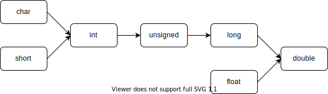
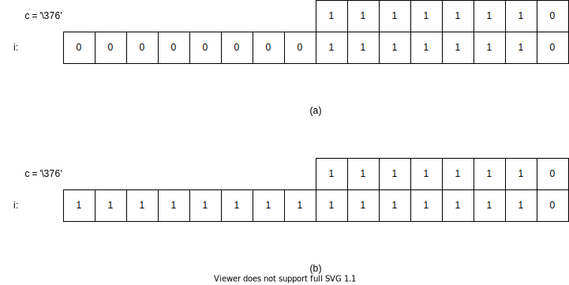

# 第三章 数据类型、运算符与表达式

## 3.1 C语言的数据类型

* 数据结构：数据的组织形式

### C语言提供的数据类型

<table>
<tr>
<td rowspan=10>数据类型</td>
<td rowspan=5>基本类型</td>
<td colspan=2>整数型</td>
</tr>
<tr>
<td rowspan=2>浮点数型</td>
<td>单精度型</td>
</tr>
<tr>
<td>双精度型</td>
</tr>
<tr>
<td colspan=2>字符型</td>
</tr>
<tr>
<td colspan=2>枚举类型</td>
<tr>
<td rowspan=3>构造类型</td>
<td colspan=2>数组类型</td>
</tr>
<tr>
<td colspan=2>结构体类型</td>
</tr>
</tr>
<tr>
<td colspan=2>共用体类型</td>
</tr>
<tr>
<td colspan=3>指针类型</td>
</tr>
<tr>
<td colspan=3>空类型</td>
</tr>
</table>

## 3.2 常量与变量

### 3.2.1 常量和符号常量

* 常量：值不能改变的量，分为整形常量(12、0、-3)，实型常量(4.6、-1.23)，字符常量('a'、'd')，又叫字面常量或者直接常量
* 宏定义

```c
# define PRICE 35
```

* 这种用一个标识符代表一个常量的符号(宏定义)，成为符号常量，即以标识符形式出现的常量
* 符号常量名用大写，变量名用小写

## 3.2.2 变量

<p>变量代表内存中具有特定属性的一个存储单元，用来存放数据，也就是变量的值</p>
<p>变量名和变量值是两个概念</p>
<p>变量名实际上是以一个名字对应，代表一个地址</p>
<p>C语言规定标识符只能由字母、数字和下划线组成，且首字母必须是字母或者下划线</p>

## 3.3 整型数据

### 3.3.1 整型常量的表示方法 

* 整型常量即整常数(talbe 上紧挨着一行*开头就会正常解析幂符号 原因未知)
<table>
<tr>
<th>进制</th>
<th>表示方式</th>
<th>举例</th>
<th>换算成十进制</th>
</tr>
<tr>
<td rowspan=2>十进制</td>
<td rowspan=2>无特殊标识</td>
<td>123</td>
<td></td>
</tr>
<tr>
<td>-456</td>
<td></td>
</tr>
<tr>
<td rowspan=2>八进制</td>
<td rowspan=2>以0开头</td>
<td>0123</td>
<td><pre>1 x 8^2 + 2 x 8^1 + 3 x 8^0 = 83</pre></td>
</tr>
<tr>
<td>-11</td>
<td><pre>-(1 x 8^1 + 1 x 8^0) = -9</pre></td>
</tr>
<tr>
<td rowspan=2>十六进制</td>
<td rowspan=2>以0x开头</td>
<td>0123</td>
<td><pre>1 x 16^2 + 2 x 16^1 + 3 x 16^0 = 291</pre></td>
</tr>
<tr>
<td>-0x12</td>
<td><pre>-( 1 x 16^1 + 2 x 16^0 ) = -18</pre></td>
</tr>
</table>


### 3.3.2 整型变量

#### 3.3.2.1 整型数据在内存中的存放形式

* 数据在内存中以二进制形式存放，定义一个整型变量方式如下:

```c
int i; /* 定义为整型变量 */
i = 10; /* 给i赋值 */
```

<p>十进制数10的二进制形式为: 1010</p>
<p>Turbo C 2.0 和 Turbo C++ 3.0 为一个整型变量在内存中分配两个字节的存储单元。</p>
<p>Visual C++ 6.0 为整型变量分配4个字节的存储单元。</p>
<p>不同的编译系统为整型数据分配的字节数是不同的。</p>
<p>本书在举例时一般假定整型变量在内存中占用两个字节。</p>
<p>* 实际上，数值是以补码(complement)表示的。</p>
<p>一个正整数的补码和该数的原码(即该数的二进制形式)相同。</p>
<p>求负数的补码的方法：将该数的绝对值的二进制形式按位取反再加1。</p>

* -10的补码计算过程如下：
<table>
<tr><th>步骤</th><th>二进制形式</th></tr>
<tr><td>-10绝对值原码</td><td><pre>0000 0000 0000 1010</pre></td></tr>
<tr><td>按位取反</td><td><pre>1111 1111 1111 0101</pre></td></tr>
<tr><td>加1得补码(complemnt)</td><td><pre>1111 1111 1111 0110</pre></td></tr>
</table>

<p>在存放整数的存储单元中，最左面的一位用来表示符号，0代表正，1代表负。</p>

* 附上int型变量取值范围在内存中的存储码( -2^15 至 2^15 - 1 )：
<table>
<tr>
<th></th><th></th><th>原值</th>
<th>二进制形式</th>
</tr>
<tr>
<td>最小</td><td>-2^15</td><td>-32768</td>
<td><pre>1000 0000 0000 0000</pre></td>
</tr>
<tr>
<td>最小</td><td>-2^15 + 1</td><td>-32767</td>
<td><pre>1000 0000 0000 0001</pre></td>
</tr>
<tr>
<td>最小</td><td>-2^15 + 2</td><td>-32766</td>
<td><pre>1000 0000 0000 0010</pre></td>
</tr>
<tr>
<td></td><td>-3</td><td>-3</td>
<td><pre>1111 1111 1111 1101</pre></td>
</tr>
<tr>
<td></td><td>-2</td><td>-2</td>
<td><pre>1111 1111 1111 1110</pre></td>
</tr>
<tr>
<td></td><td>-1</td><td>-1</td>
<td><pre>1111 1111 1111 1111</pre></td>
</tr>
<tr>
<td></td><td>0</td><td>0</td>
<td><pre>0000 0000 0000 0000</pre></td>
</tr>
<tr>
<td></td><td>1</td><td>1</td>
<td><pre>0000 0000 0000 0001</pre></td>
</tr>
<tr>
<td></td><td>2</td><td>2</td>
<td><pre>0000 0000 0000 0010</pre></td>
</tr>
<tr>
<td></td><td>3</td><td>3</td>
<td><pre>0000 0000 0000 0011</pre></td>
</tr>
<tr>
<td>最大</td><td>2^15 - 3</td><td>32765</td>
<td><pre>0111 1111 1111 1101</pre></td>
</tr>
<tr>
<td>最大</td><td>2^15 - 2</td><td>32766</td>
<td><pre>0111 1111 1111 1110</pre></td>
</tr>
<tr>
<td>最大</td><td>2^15 - 1</td><td>32767</td>
<td><pre>0111 1111 1111 1111</pre></td>
</tr>
</table>

#### 3.3.2.2 整型变量的分类

<p>整型变量基本类型是int。</p>

* 在int之前可以加修饰符(modifier)：short，long，signed，unsigned

<table>
<tr>
<th>分类</th>
<th>表示方式</th>
<th>比特位</th>
<th>表达范围</th>
<th>-</th>
</tr>
<tr>
<td>有符号整数</td>
<td>[signed] int</td>
<td>16</td>
<td>-2^15 ~ 2^15 - 1</td>
<td>-32768 ~ 32767</td>
</tr>
<tr>
<td>无符号整数</td>
<td>unsigned int</td>
<td>16</td>
<td>-2^16 ~ 2^16 - 1</td>
<td>0 ~ 65535</td>
</tr>
<tr>
<td>有符号短整数</td>
<td>[signed] short [int]</td>
<td>16</td>
<td>-2^15 ~ 2^15 - 1</td>
<td>-32768 ~ 32767</td>
</tr>
<tr>
<td>无符号整数</td>
<td>unsigned short [int]</td>
<td>16</td>
<td>-2^16 ~ 2^16 - 1</td>
<td>0 ~ 65535</td>
</tr>
<tr>
<td>无符号整数</td>
<td>[signed] long [int]</td>
<td>32</td>
<td>-2^31 ~ 2^31 - 1</td>
<td>-2147483648 ~ 2147483647</td>
</tr>
<tr>
<td>无符号整数</td>
<td>unsigned long [int]</td>
<td>32</td>
<td>-0 ~ 2^32 - 1</td>
<td>0 ~ 4294967295</td>
</tr>
<tr>
</table>

#### 3.3.2.3 整型变量的定义

<p>强制类型定义：C语言要求变量必须定义。</p>

<a herf="https://baike.baidu.com/item/%E6%9C%89%E6%95%88%E6%95%B0%E5%AD%97/406066?fr=aladdin">有效数字 : https://baike.baidu.com/item/%E6%9C%89%E6%95%88%E6%95%B0%E5%AD%97/406066?fr=aladdin</a>

<p>对变量的定义一般放在函数开头部分的声明部分。</p>
<p>也可以放在某一段分程序内，同时其作用域也只限于这段分程序内。</p>

* 例3.2 整型变量的定义与使用

```c
# include <stdio.h>
void main() {
	int a,b,c,d;
	unsigned u;
	a = 12;
	b = -24;
	u = 10;
	c = a + u;
 	d = b + u;
	printf("a + u = %d, b + u = %d\n", c, d);//a + u = 22, b + u = -14
}
```
<p>不同种类的整型数据可以进行算术运算。</p>
<p>本例是int与unsigned int进行相加减运算。</p>

#### 3.3.2.4 整型数据的溢出

* 例 3-3 整型数据的溢出

```c
# include <stdio.h>
void main() {
	int a,b;
	a = 32767;
	b = a + 1;

	printf("sizeof(a) = %d\n", sizeof(a));
	printf("sizeof a = %d\n", sizeof a);
	printf("sizeof(int) = %d\n", sizeof(int));
	//printf("sizeof int = %d\n", sizeof int);//这个语法不允许

	printf("a = %d, b = %d\n", a, b);//a = 32767, b = 32768

	a = 2147483647;
	b = a + 1;

	printf("a = %d, b = %d\n", a, b);//a = 2147483647, b = -2147483648
}
```
<p>原来的教材当时int是两字节，现在是4字节。所以为了演示溢出效果要用有符号4字节的最大值+1才行。</p>
<p>C语言的运算，溢出但是没报错，需要程序员自己注意。</p>

### 3.3.3 整型常量的类型

#### 3.3.3.4 unsigned int

<p>一个整常量后面加一个字母u或者U，认为是unsigned int型，在内存中按照unsigned int规定的方式存放，存储单元中最高位不作为符号位，而用来存储数据</p>
<p>如果写成-123445u，则先将-12345转换成其补码53191，然后按照无符号数存储</p>

#### 3.3.3.5 long int

<p>在一个整常量后面加一个字l或者L，则认为是long int型常量，如123l，432L，0L等</p>
<p>常用于函数调用中，如果函数形参是long int型，则要求实参也为long int型</p>

## 3.4 浮点型数据

<p>实数是个数学概念，这里补充下数的分类(深入了解见<<数论>>)：</p>

<pre>单数(odd numbers / singular)</pre>
<p>数学中正奇数的别称，可以表示为2n+1(n为>=0的整数)</p>

<pre>双数(even numbers)</pre>
<p>数学中正偶数的别称，与单数相对</p>

<pre>自然数(natural number)</pre>
<p>自然数，又叫非负整数，是指用以计量事物的件数或表示事物次序的数。</p>
<p>即用数码0，1，2，3，4……所表示的数。自然数由0开始，一个接一个，组成一个无穷的集体。</p>
<p>自然数有有序性，无限性。</p>
<p>分为偶数和奇数，合数和质数等。</p>

<pre>整数(integer)</pre>
<p>整数（integer），是正整数、零、负整数的集合。</p>
<p>整数的全体构成整数集，整数集是一个数环。</p>
<p>在整数系中，零和正整数统称为自然数。</p>
<p>-1、-2、-3、…、-n、…（n为非零自然数）为负整数。</p>
<p>则正整数、零与负整数构成整数系。</p>
<p>整数不包括小数、分数。如果不加特殊说明，所涉及的数都是整数，所采用的字母也表示整数。</p>
<p>整数可以看作分母为1的分数。</p>

<pre>有理数(rational number)</pre>
<p>有理数是整数（正整数、0、负整数）和分数的统称，是整数和分数的集合。</p>
<p>有理数,包含整数及小数（不包含无限不循环小数）,通俗理解就是可以写成分数形式的数,所有有理数都可以用分数表示.</p>

<pre>无理数(irrational number)</pre>
<p>不是有理数的实数称为无理数，即无理数的小数部分是无限不循环的数。</p>
<p>即无限不循环小数,不可以用分数形式表示.如圆周率,根号2等.</p>

<pre>实数(real number)</pre>
<p>实数就是有理数和无理数的统称，或代数数和超越数两类。</p>
<p>实数集通常用黑正体字母 R 表示。</p>
<p>实数是不可数的。</p>
<p>其余特性见：https://baike.baidu.com/item/%E5%AE%9E%E6%95%B0/296419?fr=ge_ala</p>
<p>实数是实数理论的核心研究对象。</p>
<p>所有实数的集合可称为实数系（real number system）或实数连续统。</p>
<p>任何一个完备的阿基米德有序域均可称为实数系。</p>
<p>在保序同构意义下它是惟一的，常用R表示。</p>
<p>由于R是定义了算数运算的运算系统，故有实数系这个名称。</p>
<p>实数可以用来测量连续的量。</p>
<p>理论上，任何实数都可以用无限小数的方式表示，小数点的右边是一个无穷的数列（可以是循环的，也可以是非循环的）。</p>
<p>在实际运用中，实数经常被近似成一个有限小数（保留小数点后 n 位，n为正整数）。</p>
<p>在计算机领域，由于计算机只能存储有限的小数位数，实数经常用浮点数来表示。</p>

<pre>虚数(imaginary number)</pre>
<p>在数学中，虚数就是形如a+b×i的数，其中a，b是实数，且b≠0，i² = - 1。</p>
<p>虚数这个名词是17世纪著名数学家笛卡尔创立，因为当时的观念认为这是真实不存在的数字。</p>
<p>后来发现虚数a+b×i的实部a可对应平面上的横轴，虚部b可对应平面上的纵轴，这样虚数a+b×i可与平面内的点(a,b)对应。</p>
<p>可以将虚数bi添加到实数a以形成形式a + b×i的复数，其中实数a和b分别被称为复数的实部和虚部。</p>
<p>一些作者使用术语纯虚数来表示所谓的虚数，虚数表示具有非零虚部的任何复数。</p>

<pre>复数(complex number)</pre>
<p>实数和虚数共同构成复数。</p>
<p>复数是指能写成如下形式的数a+bi,这里a和b是实数,i是虚数单位（即-1开方）比如：根的判别式小于0的一元二次方程的根.</p>
<p>复数是指形如 z=a+bi 的数，其中a称为实部，b称为虚部，i称为虚数单位。</p>
<p>当 b=0 时，z为实数</p>
<p>当 b<>0 & a=0 时，z为纯虚数。</p>
<p>复数域是实数域的代数闭包，即任何复系数多项式在复数域中总有根。</p>

<pre>有效数字(significant digit)</pre>
<p>具体地说，有效数字是指在分析工作中实际能够测量到的数字。</p>
<p>能够测量到的是包括最后一位估计的，不确定的数字。 </p>
<p>我们把通过直读获得的准确数字叫做可靠数字；把通过估读得到的那部分数字叫做存疑数字。</p>
<p>把测量结果中能够反映被测量大小的带有一位存疑数字的全部数字叫有效数字。</p>
<p>测得物体的长度5.15cm。</p>
<p>数据记录时，我们记录的数据和实验结果真值一致的数据位便是有效数字。</p>
<p>另外在数学中，有效数字是指从一个数的左边第一个非0数字起，到末位数字止，所有的数字都是这个数的有效数字，如0.618的有效数字有三个，分别是6,1,8。</p>
<p>舍入规则：当保留n位有效数字，</p>
<p>若第n+1位数字≤4就舍掉。</p>
<p>若第n+1位数字≥6时，则第n位数字进1。</p>
<p>若第n+1位数字=5且后面数字为0时 ，则第n位数字若为偶数时就舍掉后面的数字，若第n位数字为奇数时加1；</p>
<p>若第n+1位数字=5且后面还有不为0的任何数字时，无论第n位数字是奇或是偶都加1。</p>

### 3.4.1 浮点型常量的表示方法

<p>C语言中的浮点数(float point number)指实数(real number)，浮点数有两种表示形式：</p>

* 十进制小数表示形式。它由数字和小数点组成(注意必须有小数点)。0.123、123.、123.0、0.0都是十进制小数形式。
* 指数形式。如123e3，或者123E3，都代表123X10^3。 注意字母e/E之前必须有数字，且e后面的指数必须为整数，如e3、2.1e3.5、.e3、e等都是不合法的指数形式。

<p>一个浮点数可以有多种指数表示形式。如123.456可以表示为：123.456e0、12.3456e^1、1.23456e^2、0.123456e^3、0.0123456e^4、0.00123456e^5。其中1.23456e^2称为 <u>规范化的指数形式</u>。即在字母e/E之前的小数部分中，小数点左边应有且只有一位非零的数字。</p>
<p>浮点数在以指数形式输出时，是按照规范化的指数形式输出的。如：如果指定将实数5689.65按照指定形式输出，是5.68965e+003。</p>

### 3.4.2 浮点型变量

#### 3.4.2.1 浮点型数据在内存中的存放形式

<p>一个浮点型数据在内存中占用四个字节(旧)。与整型数据不同，浮点型数据按照指数形式存储。系统把一个浮点型数据分成小数部分和指数部分分别存放。实数3.14159在内存中的存放形式：</p>

* 图 3-7
<table>
<tr>
<td><pre/>+</pre></td>
<td><pre>.314159</pre></td>
<td><pre>1</pre></td>
</tr>
<tr>
<td>数符</td>
<td>小数部分</td>
<td>指数</td>
</tr>
<tr>
<td colspan=3>+ .314159 x 10^1 = 3.14159</td>
</tr>
</table>

<p>图3-7中使用十进制数来示意的，实际上在计算机中是用二进制数来表示小数部分以及用2的幂次来表示指数部分的。</p>

<p>在四个字节中多少位用来表示小数部分，多少位表示指数部分，标准没有具体规定，有各C语言编译系统自定。不少C语言编译系统用24位表示小数(包括符号)，8位表示指数(包括指数的符号)。</p>

<p>小数半部分占的位越多，数字的有效数字越多，精度越高。指数部分占的位数越多，能表示的数值范围越大。</p>

#### 3.4.2.2 浮点型变量的分类

<p>浮点型数据分类如下：</p>

* 表 3-2 浮点型数据
<table>
<tr>
<th>类型</th>
<th>比特位</th>
<th>有效数字</th>
<th>数值范围</th>
</tr>
<tr>
<td>float</td>
<td>32</td>
<td>6 ~ 7</td>
<td>-3.4 x 10^-38 ~ -3.4 x 10^38</td>
</tr>
<tr>
<td>double</td>
<td>64</td>
<td>15 ~ 16</td>
<td>-1.7 x 10^-308 ~ -1.7 x 10^308</td>
</tr>
<tr>
<td>long double</td>
<td>128</td>
<td>18 ~ 19</td>
<td>-1.2 x 10^-4932 ~ -1.2 x 10^4932</td>
</tr>
</table>

<p>ANSI C 并未规定每种类型的长度、精度和数值范围。有的系统将double类型增加的32位全用于存放小数部分，这样可以增加数值的有效位数，减少舍入误差。有的系统则将增加的bit位的一部分用于存放指数部分，这样可以扩大数值的范围。表3-2列出的是Turbo C、Turbo C++ 6.0、MS C的情况，不同的系统会有差异。</p>

#### 3.4.2.3 浮点型变量的舍入误差

<p>由于浮点型变量是由有限的存储单元组成，因此提供的有效数字总是有限的。在有效位以外的数字将会被舍去。这可能会产生一些误差。</p>

* 例 3-4 浮点型数据的舍入误差

```c
#include <stdio.h>

void main()
{
  float a,b;
  a = 123456.789e5;
  b = a + 20;
  printf("a = %f\n", a);
  printf("b = %f\n", b);
}
```

<p>程序内printf函数中的 "%f" 是输出浮点数时指定的格式符，作用是指定该实数以小数形式输出。</p>

<p>程序运行时输出的b的值与a相等，原因是：a的值比20大很多，a+20的理论值应该是12345678920，而一个浮点型变量只能保证有效的数字是7位，后面的数字是无意义的，因而并不能准确的表示该数。</p>

<p>运行程序可以看到前8位是准确的，后几位是不准确的，把20加在后几位上，是无意义的。</p>

<p>应当避免将一个很大的数和一个很小的数相加减，否则就会“丢失”小的数。</p>

<p>与此类似，用程序计算 1.0/3.0*3 的结果并不等于1。</p>

### 3.4.3 浮点型常量的类型

<p>C语言编译系统将浮点型常量作为双精度来处理。例如已定义一个浮点型变量 f，有如下语句：</p>

```c
f = 2.45678 * 4523.65;
```

<p>系统先把 2.45678 和 4523.65 作为双精度数，然后进行相乘的运算，得到的乘积也是一个双精度数。最后取其前7位赋给浮点型变量 f。这样做可以使计算结果更精确。但是运算速度降低了。如果是在数的后面加字母 f 或者 F (如：1.65f、654.87F)，这样编译系统就会把它们按单精度(32位)处理。</p>

<p>一个浮点型常量可以赋值给一个 float 型、double 型、或者 long double 型变量，根据变量的类型截取实型变量中相应有效位数字。</p>

<p>假如 a 已指定为单精度浮点型变量：</p>

```c
float a;
a = 111111.111;
```

<p>由于 float 型变量只能接收7位有效数字，因此最后两位小数不起作用。如果 a 改为 double 型，则能全部接收上述 9 位数字并存储在变量 a 中。</p>

## 3.5 字符型数据

### 3.5.1 字符常量

<p>C语言的字符常量是用单撇号括起来的一个字符。如 `a`,`x`,`D`,`?`,`$`。</p>
<p>除了以上形式的字符串常量，C语言还允许用一种特殊形式的字符常量，就是 "\" 开头的字符。例如在 printf 函数中使用的 "\n"，它代表一个"换行符"，这是一种"控制字符"，在屏幕中不显示，在程序中也不能用一般形式的字符表示，只能用特殊形式表示。</p>

* 表 3-3 常用的转义字符及其作用
<table>
<tr>
<th>字符形式</th>
<th>含义</th>
<th>ASCII代码</th>
</tr>
<tr>
<td><pre>\n</pre></td>
<td>换行，将当前位置移到下一行开头</td>
<td>10</td>
</tr>
<tr>
<td><pre>\t</pre></td>
<td>水平制表(调到下一个Tab位置)</td>
<td>9</td>
</tr>
<tr>
<td><pre>\b</pre></td>
<td>退格，将当前位置移到前一列</td>
<td>8</td>
</tr>
<tr>
<td><pre>\r</pre></td>
<td>换行，将当前位置移到下一行开头</td>
<td>13</td>
</tr>
<tr>
<td><pre>\f</pre></td>
<td>换页，将当前位置移到下页开头</td>
<td>12</td>
</tr>
<tr>
<td><pre>\\\\</pre></td>
<td>代表一个反斜杠字符"\\"</td>
<td>92</td>
</tr>
<tr>
<td><pre>\'</pre></td>
<td>代表一个单引号(撇号)字符</td>
<td>39</td>
</tr>
<tr>
<td><pre>\\\"</pre></td>
<td>代表一个双引号字符</td>
<td>34</td>
</tr>
<tr>
<td><pre>\ddd</pre></td>
<td>1到3位被八进制数所代表的字符</td>
<td></td>
</tr>
<tr>
<td><pre>\xhh</pre></td>
<td>1到2位十六进制数所代表的字符</td>
<td></td>
</tr>
</table>


<p>表 3-3中列出的字符称为"转义字符"，意思是将反斜杠"\"后面的字符转换成另外的意义。如“\n”中的n不代表字母n而作为换行符。</p>
<p>表 3-3中倒数第二行是一个ASCII码(八进制数)表示一个字符，例如<pre>\101</pre>代表ASCII码(八进制数)为101的字符A。八进制数101相当于十进制数65，从附录A可以看到ASCII码(十进制数)为65的的字符是大写字母A。<pre>\012</pre>代表八进制数12(即十进制的10)的ASCII码对应的字符换行符。用表 3-3中的方法可以表示任何可输出的字母字符、专用字符、图形字符和控制字符。请注意<pre>\0</pre>或<pre>\000</pre>是代表ASCII码为0的控制字符，即空操作符。它常用在字符串那种。</p>

<p>例 3.5 转义字符的使用</p>

```c
#include <stdio.h>

void main() {
  printf(" ab c\t de\rf\tg\n");
  printf("h\ti\b\bj k\n");
}
```

<p>用printf函数直接输出双引号内的各个字符。请注意其中的转义字符。第一行，逐个输出字符，遇到"\t"，作用是跳格，即跳到下一个制表位置，在所有系统中，一个制表区占8列。下一个制表位置从第9列开始，所以在第九列开始输出。下面遇到"\r"，它代表回车不换行，返回到本行最左端，输出字符f，然后遇到"\t"，移到下一个制表区，继续输出，下面是"\n"，作用是使当前位置移到下一行的开头。第二行"\b"的作用是退一格。</p>
<p>程序输出如下：（示例中下划线位置实际上是空格）</p>

```
fab_c___gde
h______j_k
```

<p>注意在显示屏上最后看到的效果与上述输出的结果不同，是：（示例中下划线位置实际上是空格）</p>

```
f_______gde
h______j_k
```

<p>这是由于"\r"使当前位置回到本行开头，自此输出的字符(包括空格和跳格所经过的位置)将取代原来屏幕上该位置上显示的字符。实际上，屏幕上完全按照程序的要求输出了全部的字符，只是因为在输出前面的字符后很快又输出后面的字符，在人们还未看清楚之前，新的已取代了旧的，所以误以为未输出应输出的字符。</p>

### 3.5.2 字符变量

<p>字符型变量用来存放字符常量，它只能是一个字符，不要以为在一个字符变量中可以放一个字符串。</p>
<p>字符变量定义如下：</p>

```c
char c1,c2;
```

<p>它表示c1和c2为字符型变量，各可以放一个字符，用以下语句对c1、c2赋值：</p>

```c
c1 = 'a';
c2 = 'b';
```

<p>所有编译系统中都规定以一个字节来存放一个字符，或者说一个字符变量在内存中占一个字节。</p>

### 3.5.3 字符数据在内存中的存储形式及其使用方法

<p>将一个字符常量存放到一个字符变量中，实际上并不是把该字符本身放到内存单元中，而是把该字符相应的ASCII代码放到存储单元中。例如字符'a'的ASCII代码为十进制数97，'b'的ASCII代码十进制数98，在内存中变量c1、c2的值如图3-8(a)所示。</p>


<p>图 3-8</p>

<p>既然在内存中，字符数据以ASCII码存储，它的存储形式就与整数的存储形式类似。这样使字符型数据和整型数据之间可以通用。一个字符型数据既可以以字符形式输出，也可以以整数形式输出。以字符形式输出时，需要先将存储单元中的ASCII码转换成相应字符，然后输出。以证书形式输出时，直接将ASCII码转作为整数输出。也可以对字符数据进行算术运算，此时相当于对它们的ASCII码进行算术运算。</p>
<p>例 3.6 向字符变量赋予整数</p>

```c
# include <stdio.h>
void main()
{
  char c1, c2;
  c1 = 97;
  c2 = 98;
  printf("%c %c\n", c1, c2);//输出：a b
  printf("%d %d\n", c1, c2);//输出：97 98
}
```

<p>c1和c2被指定为字符变量，在第五和第六行中，将证书97和98中分别赋给c1和c2，它的作用相当于以下两个赋值语句：</p>

```c
c1 = 'a';
c2 = 'b';
```

<p>因为a和b的ASCII码为97和98。程序中是把97和98两个整数存昂到c1和c2的内存单元中，而后面的字符赋值语句是把a和b化成ASCII码97和98，然后放到内存单元中。二者的作用和结果是相同的。</p>
<p>可以看到，字符型数据和整数型数据是通用的。它们既可以用字符形式输出，也可以用整数形式输出。需要注意：字符数据只占一个字节，只能存放0~255范围内的整数。</p>
<p>例 3.7 大小写字母的转换</p>

```c
# include <stdio.h>
void main()
{
  char c1, c2;
  c1 = 'a';
  c2 = 'b';
  c1 = c1 - 32;
  c2 = c2 - 32;
  printf("%c %c\n", c1, c2);//输出：A B
}
```

<p>程序的作用是把两个小写字母转换成大写字母。从ASCII代码表中可以看到每个小写字母比它相应的大写字母ASCII码大32。C语言允许字符数据与整数直接进行算术运算。</p>
<p>C语言对字符数据做这种处理使程序设计时增大了自由度。例如对字符做各种转换就比较方便。</p>

```c
int i;
char c;
i = 'a';
c = 97;
```

<p>如上，字符数据与整数数据可以互相赋值，是合法的。</p>

```c
  printf("%c %d\n", c, c);//输出：a 97
  printf("%c %d\n", i, i);//输出：a 97
```

<p>如上输出语句，也是合法的。</p>
<p>需要说明：有鞋系统(如Turbo C)将字符变量定义为 signed char 型。其存储单元中的最高位作为符号位，它的取值范围是-128~127。如果在字符变量中存放一个ASCII码为128~255之间的字符，由于在字节中最高位为1，用%d格式符输出时，就会得到一个负整数。例如：</p>

```c
  char c = 130;
  printf("%d\n", c);//输出：-126
```

<p>如果不想按有符号数处理，可以在程序中将字符变量定义为unsigned char类型，这时其取值范围是0~255。signed char和unsigned char的含义及用法与signed int和unsigned int相仿，但它只有一个字节。</p>
<p></p>

### 3.5.4 字符串常量

<p>前面已提到，字符常量是由一对单撇号括起来的单个字符。C语言除了允许使用字符常量外，还允许使用字符串常量。字符串常量是一对双撇号括起来的字符序列。例如下面是合法的字符串常量。</p>

```c
"How do you do.", "CHINA", "a", "$ 123.45"
```

<p>可以输出一个字符串，例如</p>

```c
printf("How do you do.");
```

<p>不要将字符常量和字符串常量混淆。'a'是字符常量，"a"是字符串常量，二者不同。</p>

```c
char c;
c = 'a';//正确
c = "a";//错误
c = "CHINA";//错误
```

<p>不能把一个字符串常量赋给一个字符变量。</p>
<p>'a'和"a"的区别：C规定以字符 '\0' 作为字符串结束标志。'\0' 是一个ASCII码为0的字符，从ASCII代码表中可以看到ASCII码为 0 的字符是“空操作字符”，即它不引起任何控制动作，也不是一个可显式的字符。如果有一个字符串常量是 "CHINA"，实际上在内存中是：</p>

<table>
<tr>
<td>C</td>
<td>H</td>
<td>I</td>
<td>N</td>
<td>A</td>
<td>\0</td>
</tr>
</table>

<p>它占用的内存单元不是5个字符，而是6个字符，最后一个字符为 '\0'。但在输出时不输出 '\0'。例如 printf("How do you do.")，从第一个字符开始诸葛输出字符，直到遇到最后的 '\0' 字符，就知道字符串结束，停止输出。</p>
<p>注意在写字符串时不必加 '\0' ，否则会画蛇添足。'\0' 字符是系统自动加上的。</p>
<p>再回到前面的字符串常量赋值给字符变量的问题，字符串 "a" 实际上包含两个字符 'a' 和 '\0'，因此想把它赋给只能容纳一个字符的字符变量c显然是不行的。</p>
<p>在C语言中没有专门的字符串变量，如果想将一个字符串存放在变量中以便保存，必须使用字符数组，即用一个字符型数组来存放一个字符串，数组中每一个元素存放一个字符。这将在第7章中介绍。</p>

## 3.6 变量赋初值

<p>程序中需要对一些变量预先设置初值。C语言允许在定义变量的同时使变量初始化。例如：</p>

```c
int a = 3;
float f = 3.56;
char c = 'a';
```

<p>也可以使被定义的变量的一部分赋初值。例如：</p>

```c
int a, b, c = 5;
```

<p>如果对几个变量赋予同一个初值，应写成：</p>

```c
int a = 3, b = 3, c = 3;
```

<p>不能写成：</p>

```c
int a = b = c = 3;
```

<p>初始化不是在编译阶段完成的(只有在第八章中介绍的静态存储变量和外部变量的初始化是在编译阶段完成的)，而是在程序运行时执行本函数时赋初值的，相当于有一个赋值语句。</p>

```c
int a = 3;
```

<p>相当于：</p>

```c
int a;
a = 3;
```

<p>而这个</p>

```c
int a, b, c = 5;
```

<p>相当于：</p>

```c
int a, b, c;
c = 5;
```

## 3.7 各类数值型数据间的混合运算

<p>整型(包括int、short、long)和浮点型(float、double)可以混合运算。前面说过字符型数据可以与整型通用，因此，整型、浮点型、字符型数据间可以混合运算。例如：</p>

```c
10 + 'a' + 1.5 - 8765.1234 * 'b'
```

<p>是合法的。在进行运算时，不同类型的数据要先转换成同一类型，然后进行运算。转换规则如下：</p>


<p>图 3-10</p>

<p>图  3-10 中箭头表示必定的转换，如字符数据必定先转换为整数，short型转换为int型，float
型数据在运算时一律先转换成双精度型，以提高运算精度(即使是两个float型数据相加，也先都化成double型，然后再相加)。</p>
<p>纵向的箭头表示当运算对象为不同类型时转换的方向。例如当int型与double型数据进行运算，现将int型的数据转换成double型，然后在两个同类型(double型)数据间进行运算，结果为double型。</p>
<p>注意：箭头方向指标是数据类型级别的高低，由低向高转换。不要理解为int型先转换成unsigned int型，再转成long型，再转成double型。如果一个int型与一个double型数据运算，是直接将int转成double型。同理，int型与一个long型数据运算，现将int型转换成long型。</p>
<p>换言之，如果有一个数据是float型或double型，则另一数据要先转换为double型，运算结果为double型。如果参加运算的两个数据中最高级别为long型，则另一个数据先转换为long型，运算结果为long型。其它依次类推。</p>
<p>假设已指定i为整型变量，f为float型，d为double型变量，e为long，有下面式子：</p>

```c
10 + 'a' + i * f - d / e
```

<p>在计算机执行时从左至右扫描，运算次序为：</p>
<p>（1）进行 10 + 'a' 的运算，先将 'a' 转换成整数 97，运算结果为 107。</p>
<p>（2）由于 "*" 比 "+" 优先，先进行 i * f 的运算。先将 i 与 f 都转成 double 型，运算结果为 double型。</p>
<p>（3）整数107与 i * f 的积相加。先将整数 107 转换成双精度数(小数点后加若干个 0，即107.000...00)，结果为double型。</p>
<p>（4）将变量 e 化成 double 型，d / e 结果为 double 型。</p>
<p>（5）将 10 + 'a' + i * f 的结果与 d / e 的商相减，结果为 double 型。</p>
<p>上述的类型转换是由系统自动进行的。</p>

## 3.8 算术运算符和算术表达式

### 3.8.1 C语言运算符简介

<p>C的运算符</p>

<table>
<tr><td>算术运算符</td><td><pre>+ - * / %</pre></td></tr>
<tr><td>关系运算符</td><td><pre>> < == >= <= !=</pre></td></tr>
<tr><td>逻辑运算符</td><td><pre>! && ||</pre></td></tr>
<tr><td>位运算符</td><td><pre><< >> ~ | ^ &</pre></td></tr>
<tr><td>赋值运算符</td><td><pre>=及其扩展赋值运算符</pre></td></tr>
<tr><td>条件运算符</td><td><pre>?:</pre></td></tr>
<tr><td>逗号运算符</td><td><pre>,</pre></td></tr>
<tr><td>指针运算符</td><td><pre>* &</pre></td></tr>
<tr><td>求字节数运算符</td><td><pre>sizeof</pre></td></tr>
<tr><td>强制类型转换运算符</td><td><pre>(类型)</pre></td></tr>
<tr><td>分量运算符</td><td><pre>. -></pre></td></tr>
<tr><td>下标运算符</td><td><pre>[]</pre></td></tr>
<tr><td>其他运算符</td><td><pre>如函数调用运算符()</pre></td></tr>
</table>

### 3.8.2 算术运算符和算术表达式

#### 3.8.2.1 基本的算术运算符

<p>两个整数相除的结果为整数，如 5/3 的结果值为 1，舍去小数部分。但是，如果除数或被除数中有一个为负值，则舍入的方向是不固定的。例如，-5/3 在有的系统中得到的结果为 -1，在有的系统中得到结果为 -2。多数C编译系统采取“向零取整”的方法，即 5/3=1，-5/3=-1，取整后向零靠拢。</p>
<p>【如果参加加减乘除运算的两个数中有一个数为实数或双精度数，则结果是double型，因为所有实数都按double型进行运算。】</p>

#### 3.8.2.2 算术表达式和运算符的优先级与结合性

<p>用算术运算符和括号将运算对象(也称操作数)连接起来的、符合C语法规则的式子，称为C算术表达式。运算对象包括常量、变量、函数等。</p>

#### 3.8.2.3 强制类型转换运算符

<p>可以利用强制类型转换运算符将一个表达式转换成所需类型。</p>

```c
(double)a
(int)(x+y)
(float)(5%3)
```

<p>其一般类型为：</p>

```c
(类型名)表达式
```

<p>有时表达式需要用括号括起来，如：</p>


```c
(int)x + y //错误 先把x转成int再与y相加
(int)(x + y) //正确 x和y先相加再转int
```

<p>需要说明的是，在强制类型转换时，得到一个所需类型的中间变量，原来变量的类型未发生变化。</p>
<p>例 3.8 强制类型转换</p>

```c
#include <stdio.h>

void main() 
{
  float x;
  int i;
  x = 3.6;
  i = (int)x;
  printf("x=%f, i=%d\n", x, i);// x=3.6000000, i=3 
  //此例验证了 x类型仍是float，值不变
}
```

<p>有两种类型转换，一种是在运算时不必用户指定，系统自动进行的类型转换，如3+6.5。第二种是强制类型转换。当自动类型转换不能实现目的时，可以用强制类型转换。如 “%” 运算符要求其两侧均为整型量，若x为float型，则 x%3 不合法，必须用 “(int)x%3”。从附录C可以查到，强制类型转换运算优先于…%运算，因此先进行类型转换再求模。此外，在函数调用时，有时为了使实参与形参类型一致，可以用强制类型转换运算符得到一个所需类型的参数。</p>

#### 3.8.2.4 自增、自减运算符

<p>作用是使变量的值增1或减1，例如：</p>

```c
++i, --i
i++, i--
```

<p>++i 和 i++ 的不同之处是 ++i 使先执行 i = i + 1 再使用 i 的值；而 i++ 是先使用 i 的值后，再执行 i = i + 1。如果 i 的原值等于3，请分析以下赋值语句：</p>

```c
j = ++i; // i的值先变成 4，再赋值给 j，j的值变成4
j = i++; // 先将 i 的值 3 赋给 j，j 的值为 3，然后 i 变为 4
```

<p>又如：</p>

```c
i = 3;
printf("%d", ++i);// 输出4
i = 3;
printf("%d", i++);// 输出3
```

<p>注意：</p>
<p>（1）自增运算符(++)和自减运算符(--)只能用于变量，而不能用于常量或表达式。</p>

```c
5++; // 不合法，因为5是常量
(a+b)++; / 不合法，因为假如 a+b 的值是 5，那么自增后得到的 6 无变量可供存放
```

<p>（2）++ 和 -- 的结合方向是“自右至左”，前面提到，算术运算符的结合方向是“自左而右”。</p>

```c
-i++; // 相当于是 (-i)++，但是注意，看下一行
(-i)++; / 注意这是不合法的，表达式不能进行自加自减运算
```

#### 3.8.2.5 有关表达式使用中的问题说明

<p>（1）C运算符和表达式使用灵活，利用这一点可以巧妙的处理许多在其它语言中难以处理的问题。但是应当注意：ANSI C并没有具体规定表达式中子表达式的求职顺序，允许各编译系统自己安排。例如：</p>

```c
a = f1() + f2()
```

<p>并不是所有编译系统都先调用函数f1()，然后调用函数f2()。一般情况下，先调用f1和先调用f2的结果可能是相同的。但是在有的情况下，结果可能不同。有时会出现一些令人容易搞混的问题，因此务必要小心谨慎。</p>
<p>又如，i 的初值为 3，有以下表达式：</p>

```c
(i++) + (i++) + (i++)
```

<p>有的系统按照自左而右的顺序求解括号内的运算，求完第一个括号的值后，实现 i 的自加，i 的值变为 4，再求第二个括号的值，结果表达式相当于 3 + 4 + 5，即 12。而另一些系统（如Turber c和MS C）把3作为表达式中所有 i 的值，因此三个 i 相加，得到表达式的值为 9。在求出整个表达式的值后再实现自加3次，i 的值变为6。</p>
<p>应该避免出现这种歧义性。如果编程者的意愿是想得到12，可以写成下列语句：</p>

```c
a = i++;
b = i++;
c = i++;
d = a + b + c;
```

<p>执行完上述语句后，d 的值为 12，i 的值为 6。虽然语句多了，但不会引起歧义，无论程序移植到哪一种 C 编译系统运行，结果都一样。</p>
<p>（2）C语言中有的运算符为一个字符，有的运算符由两个字符组成。C编译系统在处理时尽可能多的(自左而右)将若干个字符组成一个运算符(在处理标识符、关键字时也按同一原则处理)，如 i+++j，将解释为(i++)+j，而不是i+(++j)。为避免阅读误解，应尽量使用易读的书写方式。</p>
<p>（3）C语言中类似上述的问题还有一些，例如，在调用函数时，实参数的求值顺序，C并无统一规定。如i的初始值为3，函数调用形式如下：</p>

```c
printf("%d,%d", i, i++);
```

<p>有的系统输出 "3,3"，但多数系统中对函数参数的求值顺序是自右而左，输出"4,3"。由于可读性查，这个写法应该为：</p>

```c
j = i++;
printf("%d,%d", j, i);
```

<p>总之，不要写出别人不易看懂，难以推测系统如何执行的代码。</p>
<p>阅读代码时应考虑到类似的上述问题，不同系统处理方式不尽相同。应当指到使用C语言时可能出问题的地方，以免遇到问题不知其所以然。</p>
<p>使用++和--时，可能会有“意想不到”的副作用，应谨慎。</p>

## 3.9 赋值运算符和赋值表达式

### 3.9.1 赋值运算符

<p>赋值符号“=”就使赋值运算符，作用是将一个数据赋给一个变量。</p>

### 3.9.2 类型转换

<p>如果复制运算符两侧的类型不一致，但都是数值型或者字符型时，在赋值时要进行类型转换。</p>
<p>（1）将浮点型数据(包括单、双精度)赋给整型变量时，舍弃浮点数的小数部分。</p>

```c
int i；
i = 3.56; // i 值是3
```
<p>（2）将整型数据赋给单、双精度变量时，数值不变，但以浮点数形式存储到变量中。</p>
<p>如将23赋给float变量f，先将23转换成23.00000，再存储在f中。</p>
<p>如将23赋给double型变量d，则将23补足有效数字为23.00000000000000，然后以双精度浮点数形式存储到变量d中。</p>
<p>（3）将一个double型数据赋给float变量时，截取其前面7位有效数字，存放到float变量的存储单元(4个字节)中。但应注意数值范围不能溢出。</p>

```c
float f;
double d = 123.456789e100;
f = d; //溢出错误 -> 以前的存储位数会，现在会不会需要确认
```

<p>将一个float型数据赋给double变量时，数值不变，有效位数扩展到16位，在内存中以8个字节存储。</p>
<p>（4）字符型数据赋给整型变量时，由于字符只占1个字节，而整型变量占两个字节，因此将字符数据放到整型变量存储单元的低8位中。有两种情况：</p>
<p>①如果所用系统将字符处理为无符号的字符类型，或程序已将字符变量定义为unsigned char型，则将字符的8位放到整型变量低8位，高8位补零。例如，将字符'\376'赋给int型变量i（见图3-11(a)）。</p>
<p>②如果所用系统(如Trubo C++)将字符处理为带符号的(即 signed char)，若字符高位为0，则整型变量高八位补0；若字符最高位为1，则高8位全补1（见图3-11(b)）。这称为“符号扩展”，这样做的目的是使数值保持不变，如变量c(字符'\376')以整数形式输出为-2，i的值也是-2。</p>


<p>图 3-11</p>

<p>（5）将一个int、short、long型数据赋给一个char型变量时，只将其低八位原封不动地送到char型变量(即截断)。</p>
<p>例如：</p>

```c
int i = 289;
char c = 'a';
c = i;
```

<p>c的值为33，如果用"%c"输出c，将得到字符“!”(其ASCII码为33)。</p>


<p>图 3-12</p>

<p>（6）将带符号的整型数据(int型)赋给long型变量时，要进行符号扩展，将整型数据的16位送到long型低16位中，如果int型数据为正值(符号位为0)，则long型变量的高16位补0；如果int型变量为负值(符号位为1)，则long型变量的高16位补1，以保持数值不变(因为内存里真正保存的是补码)。</p>
<p>反之，若将一个long型数据赋给一个int型变量，直降long型数据中低16位原封不动地送到整型变量(即截断)。例如：</p>

```c
int a;
long b = 8;
a = b;
```

<p>赋值情况见图 3-13。</p>


<p>图 3-13</p>

<p>如果b = 65536(八进制数0200000)，则复制后a值为0，见图 3-14。</p>


<p>图 3-14</p>

<p>如果b=020000000000(八进制数)，赋值后a也为0。</p>
<p>（7）</p>
<p></p>
<p></p>
<p></p>
<p></p>
<p></p>
<p>（8）</p>
<p></p>
<p></p>
<p></p>
<p></p>
<p></p>
<p></p>
<p></p>
<p></p>
<p></p>
<p></p>
<p></p>
<p></p>
<p></p>


### 3.9.3 复合的复制运算符

<p></p>
<p></p>
<p></p>
<p></p>
<p></p>
<p></p>
<p></p>
<p></p>
<p></p>
<p></p>
<p></p>
<p></p>
<p></p>
<p></p>
<p></p>

### 3.9.4 赋值表达式

<p></p>
<p></p>
<p></p>
<p></p>
<p></p>
<p></p>
<p></p>
<p></p>
<p></p>
<p></p>
<p></p>
<p></p>
<p></p>
<p></p>
<p></p>
<p></p>
<p></p>
<p></p>

## 3.10 逗号运算符和逗号表达式

<p></p>
<p></p>
<p></p>
<p></p>
<p></p>
<p></p>
