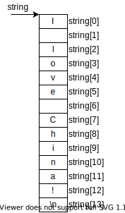

# 第十章 指针

<p>指针是C语言中的一个重要概念，也是C语言的一个重要特色。正确而灵活的运用指针，可以有效的表示复杂的数据结构；能动态分配内存；方便的使用字符串；有效而方便的使用数组；在调用函数时能获得一个以上的结果；能直接处理内存单元地址等，这对设计系统软件是非常必要的。掌握指针的应用，可以使程序简捷、紧凑、高效。</p>

## 10.1 地址和指针的概念

<p>为了弄清楚指针，必须弄清楚数据在内存中是如何存储的，又是如何读取的。</p>
<p>如果在程序中定义了一个变量，在对程序进行编译时，系统就会给这个变量分配内存单元。编译系统根据程序中定义的变量类型，分配一定长度的空间。例如，一般为整型变量分配两个字节，对单精度浮点型变量分配四个字节，对字符型变量分配一个字节。内存区的每一个字节有一个编号，这就是“地址”，相当于是旅馆中的房间号。在地址所标志的内存单元中存放数据，相当于旅馆中居住的旅客。</p>
<p>请务必弄清楚一个内存单元的地址和内存单元的内容这两个概念的区别，假设程序已定义了3个整型变量i、j、k，编译时系统分配2000和2001两个变量给i，2002、2003字节给j，2004、2005给k。在程序中一般是通过变量名来对内存单元进行存取操作的。其实程序经过编译以后已经将变量名转换为变量的地址，对变量的存取都是通过地址进行的。加入有输出语句：</p>

```c
    printf("%d", i);
```

<p>它是这样执行的：根据变量名与地址的对应关系(这个对应关系是在编译时确定的)，找到变量 i 的地址2000，然后从由2000开始的两个字节中取出数据(即变量的值3)，把它输出。假如有输入语句：</p>

```c
    scanf("%d", &i);
```

<p>在执行时，把从键盘输入的值送到地址为2000开始的整型存储单元中。如果有语句：</p>

```c
    k = i + j;
```

<p>则从2000、2001字节取出 i 的值(3)，再从2002、2003字节取出 j 的值(6)，将它们相加后再将其和(9)送到 k 所占用的2004、2005字节单元中。这种按变量地址存取变量值的方式称为“直接访问”方式。</p>
<p>还有一种称为“间接访问”的方式，将变量 i 的地址存放在另一个变量中。按C语言的规定，可以在程序中定义整型变量、实型变量、字符变量等，也可以定义这样的一种特殊变量，它是存放地址的。假设我们定义了一个变量 i_pointer，用来存放整型变量的地址，它被分配为3010、3011两个字节。可以通过下面语句将 i 的地址(2000)存放到 i_pointer 中。</p>

```c
    i_pointer = &i;
```

<p>这时 i_pointer 的值就是 2000，即变量 i 所占用单元的起始地址。要存取变量 i 的值，也可以采用间接方式：先找到存放“i 的地址”的变量 i_pointer，从中取出 i 的地址(2000)，然后到2000、2001字节取出 i 的值(3)。</p>
<p>由于通过地址能找到所需的变量单元，我们可以说，地址指向该变量单元。因此在C语言中，将地址形象化地称为“指针”。意思是通过它能找到以它为地址的内存单元(例如根据地址2000就能找到变量 i 的存储单元，从而读取其中的值)。</p>
<p>一个变量的地址称为该变量的“指针”。例如，地址 2000 是变量 i 的指针。如果有一个变量专门用来存放另一个变量的地址(即指针)，则它称为“指针变量”。上述的 i_pointer 就是一个指针变量。指针变量的值(即指针变量中存放的值)是地址(即指针)。请区分“指针”和“指针变量”这两个概念。例如，可以说变量 i 的指针 2000，而不能说 i 的指针变量是 2000。指针是一个地址，而指针变量是存放地址的变量。</p>

## 10.2 变量的指针和指向变量的指针变量

<p>如前所述，变量的指针就是变量的地址。存放变量地址的变量就是指针变量，它用来指向另一个变量。为了表示指针变量和它所指向的变量之间的联系，在程序中用“*”符号表示“指向”，如果已定义 i_pointer 为指针变量，则(* i_pointer)是 i_pointer 所指向的变量，见图 10.3。</p>


<p>图 10-3</p>

<p>可以看到， * i_pointer也代表一个变量，它和变量 i 是同一回事。下面两个语句作用相同：</p>

```c
    i = 3;
    *i_pointer = 3;
```

<p>第二个语句的含义是将3赋给指针变量 i_pointer  所指向的变量。</p>

### 10.2.1 定义一个指针变量

<p>C语言规定所有变量在使用前必须定义，指定其类型，并按此分配内存单元。指针变量不同于整型变量和其它类型的变量，他是专门用来存放内存地址的，必须将它定义为“指针类型”。例如：</p>

```c
    int i, j;
    int *pointer_1, *pointer_2;
```

<p>第二行定义了两个指向整型变量的指针变量。左端的int是在定义指针变量时必须指定的“基类型”。指针变量的基类型用来指定该指针变量可以指向的变量的类型。</p>
<p>定义指针变量的一般形式为：</p>
<p>基类型 *指针变量名</p>
<p>使一个指针变量指向另一个变量的方法是，用赋值语句使一个指针变量得到另一个变量的地址，从而使它指向另一个变量。</p>

```c
    pointer_1 = &i;
    pointer_2 = &j;
```

<p>注意：</p>
<p>(1) 指针变量前面的“*”表示该变量的类型为指针变量。指针变量名为pointer_1，pointer_2，而不是* pointer_1，*pointer_2。</p>
<p>(2) 在定义指针变量时必须指定基类型。一个指针变量只能指向同一个类型的变量，不能更换指向变量的类型。只有整型变量的地址才能放到指向整型变量的指针变量中。</p>

### 10.2.2 指针变量的引用

<p>指针变量中只能存放地址(指针)，不要将一个整数(或任何其他非地址类型的数据)赋给一个指针变量。</p>
<p>两个指针相关的运算符：</p>
<p>&：取地址运算符。</p>
<p>*：指针运算符(或称“间接访问运算符”)，取其指向的内容。</p>
<p>例如，&a为变量a的地址，*p为指针变量p所指向的存储单元的内容(即p所指向的变量的值)。</p>
<p>例 10.1 通过指针变量访问整型变量</p>

```c
#include <stdio.h>

void main()
{
    int a, b;
    int *pointer_1, *pointer_2;
    a = 100; b = 10;
    pointer_1 = &a;//注意不能写成 *pointer_1 = &a;
    pointer_2 = &b;
    printf("%d,%d\n", a, b);
    printf("%d,%d\n", *pointer_1, *pointer_2);
}
```

<p>关于指针运算符的一些补充说明：</p>

```c
    pointer_1 = &a;
```

<p>(1) &*pointer_1 含义是，&和*两个运算符优先级相同，但按自右而左方向结合，因此先进行 *pointer_1运算，就是变量a，在执行&运算。因此，&*pointer_1 与 &a 相同，即变量a的地址。</p>

```c
    pointer_2 = &*pointer_1;
```

<p>(2) *&a 含义是，先进行&a运算，得a的地址，在进行*运算，即&a所指向的变量，也就是变量a。*&a和*pointer_1的作用是一样的，都等价于变量a。</p>
<p>(3) (*pointer_1)++相当于是a++。注意括号是必要的，++和*优先级相同，而结合方向为自右而左，因此它相当于*(pointer_1++)。</p>
<p>下面给出一个指针变量应用的例子。</p>
<p>例 10.2 输入a和b两个整数，按先大后小的顺序输出a和b。</p>

```c
#include <stdio.h>

void main()
{
    int *p1, *p2, *p, a, b;
    scanf("%d, %d", &a, &b);
    p1=&a; p2=&b;
    if(a < b) {
        p=p1; p1=p2; p2=p;
    }
    printf("a = %d, b = %d\n\n", a, b);
    printf("max = %d, min = %d\n", *p1, *p2);
}
```

<p>注意，a和b并未交换，仍保持原值，但p1和p2的值变了。p1的值原为&a，后来变成&b，p2的值也从&b变成了&a。这个例子交换的并不是这整型变量的值，而是两个指针变量的值(即a和b的地址)。</p>

### 10.2.3 指针变量作为函数参数

<p>函数的参数不仅可以是整型、浮点型、字符型等类型，还可以是指针类型。它的作用是将一个变量的地址传送到另一个函数中。</p>
<p>例 10.3 同10.2，对输入的两个整数按大小顺序输出，用函数处理，且用指针类型的数据作为作为函数参数</p>

```c
#include <stdio.h>

void main()
{
    void swap(int*, int*);
    int a, b;
    int * pointer_1, * pointer_2;
    scanf("%d, %d", &a, &b);
    pointer_1 = &a;
    pointer_2 = &b;
    if(a < b) swap(pointer_1, pointer_2);
    printf("\na = %d, b = %d\n", a, b);
}

void swap(int *p1, int *p2)
{
    int tmp;
    tmp = *p1;
    *p1 = *p2;
    *p2 = tmp;
}
```

<p>注意本例采用的方法是交换a和b的值，而p1和p2的值不变。这和例 10.2相反。</p>
<p>下面给出一个错误的示例：</p>

```c
void swap(int *p1, int *p2)
{
    int *tmp;
    *tmp = *p1;/* 语法上没错，但是未对tmp赋值，所以tmp变量指向一个不确定的位置 */
    *p1 = *p2;
    *p2 = *tmp;
}
```

<p>swap调用，是“单向传送”的“值传递”方式，实参不随形参改变。用指针变量作为函数参数，在函数执行过程中，指针变量所指向的变量的值发生变化，在主调函数(如main函数)可以使用改变了的值。</p>

## 10.3 数组与指针

<p>一个变量有地址，一个数组包含若干元素，每个数组元素都在内存中占用存储单元，他们都有相应的地址。指针变量既然可以指向变量，当然也可以指向数组元素(把某一元素的地址放到一个指针变量中)。所谓数组元素的指针就是数组元素的地址。</p>
<p>引用数组元素可以用下标法(如a[3])，也可以用指针法，即通过指向数组元素的指针找到所需的元素。使用指针法能使目标程序质量高(占内存少，运行速度快)。</p>

### 10.3.1 指向数组元素的指针

<p>定义一个指向数组元素的指针变量的方法，与以前介绍的指向变量的指针变量相同。</p>
<p>例如：</p>

```c
int a[10]; //定义a为包含10个整型数据的数组
int *p; //定义p为指向整型变量的指针变量
p = &a[0]; //赋值
```

<p>注意，如果数组为int型，则指针变量的基类型也应为int型。</p>
<p>把a[0]元素的地址赋给指针变量p。也就是使p指向a数组的第0号元素，见图10-12。</p>

<p>图 10-12</p>
<p>C语言规定数组名(不包括形参数组名，形参数组并不占据实际的内存单元)代表数组中首元素(即序号为0的元素)的地址。因此，下面两个语句等价：</p>

```c
p = &a[0];
p = a;
```

<p>注意数组名a不代表整个数组，“p = a;”的作用是“把a数组的首元素的地址赋给指针变量p”，而不是“把数组a各元素的值赋给p”。</p>
<p>也可以在定义指针变量时赋初值：</p>

```c
int *p = &a[0];
```

<p>等价于</p>

```c
int *p;
p = &a[0]; //注意，不是 *p = &a[0];
```

<p>也可以写成</p>

```c
int *p = a;
```

<p>它的作用是将a数组首元素(即a[0])的地址赋给指针变量p(而不是赋给 *p)。</p>

### 10.3.2 通过指针引用数组元素

<p>假设p已定义为一个指向整型数据的指针变量，并已给它赋了一个整型数组元素的地址，使它指向某一个数组元素。如果有以下赋值语句：</p>

```c
*p = 1; //表示将1赋给p当前所指向的数组元素。
```

<p>C语言规定：如果指针变量p已指向数组中的一个元素，则p+1指向同一数组中的下一个元素，而不是将p的值(地址)简单地加1。例如，数组元素是float型，每个元素占4个字节，则p+1意味着使p的值(是地址)加4个字节，以使它指向下一个元素。p+1所代表的地址实际上是p+1xd，d是一个数组元素所占的字节数。</p>
<p>如果p的初始值是 p = &a[0]，[]实际上是变址运算符，即a[i]按a+i计算地址，然后找出此地址单元中的值。指向数组的指针变量也可以带下标，如p[i]与*(p+i)等价。</p>

<p>图 10-13</p>
<p>引用一个数组，可以用：</p>
<p>(1) 下标法，如a[i]等形式；</p>
<p>(2) 指针法，如 *(a+i) 或 *(p+i)。</p>
<p>例 10.5 输出数组中的全部元素</p>
<p>假设有一个a数组，整型，有10个元素。要输出个元素的值有3中方法。</p>
<p>(1) 下标法</p>

```c
#include <stdio.h>

void main()
{
    int a[10];
    int i;
    for(i = 0; i < 10; i++)
        scanf("%d", &a[i]);
    printf("\n");
    for(i = 0; i < 10; i++)
        printf("%d\n", a[i]);
}
```

<p>(2) 通过数组名计算数组元素地址，找出元素的值</p>

```c
#include <stdio.h>

void main()
{
    int a[10];
    int i;
    for(i = 0; i < 10; i++)
        scanf("%d", &a[i]);
    printf("\n");
    for(i = 0; i < 10; i++)
        printf("%d\n", *（a+i));
}
```

<p>(3) 用指针变量指向数组元素</p>

```c
#include <stdio.h>

void main()
{
    int a[10];
    int i, *p;
    for(i = 0; i < 10; i++)
        scanf("%d", &a[i]);
    printf("\n");
    for(p = a; p < (a+10); p++)
        printf("%d\n", *p);
}
```

<p>对比：</p>
<p>(1) 方法1和2执行效率相同。C编译系统是将a[i]转换为*(a+i)处理的，即先计算元素地址。</p>
<p>(2) 方法3比1、2快，指针变量直接指向元素，不必每次都重新计算地址，像p++这样的自加操作是比较快的。这种有规律的改变地址值(p++)能大大提高执行效率。</p>
<p>(3) 用下标法比较直观，能直接知道访问的是第几个元素。</p>
<p>在使用指针变量指向数组元素时，注意：</p>
<p>(1) 不能用数组名a++操作。因为数组名a代表数组首元素地址，它是一个指针常量，它的值在程序运行期间固定不变。因为a是常量，所以a++无法实现。</p>

```c
    for(p = a; a < (p+10); a++)
        printf("%d\n", *a);
```

<p>(2) 注意指针当前值，不要访问错误地址。</p>

<p>例 10.6 通过指针变量输出a数组的10个元素</p>

```c
#include <stdio.h>

void main()
{
    int *p, i, a[10];
    p = a;
    for(i = 0; i < 10; i++)
        scanf("%d", p++);
    printf("\n");
    //p = a;//放开这句就对了
    for(i = 0; i < 10; i++,p++)//再次使用p之前没有把p的指向复位
        printf("%d\n", *p);
}
```

<p>(3) 参考上例，虽然定义数组时长度为10，但是实际上指针变量p可以指向数组以后的内存单元。如果引用a[10]，C编译程序并不认为非法，系统把它按*(a+10)处理，即先找出(a+10)的值(是一个地址)，然后找出它所指向的单元的内容。这样做在编译时不报错，但应避免出现这种情况，这会使程序得不到预期结果，并且这种错误比较隐蔽，难以发现。使用指针变量指向数组元素时，应切实保证指向数组中有效的元素。</p>
<p>(4) 使用指针变量时，要格外注意运算符优先级的问题。</p>

### 10.3.3 用数组名作函数参数

<p>在第八章 8.7节中介绍过可以用数组名作函数参数。例如：</p>

```c
void main()
{
    void f(int arr[], int n);
    int array[10];
    ...
    f(array, 10)
    ...
}

void f(int arr[], int n)
{
    ...
}
```

<p>array为实参数组名，arr为形参数组名。在8.7节已知，当用数组名作参数时，如果形参数组中各元素的值发生变化，实参数组元素的值随之变化。在学习指针后，此问题就很容易理解了。</p>
<p>形参与实参是值传递的方式。上例中，实参数组名代表该数组首元素的地址，形参是用来接收从实参传递过来的数组首元素地址的。因此形参应该是一个指针变量(只有指针变量才能存放地址)。实际上，C编译都是将形参数组名作为指针变量来处理的。例如，上面给出的函数f的形参是写成数组形式的：</p>

```c
void f(int arr[], int n);
//sizeof(arr) 等于指针的长度
//sizeof(* arr) 等于数组中元素的长度
```

<p>但在编译时是将arr按指针变量处理的，相当于将f的首部写成：</p>

```c
void f(int *arr, int n);
```

<p>以上两种写法等价。在该函数被调用时，系统会建立一个指针变量arr，用来存放从主调函数传递过来的实参数组首元素的地址。如果在f函数中用sizeof(arr)测定arr所占的字节数，结果为2或4。这证明了系统是把arr作为指针变量来处理的。</p>
<p>常用这种方法通过调用一个函数来改变实参数组的值。</p>
<p>用变量名作为函数参数和用数组名作为函数参数对比：</p>

<table>
<tr><td>实参类型</td><td>变量名</td><td>数组名</td></td>
<tr><td>要求形参的类型</td><td>变量名</td><td>数组名或指针变量</td></td>
<tr><td>传递的信息</td><td>变量的值</td><td>实参数组首元素的地址</td></td>
<tr><td>通过函数调用能否改变实参的值</td><td>不能</td><td>能</td></td>
</table>

<p>说明：C语言调用函数时虚实结合的方法都是采用“值传递”方式，当用变量名作为函数参数时传递的是变量的值，当用数组名作为函数参数时，由于数组名代表的是数组首元素地址，因此传递的是地址，所以要求形参为指针变量。</p>
<p>在用数组名作为函数参数时，相应的形参是指针变量，但还是允许使用形参数组。因为在C语言中用下标法和指针法都可以访问一个数组(如果有一个数组a，则a[i]和*(a+i)无条件等价)。由于下标法直观便于理解，因此许多人原意用数组名作形参，以便与实参数组对应。从应用的角度看，用户可以认为有一个形参数组，它从实参数组那里的二到起始地址，因此形参数组与实参数组共占同一段内存单元，在调用函数期间，如果改变了形参数组的值，也就是改变了实参数组的值。当然在主调函数中可以利用这些已改变的值。对C语言比较熟练的专业人员往往喜欢用指针变量做形参。</p>
<p>注意：实参数组名代表一个固定的地址，或者说是指针常量，但是形参数组并不是一个固定的地址，而是作为指针变量，在函数调用开始时，它的值等于实参数组首元素的地址，在函数执行期间，它可以被再赋值。例如：</p>

```c
void f(int *arr, int n)
{
    printf("%d\n", *arr);//输出 arr[0]
    arr += 3;// 形参数组名允许这么操作！！！
    printf("%d\n", *arr);//输出 arr[3]
}
```

<p>例 10.7 将数组a中n个整数反序</p>

```c
#include <stdio.h>

void main()
{
    void inv(int x[], int n);
    int i, a[10] = {3,7,9,11,0,6,7,5,4,2};
    printf("The original array:\n");
    for(i = 0; i < 10; i++)
        printf("%d,", a[i]);
    printf("\n");
    inv(a, 10);
    printf("The array has been inverted:\n");
    for(i = 0; i < 10; i++)
        printf("%d,", a[i]);
    printf("\n");
}

void inv(int x[], int n)
{
    int tmp, i, j, m = (n - 1)/2
    for(i = 0; i <= m; i++)
    {
        j = n - 1 - i;
        tmp = x[i];
        x[i] = x[j];
        x[j] = tmp;
    }
    return;
}
```

<p>下面是另外一种方式的例子，将函数inv中的形参x改成指针变量。</p>

```c
#include <stdio.h>

void main()
{
    void inv(int *x, int n);
    int i, a[10] = {3,7,9,11,0,6,7,5,4,2};
    printf("The original array:\n");
    for(i = 0; i < 10; i++)
        printf("%d,", a[i]);
    printf("\n");
    inv(a, 10);
    printf("The array has been inverted:\n");
    for(i = 0; i < 10; i++)
        printf("%d,", a[i]);
    printf("\n");
}

void inv(int *x, int n)
{
    int *p, tmp, *i, *j, m = (n - 1)/2
    i = x; j = x + n - 1; p = x + m;
    for(; i <= p; i++, j--)
    {
        tmp = *i; *i = *j; *j = tmp;
    }
    return;
}
```

<p>如果有一个实参数组，要想在函数中改变此数组中的元素的值，实参与形参的对应关系有四种情况：</p>
<p>(1) 实参与形参都用数组名</p>
<p>(2) 实参用数组名，形参用指针变量</p>
<p>(3) 实参用指针变量，形参用数组名</p>
<p>(4) 实参与形参都用指针变量</p>
<p>例 10.8 用实参指针变量改写例10.7</p>


```c
#include <stdio.h>

void main()
{
    void inv(int *x, int n);
    int i, a[10] = {3,7,9,11,0,6,7,5,4,2};
    int *p = a;
    printf("The original array:\n");
    for(i = 0; i < 10; i++,p++)
        printf("%d,", *p);
    printf("\n");
    inv(a, 10);
    printf("The array has been inverted:\n");
    for(p = a; p < arr+10; p++)
        printf("%d,", *p);
    printf("\n");
}

void inv(int *x, int n)
{
    int *p, tmp, *i, *j, m = (n - 1)/2
    i = x; j = x + n - 1; p = x + m;
    for(; i <= p; i++, j--)
    {
        tmp = *i; *i = *j; *j = tmp;
    }
    return;
}
```

<p>上面的main函数中的指针变量p是有确定的值的。如果在main函数中不设数组，只设指针变量，就会出错。上面的示例如果做如下修改：</p>

```c
#include <stdio.h>

void main()
{
    int i, *arr;
    printf("The original array:\n");
    for(i = 0; i < 10; i++)
        scanf("%d", arr+i);
    printf("\n");
    inv(arr, 10);//实参arr是指针变量，但是未被赋值
    printf("The array has been inverted:\n");
    for(i = 0; i < 10; i++)
        printf("%d,", *(arr+i));
    printf("\n");
}
```

<p>编译时会报错，原因是指针变量arr没有确定值，谈不上指向哪个变量。</p>
<p>如果使用指针变量作实参，必须先使指针变量有确定值，指向一个已定义的单元。</p>
<p>例 10.9 用选择法对10个整数按由大到小顺序排序</p>

```c
#include <stdio.h>

void main()
{
    void sort(int x[], int n);
    int i, *p, a[10];
    p = a;
    for(i = 0; i < 10; i++)
        scanf("%d", p++);    
    p = a;
    sort(p, 10);    
    for(p = a, i = 0; i < 10; i++,p++)
        printf("%d", *p);
}

void sort(int x[], int n)
{
    int i, j, k, t;
    for(i = 0; i < n - 1; i++)
    {
        k = i;
        for(j = i + 1; j < n; j++)
            if(x[j] > x[k])k = j;
        if(k != i)
        {
            t = x[i];
            x[i] = x[k];
            x[k] = t;
        }
    }
}
```

<p>函数sort中用数组名作为形参，用下标法引用形参数组元素，程序易读性高。当然此例也可以换成指针变量：</p>

```c
void sort(int *x, int n)
{
    int i, j, k, t;
    for(i = 0; i < n - 1; i++)
    {
        k = i;
        for(j = i + 1; j < n; j++)
            if(*(x+j) > *(x+k))k = j;
        if(k != i)
        {
            t = *(x+i);
            *(x+i) = *(x+k);
            *(x+k) = t;
        }
    }
}
```

### 10.3.4 多维数组与指针

<p>用指针变量可以指向一维数组中的元素，也可以指向多维数组中的元素。但在概念上和使用上，多维数组的指针比一维数组的指针要复杂一些。</p>

#### 10.3.4.1 多维数组元素的地址

<p>为了说清楚指向多维数组元素的指针，先回顾一下多维数组的性质。以二维数组为例，设有一个二维数组a，它有3行4列。定义如下：</p>

```c
int a[3][4] = {{1,3,5,7},{9,11,13,15},{17,19,21,23}};
```

<p>a是一个数组名。a数组包含3行，即3个元素：a[0]、a[1]、a[2]。而每一个元素又是一个一维数组，包含4个元素：a[0][0]、a[0][1]、a[0][2]、a[0][3]，见图 10-22。可以认为二维数组是“数组的数组”，即二维数组a是由3个一维数组所组成。</p>

<p>图 10-22</p>
<p>从二维数组角度看，a代表二维数组首元素的地址，现在的首元素不是一个简单的整型元素，而是由4个整型元素所组成的一维数组，因此a代表的是首行(即第0行)的首地址。a+1代表第一行的首地址。如果二维数组的首行的首地址为2000(假定当前编译版本int占两字节)，则a+1为2008，因为第0行有4个整型数据，因此a+1的含义是a[1]的地址，即a+2x4=2008。a+2代表a[2]的首地址，值是2016。见图 10-23。</p>

<p>图 10-23</p>
<p>a[0]、a[1]、a[2]既然是一维数组名，而C语言又规定了数组名代表数组首元素地址，因此a[0]代表一维数组a[0]中第0列元素的地址，即&a[0][0]。a[1]的值是&a[1][0]，a[2]的值是&a[2][0]。</p>
<p>请考虑0行1列元素的地址怎么表示？a[0]为一维数组名，该一维数组中序号为1的元素的地址显然应该用a[0]+1来表示，见图 10-24。此时“a[0]+1”中的1代表1个列元素的字节数，即2个字节。今a[0]的值是2000，a[0]+1的值是2002(而不是2008)。这是因为现在是在一维数组范围内讨论问题的，正如有一个一维数组x，x+1是其第1个元素x[1]的地址一样。a[0]+0、a[0]+1、a[0]+2、a[0]+3分别是a[0][0]、a[0][1]、a[0][2]、a[0][3]元素的地址(即&a[0][0]、&a[0][1]、&a[0][2]、&a[0][3])。</p>
<p>前已述及，a[0]和*(a+0)等价，a[1]和*(a+1)等价，a[i]和*(a+i)等价。因此，a[0]+1和*(a+0)+1都是&a[0][1](即图 10-24中的2002)。a[1]+2和*(a+1)+2的值都是&a[1][2](即图中的2012)。请注意不要将*(a+1)+2错写成*(a+1+2)，后者变成*(a+3)了，相当于是a[3]。</p>

<p>图 10-24</p>
<p>进一步分析，欲得到a[0][1]的值，用地址法怎么表示呢？既然a[0]+1和*(a+0)+1是a[0][1]的地址，那么*(a[0]+1)就是a[0][1]的值。同理，*(*(a+0)+1)或*(*a+1)也是a[0][1]的值。*(a[i]+j)或*(*(a+i)+j)是a[i][j]的值。请务必记住*(a+i)和a[i]是等价的。</p>
<p>有必要对a[i]的性质作进一步说明。a[i]从形式上看是a数组中序号为i的元素。如果a是一维数组名，则a[i]代表a数组序号为i的元素所占的内存单元的内容。a[i]是有物理地址的，是占内存单元的。但如果a是二维数组，则a[i]是代表一维数组名。它只是一个地址，并不代表某一元素的值(如同一维数组名只是一个指针指常量一样)。a、a+i、a[i]、*(a+i)、*(a+i)+j、a[i]+j都是地址。而*(a[i]+j)和*(*(a+i)+j)是二维数组元素a[i][j]的值，见表 10-2。</p>
<table>
<tr><td>表示形式</td><td>含义</td><td>地址</td></tr>
<tr><td>a</td><td>二维数组名，指向一维数组a[0]，即0行首地址</td><td>2000</td></tr>
<tr><td>a[0], *(a+0), *a</td><td>0行0列元素地址</td><td>2000</td></tr>
<tr><td>a+1, &a[1]</td><td>1行首地址</td><td>2008</td></tr>
<tr><td>a[1], *(a+1)</td><td>1行0列元素a[1][0]的地址</td><td>2008</td></tr>
<tr><td>a[1]+2, *(a+1)+2, &a[1][2]</td><td>1行2列元素a[1][2]的地址</td><td>2012</td></tr>
<tr><td>*(a[1]+2), *(*(a+1)+2), a[1][2]</td><td>1行2列元素a[1][2]的值</td><td>元素值为13</td></tr>
</table>
<p>表 10-2</p>
<p>观察表中数据发现，a+1和*(a+1)都是2008。理解了这是为什么就能理解了二维数组。</p>
<p>首先，a+1是二维数组a中序号为1的行的首地址(序号从0起算)，而*(a+1)并不是a+1单元的内容(值)，因为a+1并不是一个变量的存储单元，也就谈不上它的内容了。*(a+1)就是a[1]，而a[1]是一维数组名，所以也是地址，它指向a[1][0]。以上各种形式都是地址计算的不同表示。</p>
<p>a+1与a[0]+1是不同的，a+1是序号为1的行的首地址，a+1指向序号为1的行，而*(a+1)或a[1]或a[1]+0指向1行0列元素，二者地址相同，但含义不同。a、a[0]的值虽然相同(2000)，但是由于指针的类型不同(a是指向一维数组，a[0]指向a[0][0]元素)，因此，对这些指针进行加1的运算，得到的结果是不同的。</p>
<p>再次强调，二维数组名(如a)是指向行的。因此a+1中的1代表一行中全部元素所占的字节数。一维数组名(如a[0]、a[1])是指向列元素的。a[0]+1中的1代表一个元素所占的字节数。在指向行的指针前面加一个*，就转换为指向列的指针。例如，a和a+1是指向行的指针，在它们前面加一个*就是*a和*(a+1)，他们就成为指向列的指针，分别指向a数组0行0列的元素和1行0列的元素。反之，在指向列的指针前面加&，就成为指向行的指针。例如a[0]是指向0行0列元素的指针，在它前面加一个&，得&a[0]，由于a[0]与*(a+0)等价，因此&a[0]与&*a等价，也就是与a等价，它指向二维数组的0行。</p>
<p>不要把&a[i]简单地理解为a[i]单元的物理地址，因为并不存在a[i]这样一个实际的变量。它只是一种地址的计算方法，能得到第 i 行的首地址，&a[i]与a[i]的值是一样的，但它们的含义是不同的。&a[i]或a+1指向行，而a[i]或*(a+i)指向列。当列下标 j 为0时，&a[i]和a[i](即a[i]+j)值相等，即它们具有同一地址值，但应注意它们所指向的对象是不同的，即指针的类型是不同的。</p>
<p>*(a+i)只是a[i]的另一种表示形式，不要简单地认为*(a+i)是a+i所指单元中的内容，这个说法一维数组成立，二维数组a+i不是指向具体存储单元而是指向行。在二维数组中，a+i、a[i]、*(a+i)、&a[i]、&a[i][0]的值相等，它们是同一地址值。</p>
<p>下面的示例有助于理解上面所述。</p>
<p>例 10.10 输出二维数组有关的值</p>

```c
#include <stdio.h>
#define FORMAT "%d, %d\n"

void main()
{
    int a[3][4] = {1,3,5,7,9,11,13,15,17,19,21,23};
    printf(FORMAT, a, *a);
    printf(FORMAT, a[0], *(a+0));
    printf(FORMAT, &a[0], &a[0][0]);
    printf(FORMAT, a[1], a+1);
    printf(FORMAT, &a[1][0], *(a+1)+0);
    printf(FORMAT, a[2], *(a+2));
    printf(FORMAT, &a[2], a+2);
    printf(FORMAT, a[1][0], *(*(a+1)+0));
}
```

<p>a是二维数组名，代表数组首行起始地址。*a相当于*(a+0)，即a[0]，是0行0列元素地址(示例中a，a[0]，*a输出的值相同，都是地址)。a是指向一维数组(即指向行)的指针，*a是指向列元素的指针，指向0行0列元素，**a是指向0行0列元素的值。同样，a+1是1行的首地址，单不能企图用*(a+1)得到a[1][0]的值，而是用*(*(a+1))求a[1][0]元素的值。*(*(a+1))也可以写成**(a+1)。</p>

#### 10.3.4.2 指向多维数组元素的指针变量

<p>在了解上面的概念后，可以用指针变量指向多维数组的元素。</p>
<p><b>(1) 指向数组元素的指针变量</b></p>
<p>例 10.11 用指针变量输出二维数组元素的值</p>

```c
#include <stdio.h>

void main()
{
    int a[3][4] = {1,3,5,7,9,11,13,15,17,19,21,23};
    int *p;
    for(p=a[0]; p<a[0]+12; p++)
    {
        if((p-a[0])%4==0)printf("\n");
        printf("%4d", *p);
    }
    printf("\n");
}
```

<p>p是一个指向整型变量的指针变量，它可以指向一般的整型变量，也可以指向整型的数组元素。每次使p值加1，使p指向下一元素。if语句的作用是使输出4个数据后换行。可以把p的值(即数组元素的地址)输出。可以把最后两个语句改为：</p>

```c
printf("addr=%o, value=%2d\n", p, *p);//地址是以8进制数表示的(%o)
```

<p>如果要输出某个指定的数值元素(如a[1][2])，则应事先计算该元素在数组中的相对位置(即相对于数组起始位置的相对位移量)。计算a[i][j]在数组中的相对位置的公式为：</p>
<p>i * m + j</p>
<p>其中m为二维数组的列数(二维数组大小为n x m)。例如，对上述3x4的二维数组，它的2行3列元素a[2][3]对a[0][0]的相对位移量为2*4+3=11字节。如果开始时使指针变量p指向a[0][0]，为了得到a[2][3]的值，可以用*(p+2*4+3)表示。(p+11)是a[2][3]的地址。a[i][j]的地址为&a[0][0]+i*m+j。</p>
<p>下面来说明上述(&a[0][0]+i*m+j)中的i*m+j公式的含义。从图 10-26可以看到在a[i][j]元素之前有i行元素(每行m个元素)，在a[i][j]所在行，a[i][j]的前面还有j个元素，因此a[i][j]之前共有i*m+j个元素。例如，a[2][3]的前面有两行(共2*4=8个)元素，在它本行内还有3个元素在它前面，故共有8+3=11个元素在它之前。可用p+11表示其相对位置。</p>

<p>图 10-26</p>
<p>可以看到，C语言规定数组下标从0开始，对计算上述相对位置比较方便，只要知道i和j的值，就可以直接用i*m+j公式计算出a[i][j]相对于数组开头的相对位置。如果规定下标从1开始，则为计算a[i][j]的相对位置所用的公式就要改为：</p>
<p>(i-1)*m+(j-1)</p>
<p>这就增加了计算的工作量，而且不直观。</p>
<p><b>(2) 指向由m个元素组成的一维数组的指针变量</b></p>
<p>上例的指针变量p是用“int *p”定义的，它是指向整型数据的，p+1所指向的元素是p所指向的元素的下一个。</p>
<p>可以改用另一方法，使p不是指向整型变量，而是指向一个包含m个元素的一维数组。这时，如果p先指向a[0](即p=&a[0])，则p+1不是指向a[0][1]，而是指向a[1]，p的增值以一维数组的长度为单位，见图 10-27。</p>

<p>图 10-27</p>
<p>例 10.12 输出二维数组任一行任一列元素的值</p>

```c
#include <stdio.h>

void main()
{
    int a[3][4] = {1,3,5,7,9,11,13,15,17,19,21,23};
    int (*p)[4], i, j;
    p = a;
    scanf("i=%d,j=%d", &i, &j);//注意应输入“i=1,j=2”以与scanf函数中指定的字符串相对应
    printf("a[%d,%d]=%d\n", i, j, *(*(p+i)+j));
}
```

<p>第四行“int (*p)[4]”表示p是一个指针变量，它指向包含4个整型元素的一维数组。注意*p两侧的括号不能省略，如果写成*p[4]，由于方括号[]运算级别搞，因此p先与[4]结合，p[4]是定义数组的形式，然后在与前面的*结合，*p[4]就是指针数组(见 10.7节)。“(*p)[4]”这种形式有点不好理解。可以对下面两者做比较：</p>
<p>① int a[4]；</p>
<p>② int (*p)[4];</p>
<p>第二种形式表示*p有四个元素，每个元素为整型。也就是p所指向的对象是有4个整型元素的数组，即p是指向一维数组的指针，见图 10-28。应该记住，此时p只能指向一个包含4个元素的一维数组，p的值就是该一维数组的起始地址。p不能指向一维数组中的某一元素。务必注意指针变量的类型。</p>

<p>图 10-28</p>
<p>程序中的p+i是二维数组a的i行的起始地址(由于p是指向一维数组的指针变量，因此p+1指向下一行)，见图 10-29。语法分析*(p+2)+3的含义，由于p=a，因此*(p+2)就是a[2]，*(p+2)+3就是a[2]+3，而a[2]的值是a数组中2行0列元素a[2][0]的地址(即&a[2][0])，因此*(p+2)+3就是a数组2行3列元素的地址，这是指向列元素的指针，因此不难理解：*(*(a+2)+3)就是a[2][3]的值。</p>

<p>图 10-29</p>
<p>*(p+2)是a数组2行0列元素的地址，p+2是a数组2行起始地址，二者值相同，但*(p+2)+3不能写成(p+2)+3。因为(p+2)+3就是p+5，是a数组5行起始地址。要注意指针变量的类型，由于p被定义为指向一维数组的指针变量，因此“*(p+2)+3”括号中的2是以一维数组的长度为单位的，即p每加1，地址就增加8个字节(4个元素，之前每个2字节，现在多大要自己实际看一下)，而“*(p+2)+3”括号外的数字3，不是以p所指向的一维数组为长度单位的。由于经过*(p+2)的运算，得到a[2]，即&a[2][0]，它已经转化为指向列元素的指针了，因此3是以元素的长度为单位的，加3就是加(3x2 or  3 x sizeof(int))个字节。虽然p+2和*(p+2)具有相同的值，但由于它们所指向的对象的长度不同，因此(p+2)+3和*(p+2)+3的值就不同了。</p>

#### 10.3.4.3 用指向数组的指针作函数参数

<p>一维数组名可以作为函数参数传递，多维数组名也可作函数参数传递。在用指针变量作形参可以接受实参数组名传递来的地址时，有两种方法：(1)用指向变量的指针变量；(2)用指向一维数组的指针变量。</p>
<p>例 10.13 有一个班，3个学生，各学4门课，计算总平均分及第n个学生的成绩。</p>

```c
#include <stdio.h>

void main()
{
    void average(float *p, int n);
    void search(float (*p)[4], int n);
    float score[3][4] = {{65,67,70,60},{80,87,90,81},{90,99,100,98}};
    average(*score, 12);/* 求12个分数的平均分 */
    search(score, 2);/* 求序号为2的学生的成绩 */
}

void average(float *p, int n)
{
    float *p_end;
    float sum=0, aver;
    p_end = p+n-1;
    for(;p<=p_end;p++)
        sum=sum+(*p)
    aver = sum/n;
    printf("average=%5.2f\n", aver);
}

void search(float (*p)[4], int n)
{
    int i;
    printf("the score of No. %d are :\n" n);
    for(i = 0; i < 4; i++)
        printf("%5.2f ", *(*(p+n)+i));
}
```

<p>预期运行结果：</p>
<p>average = 82.25</p>
<p>the score of No.2 are:</p>
<p>90.00 99.00 100.00 98.00</p>
<p>在main函数中，先调用average函数求总平均值。在函数average中形参p为声明为指向一个float型变量的指针变量。实参用*score，即score[0]，也就是&score[0][0]，即score[0][0]的地址。把score[0][0]的地址传给p，使p指向score[0][0]。然后使p先后指向二维数组的各个元素，p每加1就改为指向score数组的下一个元素，见图 10-30。形参n代表需要求平均值的元素的个数，实参12表示要求12个元素的平均值。p_end是最后一个元素的地址。sum是累计总分，aver是平均值。</p>

<p>图 10-30</p>
<p>函数search的形参p不是指向一般变量的指针变量，而是指向包含4个元素的一维数组的指针变量。实参传给形参n的值为2，即找序号为2的学生的成绩(三个学生序号依次为0、1、2)。函数调用开始时，将实参score的值(代表该数组0行起始地址)传递给p，使p也指向score[0]。p+n是score[n]的起始地址，*(p+n)+i是score[n][i]的地址，*(*(p+n)+i)是score[n][i]的值。</p>

<p>例 10.14 在上题基础上，查找有一门以上课程不及格的学生，输出他们的全部课程的成绩。</p>

```c
#include <stdio.h>

void main()
{
    void search(float (*p)[4], int n);
    float score[3][4] = {{65,57,70,60},{58,87,90,81},{90,99,100,98}};
    search(score, 3);
}

void search(float (*p)[4], int n)
{
    int i,j,flag;
    for(j=0; j<n; j++)
    {
        flag = 0;
        for(i=0; i<4; i++)
        {
            if(*(*(p+j)+i)<60)flag=1;
            if(floag==1)
            {
                printf("No. %d fails, his score are :\n" j+i);
                for(i=0; i<4; i++)
                    printf("%5.1f ", *(*(p+j)+i));
                printf("\n");
            }
        }
    }
}
```

<p>通过指针变量存取数据元素速度快，程序简明。用指针变量作形参，所处理的数组大小可以变化，可以使程序质量提高，</p>

## 10.4 字符串与指针

### 10.4.1 字符串的表示形式

<p>在C程序中，可以用两种方法访问一个字符串。</p>
<p>(1) 用字符数组存放一个字符串，然后输出该字符串。</p>
<p>例 10.15 定义一个字符数组，对它初始化，然后输出该字符串</p>

```c
#include <stdio.h>

void main()
{
    char string[] = "I love China!";
    printf("%s\n", string);
}
```

<p>和前面介绍的数组属性一样，string是数组名，它代表字符串数组的首元素地址(见图 10-31)。string[4]代表数组中序号为4的元素(它的值是字母v)，实际上string[4]就是*(string+4)，string+4是一个地址，它指向字符“v”。</p>

<p>图 10-31</p>

<p>(2) 用字符指针指向一个字符串。</p>
<p>可以不定义字符数组，而定义一个字符指针。用字符指针指向字符串中的字符。</p>

```c
#include <stdio.h>

void main()
{
    char *string = "I love China!";
    printf("%s\n", string);
}
```

<p>在这里没有定义字符数组，但是定义了一个字符指针变量string，用字符串常量"I love China!"对它初始化。C语言对字符串常量是按字符数组处理的，在内存中开辟了一个字符数组用来存放该字符串常量。对字符指针变量string的初始化，实际上是把字符串第一个元素的地址(即存放字符串的字符数组的首元素地址)赋给string(见图10-31)。不要误以为string是一个字符串变量，然后在定义时把"I love China!"这几个字符赋给该字符串变量，这是错误的。</p>

<p>图 10-32</p>

<p>定义string的部分：</p>

```c
    char *string = "I love China!";
```

<p>等价于：</p>

```c
    char *string;
    string = "I love China!";
```

<p>可以看到string被定义为一个指针变量，指向字符型数据，请注意它只能指向一个字符变量或其它字符类型数据，不能同时指向多个字符数据，更不是把"I love China!"这些字符存放到string中(指针变量只能存放地址)，也不是把字符串赋给 * string。只是把"I love China!"的第一个字符的地址赋给指针变量string。不要认为上述定义行等价于：</p>

```c
    char *string;
    *string = "I love China!";
```

<p>在输出这个变量时，要用</p>

```c
    printf("%s\n", string);
```

<p>%s是输出字符串时所用的格式符，在输出项中给出字符指针变量名string，则系统先输出它所指向的一个字符数据，然后自动使string加1，使之指向下一个字符，然后再输出一个字符，如此直到遇到字符串结束标志'\0'为止。注意，在内存中，字符串的最后被自动加了一个'\0'(如图10-32所示)。因此在输出时能确定字符串的终止位置。</p>
<p>说明：通过字符数组名或字符指针变量可以输出一个字符串。而对一个数值型数组，是不能用数组名输出它的全部元素的。</p>
<p>用%s可以对一个字符串进行整体的输入输出。</p>
<p>对字符串中字符的存取，可以用下标方法，也可以用指针方法。</p>
<p>例10.17 将字符串a复制为字符串b</p>


```c
#include <stdio.h>

void main()
{
    char a[] = "I am a boy.", b[20];
    int i;
    for(i = 0; *(a+1)!='\0'; i++)
      *(b+i)=*(a+i);
    *(b+i)='\0';
    printf("string a is : %s\n", a);
    printf("string b is : ");
    for(i=0; b[i]!='\0'; i++)
      printf("%c", b[i]);
    printf("\n");
}
```

<p>程序中a和b都定义为字符数组，可以通过地址访问其数组元素。在for语句中，先检查a[i]是否为'\0'，如果不等于'\0'，表示字符尚未处理完，就将a[i]的值赋给b[i]，即复制一个字符。在for循环中将a串全部赋给了b串。最后将'\0'复制过去。此时n的值是字符串有效字符的个数n加1。第二个for循环中用下标法表示一个数组元素(即一个字符)。</p>
<p>也可以设指针变量，用它的值的改变来指向字符串中的不同字符。</p>
<p>例10.18 用指针变量来处理例10.17问题</p>


```c
#include <stdio.h>

void main()
{
    char a[] = "I am a boy.", b[20], *p1, *p2;
    int i;
    p1=a; p2=b;
    for(; *p1!='\0'; p1++,p2++)
      *p2=*p1;
    *p2='\0';
    printf("string a is : %s\n", a);
    printf("string b is : ");
    for(i=0; b[i]!='\0'; i++)
      printf("%c", b[i]);
    printf("\n");
}
```


<p>见图: 10-33</p>

### 10.4.2 字符指针作函数参数

<p>将一个字符串从一个函数传递到另一个函数，可以用地址传递的办法，即用字符数组名做参数，也可以用指向字符的指针变量做参数。在被调用的函数中可以改变字符串的内容，在主调函数可以得到改变了的字符串。</p>
<p>例10.19 用函数调用实现字符串的复制</p>
<p>(1) 用字符数组作参数</p>

```c
#include <stdio.h>

void main()
{
    void copy_string(char from[], char to[]);
    char a[] = "I am a teacher.";
    char b[] = "You are a student.";
    printf("string a =%s\nstring b = %s\n", a, b);
    printf("copy string a to string b:\n");
    copy_string(a, b);
    printf("\n string a = %s\nstring b = %s\n", a, b);
}

void copy_string(char from[], char to[]) 
{
    int i = 0;
    while(from[i] != '\0')
        {to[i]=from[i];i++}
    to[i] = '\0';
}
```

<p>a和b是字符数组。初始值如图10-34(a)所示。copy_string函数的作用是将from[i]赋值给to[i]，直到from[i]的值等于'\0'为止。在调用copy_string函数时，将a和b第一个字符的地址分别传递给形参数组名from和to。因此from[i]和a[i]是同一个单元，to[i]和b[i]是同一个单元。程序执行完以后，b数组的内容如图10-34(b)所示。可以看到由于b数组原来的长度大于a数组，因此在将a数组复制到b数组后，未能全部覆盖b数组原有内容。b数组最后3个元素仍保留原状。在输出b时由于按照%s(字符串)输出，遇'\0'即告结束，因此第一个'\0'后的字符不输出。如果不采取%s格式输出而用%c逐个字符输出是可以输出后面这些字符的。</p>
<p>在main函数中也可以不定义字符数组，而用字符指针变量。mian函数可以改写如下：</p>


```c
#include <stdio.h>

void main()
{
    void copy_string(char from[], char to[]);
    char *a = "I am a teacher.";
    char *b = "You are a student.";
    printf("string a =%s\nstring b = %s\n", a, b);
    printf("copy string a to string b:\n");
    copy_string(a, b);
    printf("\n string a = %s\nstring b = %s\n", a, b);
}

void copy_string(char from[], char to[]) 
{
    int i = 0;
    while(from[i] != '\0')
        {to[i]=from[i];i++}
    to[i] = '\0';
}
```

<p>运行结果与上面程序相同。</p>
<p>(2)形参用字符指针变量。</p>
<p>程序如下：</p>


```c
#include <stdio.h>

void main()
{
    void copy_string(char *from, char *to);
    char *a = "I am a teacher.";
    char *b = "You are a student.";
    printf("string a =%s\nstring b = %s\n", a, b);
    printf("copy string a to string b:\n");
    copy_string(a, b);
    printf("\n string a = %s\nstring b = %s\n", a, b);
}

void copy_string(char *from, char *to) 
{
    for(; *from != '\0'; from++, to++)
        *to=*from;
    *to = '\0';
}
```

<p>形参to和from是字符指针变量。相当于例10.18中的p1和p2。</p>
<p>(3) 对copy_string函数还可以做简化</p>
<p>(3.1) 将copy_string函数改写为：</p>

```c
#include <stdio.h>

void copy_string(char *from, char *to) 
{
    while((*to = *from) != '\0')
        {from++; to++}
}
```

<p>(3.2) 还可以改写为：</p>

```c
#include <stdio.h>

void copy_string(char *from, char *to) 
{
    while((*to++ = *from++) != '\0');
}
```

<p>(3.3) 还写为：</p>

```c
#include <stdio.h>

void copy_string(char *from, char *to) 
{
    while(*from != '\0')
        *to++ = *from++;
    *to = '\0';
}
```

<p>字符可以用其ASCII码代替。例如“ch='a'”可以用“ch=97”代替，“while(ch != 'a')”可以用“while(ch != 97)”代替。因此，“while(ch != '\0')”可以用“while(ch != 0)”代替('\0'的ASCII码是0)。而关系表达式“*from != 0”又可以简化为“*from”，这是因为若*from的值不等于0，则“*from”为真，同时“*from != 0”也为真。因此“while(*from != 0)”和“while(*from)”是等价的。所以函数体可以简化为：</p>

```c
#include <stdio.h>

void copy_string(char *from, char *to) 
{
    while(*from)
        *to++ = *from++;
    *to = '\0';
}
```

<p>(3.4) 上面的while语句还可以进一步简化为：</p>

```c
#include <stdio.h>

void copy_string(char *from, char *to) 
{
    while(*to++ = *from++);
}
```

<p>它与下面的语句等价：</p>

```c
#include <stdio.h>

void copy_string(char *from, char *to) 
{
    while((*to++ = *from++) != '\0');
}
```

<p>将*from赋给*to，如果赋值后的*to值等于'\0'，则循环终止('\0'已赋给*to)。</p>
<p>(3.5) 函数体中的while语句也可以改用for语句：</p>

```c
#include <stdio.h>

void copy_string(char *from, char *to) 
{
    for(;(*to++ = *from++) != '\0';);
}
```

<p>或</p>

```c
#include <stdio.h>

void copy_string(char *from, char *to) 
{
    for(;*to++ = *from++;);
}
```

<p>(3.6) 也可以用指针变量，函数copy_string改写为：</p>

```c
#include <stdio.h>

void copy_string(char from[], char to[]) 
{
    char *p1, *p2;
    p1 = from; p2 = to;
    while((*p2++ = *p1++) != '\0');
}
```

<p>以上各种用法，变化多端，使用十分灵活，初看起来不太习惯，含义不直观。初学者会有些困难，也容易出错。但对C熟练之后，以上形式的使用是比较多的，读者应逐渐熟悉并掌握。</p>
<p>归纳起来，作为函数参数，有以下几种情况：见表10-3。</p>

<p>表 10-3</p>
<table>
<tr>
<td>实参</td>
<td>形参</td>
<td>实参</td>
<td>形参</td>
</tr>
<tr>
<td>数组名</td>
<td>数组名</td>
<td>字符指针变量</td>
<td>字符指针变量</td>
</tr>
<tr>
<td>数组名</td>
<td>字符指针变量</td>
<td>字符指针变量</td>
<td>数组名</td>
</tr>
</table>

<p></p>

### 10.4.3 对使用字符指针变量和字符数组的讨论

<p>虽然用字符数组和字符指针变量都能实现字符串的存储和运算，但它们二者之间是有区别的，不应混为一谈，主要有以下几点。</p>
<p>(1) 字符数组由若干元素组成，每个元素中放一个字符，而字符指针变量中存放的是地址(字符串第一个字符的地址值)，绝不是将字符串放到字符指针变量中。</p>
<p>(2) 赋值方式。对字符数组只能对各个元素赋值，不能用以下办法对字符数组赋值：</p>

```c
char str[14];
str = "I love China!";//错误的声明和赋值方式(定义时可以这么干)
```

<p>而对字符指针变量，可以采用下面方法赋值：</p>

```c
char *a;
a = "I love China!";
```

<p>但是注意赋给a的不是字符，而是字符串第一个元素的地址。</p>

<p>(3) 对字符指针变量赋初值</p>

```c
char *a = "I love China!";
```
<p>这个方式与上面分两步的方式等价。</p>
<p>而对数组的初始化：</p>

```c
char str[14] = "I love China!";
```

<p>不能等价于：</p>

```c
char str[14];
str[] = "I love China!";
```

_<b>即数组可以在定义时整体赋初值，但不能再赋值语句中整体赋值。</b>_

<p>(4) 如果定义了一个字符数组，在编译时为它分配内存单元，它有确定的地址。而定义一个字符指针变量时，给指针变量分配的内存单元，在其中可以放一个字符变量的地址，也就是说，该指针变量可以指向一个字符型数据，但如果为对它赋予一个地址值，则它并未具体指向一个确定的字符数据。例如：</p>

```c
char str[10];
scanf("%s", str);
```

<p>是可以的。而常有人用下面的方法：</p>

```c
char *a;
scanf("%s", a);// ！！！危险的用法！！！
```

<p>目的是想输入一个字符串，虽然一般也能运行，但这种方法是危险的，绝不应提倡。因为编译时虽然给指针变量a分配了内存单元，a的地址(即&a)是已经指定了，但a的值并未指定，在a单元中是一个不可预料的值。在执行scanf函数时要求将一个字符串输入到a所指向的一段内存单元(即以a的值(地址)开始的一段内存单元)中。而a的值如今却是不可预料的，它可能指向内存中空白的(未用的)用户储存区中(这是好的情况)，也有可能指向已经存放指令或数据的有用内存段，这就会破坏了程序，甚至破坏了系统，会造成严重的后果。在程序规模小时，由于空白地带多，往往可以正常运行，而程序规模大时，出现上述“冲突”的可能性就大多了。</p>
<p>应当这样处理：</p>


```c
char *a, str[10];
a = str;
scanf("%s", a);
```

<p>先使a有确定值，也就是使a指向一个数组的首元素，然后输入一个字符串，把它存放在以改地址开始的若干单元中。</p>
<p>(5) 指针变量的值是可以改变的</p>
<p>例 10.20 改变指针变量的值</p>


```c
#include <stdio.h>

void main()
{
    char *a = "I love China!";
    a = a + 7;
    printf("%s", a);//China!
}
```

<p>指针变量a的值是可以变化的，输出字符串时从a当时所指向的单元开始输出各个字符，直到遇到'\0'为止。而数组名虽然代表地址，但它是常量，它的值是不能改变的。</p>

```c
#include <stdio.h>

void main()
{
    char str[] = {"I love China!"};
    str = str + 7;//示例数组名是常量，其值不能修改，错误用法
    printf("%s", str);
}
```

<p>需要说明，若定义了一个指针变量，并使它指向一个字符串，就可以用下标形式引用指针变量所指的字符串中的字符。</p>
<p>例 10.21</p>

```c
#include <stdio.h>

void main()
{
    char *a = "I love China!";
    int i;
    printf("The sixth character is %c\n", a[5]);
    for(i=0; a[i]!='\0'; i++)
        printf("%c", a[i]);
    printf("\n");
}
```

<p>程序中虽然并未定义数组a，但字符串在内存中是以字符数组形式存放的。a[5]按*(a+5)处理，即从a当前所指向的元素下移5个元素位置，取出其单元中的值。</p>
<p>(6) 用指针变量指向一个格式字符串，可以用它代替printf函数中的格式字符串。</p>
<p>例如：</p>

```c
char *format;
format = "a = %d, b = %f\n";
printf(format, a, b);
```

<p>它相当于</p>

```c
printf("a = %d, b = %f\n", a, b);
```

<p>因此只要改变指针变量format所指向的字符串，就可以改变输入输出的格式。这种printf函数称为可变格式输出函数。也可以用字符数组实现。例如：</p>

```c
char format[] = "a = %d, b = %f\n";
printf(format, a, b);
```

<p>但由于不能采用赋值语句对数组整体赋值，例如：</p>

```c
char format[];
format = "a = %d, b = %f\n";//错误示范：不能采用赋值语句对数组整体赋值
```
<p>因此用指针变量指向字符串的方式更为方便。</p>

## 10.5 指向函数的指针

<p></p>
<p></p>
<p></p>
<p></p>
<p></p>
<p></p>
<p></p>
<p></p>
<p></p>
<p></p>

### 10.5.1 用函数指针变量调用函数

<p></p>
<p></p>
<p></p>
<p></p>
<p></p>
<p></p>
<p></p>
<p></p>
<p></p>

### 10.5.2 用指向函数的指针作函数参数

<p></p>
<p></p>
<p></p>
<p></p>
<p></p>
<p></p>
<p></p>
<p></p>
<p></p>

## 10.6 返回指针值的函数

<p></p>
<p></p>
<p></p>
<p></p>
<p></p>
<p></p>
<p></p>
<p></p>
<p></p>

## 10.7 指针数组和指向指针的指针

<p></p>
<p></p>
<p></p>
<p></p>
<p></p>
<p></p>
<p></p>
<p></p>
<p></p>

### 10.7.1 指针数组的概念

<p></p>
<p></p>
<p></p>
<p></p>
<p></p>
<p></p>
<p></p>
<p></p>
<p></p>

### 10.7.2 指向指针的指针

<p></p>
<p></p>
<p></p>
<p></p>
<p></p>
<p></p>
<p></p>
<p></p>
<p></p>

### 10.7.3 指针数组作main函数的形参

<p></p>
<p></p>
<p></p>
<p></p>
<p></p>
<p></p>
<p></p>
<p></p>
<p></p>

## 10.8 有关指针的数据类型和指针运算的小结

<p></p>
<p></p>
<p></p>
<p></p>
<p></p>
<p></p>
<p></p>
<p></p>
<p></p>

### 10.8.1 有关指针的数据类型的小结

<p></p>
<p></p>
<p></p>
<p></p>
<p></p>
<p></p>
<p></p>
<p></p>
<p></p>

### 10.8.2 指针运算小结

<p></p>
<p></p>
<p></p>
<p></p>
<p></p>
<p></p>
<p></p>
<p></p>
<p></p>

### 10.8.3 void指针类型

<p></p>
<p></p>
<p></p>
<p></p>
<p></p>
<p></p>
<p></p>
<p></p>
<p></p>