# 第十一章 结构体与共用体

## 11.1 概述

<p>迄今为止，已经介绍了基本类型(或称简单变量)的变量(如整形，实型，字符型变量等)，也介绍了一种构造类型数据--数组，数组中的各元素是属于同一个类型的。</p> 
<p>但是只有这些数据类型是不够的。有时需要将不同类型的数据组合成一个有机的整体，以便于引用。C语言允许用户自己定义这样的一种数据结构，它称为结构体(structure)。</p> 
<p>用户定义结构体类型：</p>

```c
struct student
{
    int num;
    char name[20];
    char sex;
    int age;
    float score;
    char addr[30];
}; //注意尾部的分号不能丢
```

<p>上面由程序设计者指定了一个新的结构体类型struct student(struct是声明结构体类型时所必须使用的关键字，不能省略)，它向编译系统声明这是一个“结构体类型”，它包括不同类型的若干数据项。应当说明struct student是一个类型名，它和系统提供的标准类型(如int、char、float、double等)一样具有同样的作用，都可以用来定义变量的类型，只不过结构体类型需要由用户自己指定而已。</p> 
<p>声明一个结构体类型的一版形式为：</p> 

```c
struct 结构体名
{
    成员列表 
};
```

<p>“结构体名”用作结构体类型的标志，它又称“结构体标记”(structure tag)。上面的结构体声明中student就是结构体名(结构体标记)。花括号内是该结构体中的各个成员，由它们组成一个结构体。对各成员都应进行类型声明，即：</p>

```c
类型名 成员名;
```
 
<p>也可以把“成员列表”(member list)称为“域表”(field list)。每一个成员也称为结构体中的一个域。成员名命名规则与变量名相同。</p> 
<p>“结构体”这个词是根据英文单词structure译出的。也有译为：“结构”、“构造体”。</p> 

## 11.2 定义结构体类型变量的方法

<p>定义结构体变量的三种方式：</p>
<p>1，先声明结构体类型再定义变量名</p>
<p>用上面已经定义的结构体类型struct student，可以用来定义变量：</p>

```c
// struct student 类型名
// sudent1, student2 变量名
struct student student1, student2; //注意定义后就分配了内存
```

___在定义了结构体变量后，系统会为之分配内存单元。___

<p>如果程序规模比较大，往往对结构体类型的声明集中放在一个头文件里，哪个原文件需要用到此结构体类型可以用#include指令将该头文件包含到本文件中。这样做便于装配、修改、使用。</p>
<p>2，在声明类型的同时定义变量</p>

```c
struct student
{
    int num;
    char name[20];
    char sex;
    int age;
    float score;
    char addr[30];
} student1, student2;
```

<p>一般形式为：</p>

```c
struct 结构体名
{
    成员列表 
} 变量名列表;
```

<p>3，直接定义结构体类型变量</p>

```c
struct
{
    成员列表 
} 变量名列表;
```

<p>关于结构体类型，有几点说明：</p>
<p>1，类型与变量是不同的概念，不要混同。只能对变量赋值、存取、运算，不能对一个类型赋值、存取、预算。在编译时，对类型是不分配空间的，只对变量分配空间。</p>
<p>2，对结构体中的成员(即“域”)，可以单独使用，它的作用与地位相当于普通变量。对成员的引用方法见11.3。</p>
<p>3，成员也可以是一个结构体变量。</p>


```c
struct date
{
    int month;
    int day;
    int year;
};

struct student
{
    int num;
    char name[20];
    char sex;
    int age;
    struct date birthday; /* birthday是struct date类型 */
    char addr[30];
} student1, student2;
```

<p>4，成员名可以与程序中的变量名相同，不代表同一对象。</p>

## 11.3 结构体变量的引用

<p>在定义了结构体变量后，可以引用这个变量，遵循以下规则：</p>
<p>（1）不能将一个结构体变量作为一个整体进行输入和输出。</p>

```c
printf("%d,%s,%c,%d,%f,%s\n", student1); //错误示范
```

<p>只能对结构体变量中的各个成员分别进行输入和输出。引用结构体变量中成员的方式为：</p>

```c
结构体变量名.成员名
```

<p>例如：</p>

```c
student1.num = 10010;
```

<p>“.”是成员(分量)运算符，它在所有的运算符中优先级最高。</p>
<p>（2）如果成员本身又是结构体类型，则要若干成员运算符，一级一级地找到最低一级的成员。只能对最低级的成员进行赋值、存取、运算。例如：对上面定义的结构体变量student1，可以这样访问各成员：</p>

```c
student1.num
student1.birthday.month
```

<p>（3）对结构体变量的成员可以像普通变量一样进行各种运算(根据其类型决定可以进行的运算)。如：</p>

```c
student2.score = student1.score;
sum = student1.score + student2.score;
student1.age++;
++student1.age;
```

<p>由于“.”运算符的优先级最高，因此student1.age++是对student1.age进行自加运算，而不是age。</p>
<p>（4）可以引用结构体变量成员的地址，也可以引用结构体变量的地址。例如：</p>

```c
scanf("%d", &student1.num); //录入student1.num的值
printf("%o", &student1); //输出student1的首地址
```

<p>不能用以下语句整体录入结构体变量：</p>

```c
scanf("%d,%s,%c,%d,%f,%s", &student1); //错误示范
```

<p>结构体变量的地址主要用作函数参数，传递结构体变量的地址。</p>

## 11.4 结构体变量的初始化

<p>和其它类型的变量一样，对结构体变量可以在定义时指定初始值。</p>
<p>例 11.1 对结构体变量初始化</p>

```c
#include <stdio.h>

void main()
{
    struct student
    {
        long int num;
        char name[20];
        char sex;
        char addr[20];
    } a = {10101, "Li Lin", 'M', "123 Beijing Road"}; //对结构体变量a赋初值
    printf("No. : %ld\nname : %s\nsex : %c\naddress : %s\n", a.num, a.name, a.sex, a.addr);
}
```

## 11.5 结构体数组

<p>结构体数组与数值型数组不同之处在于每个数组元素都是一个结构体类型的数据，他们都分别包括各二个成员(分量)项。</p>

### 11.5.1 定义结构体数组

<p>和定义结构体变量的方法相仿，只需说明其为数组即可。例如：</p>

```c
struct student
{
    int num;
    char name[20];
    char sex;
    int age;
    float score;
    char addr[30];
};

struct student stu[3];
```

<p>以上定义了一个数组stu，数组有三个元素，均为struct student类型数据。也可以直接定义一个结构体数组：</p>

```c
struct student
{
    int num;
    char name[20];
    char sex;
    int age;
    float score;
    char addr[30];
} stu[3];
```

<p>或者：</p>

```c
struct
{
    int num;
    char name[20];
    char sex;
    int age;
    float score;
    char addr[30];
} stu[3];
```
__数组各元素在内存中连续存放，见图 11-5__


<p>图: 11-05</p>

### 11.5.2 结构体数组的初始化

<p>与其它类型的数组一样，对结构体数组可以初始化。例如：</p>

```c
struct
{
    int num;
    char name[20];
    char sex;
    int age;
    float score;
    char addr[30];
} stu[3] = {
    {10101, "Li Lin", 'M', "103 Beijing Road"},
    {10102, "Zhang Fun", 'M', "130 Shanghai Road"},
    {10103, "Wang Min", 'F', "1010 Zhongshan Road"}
};
```

<p>定义数组stu时，元素个数可以不指定，即写成如下形式：</p>

```c
stu[] = {{...}, {...}, {...}};
```

<p>编译时系统会根据给出初始值的结构体常量的个数来确定数组元素的个数。一个结构体常量包括结构体中全部成员的值。</p>
<p>当然，数组的初始化也可以用以下形式：</p>

```c
struct
{
    int num;
    char name[20];
    char sex;
    int age;
    float score;
    char addr[30];
};

struct student stu[] = {
    {10101, "Li Lin", 'M', "103 Beijing Road"},
    {10102, "Zhang Fun", 'M', "130 Shanghai Road"},
    {10103, "Wang Min", 'F', "1010 Zhongshan Road"}
}
```

<p>即先声明结构体类型，然后定义数组为该结构体类型，在定义数组时初始化。</p>
<p>从以上可以看到，结构体数组初始化的一般形式是在定义数组的后面加上“={初值列表};”。</p>

### 11.5.3 结构体数组应用举例

<p>下面举一个简单的例子来说明结构体数组的定义和引用。</p>
<p>例 11.2 对候选人得票的统计程序。设有3个候选人，每次输入一个得票的候选人的名字，要求最后输入各人得票结果。</p>

```c
#include <stdio.h>
#include <string.h>

struct person
{
    char name[20];
    int count;
}leader[3] = {"Li", 0, "Zhang", 0, "Fun", 0,};

void main()
{
    int i, j;
    char leader_name[20];
    for(i = 1; i <= 10; i++)
    {
        scanf("%s", leader_name);
        for(j = 0; j < 3; j++)
        {
            if(strcmp(leader_name, leader[j].name) == 0)
                leader[j].count++;
        }
    }
    printf("\n");
    for(i = 0; i < 3; i++)
        printf("%5s : %d\n", leader[i].name, leader[i].count);
}
```

## 11.6 指向结构体类型数据的指针

<p>一个结构体变量的指针就是该变量所占据的内存段的起始地址。可以设一个指针变量，用来指向一个结构体变量，此时该指针变量的值是结构体变量的起始地址。指针变量也可以用来指向结构体数组中的元素。</p>

### 11.6.1 指向结构体变量的指针

<p>下面通过一个简单例子来说明指向结构体变量的指针变量的应用。</p>
<p>例 11.3 指向结构体变量的指针的应用</p>

```c
#include <stdio.h>
#include <string.h>

struct student
{
    long num;
    char name[20];
    char sex;
    float score;
};

void main()
{
    struct student stu_1;
    struct student *p;
    p = &stu_1;
    stu_1.num = 89101;
    strcpy(stu_1.name, "Li Lin");
    stu_1.sex = 'M';
    stu_1.score = 89.5;
    
    printf("No. : %ld\nname : %s\nsex : %c\nscore : %f\n", stu_1.num, stu_1.name, stu_1.sex, stu_1.score);
    printf("No. : %ld\nname : %s\nsex : %c\nscore : %f\n", (*p).num, (*p).name, (*p).sex, (*p).score);
}
```

<p>其中：</p>

```c
(*p)
```

<p>表示p指向的结构体变量，</p>

```c
(*p).num
```

<p>是p指向的结构体变量中的成员num。注意</p>

```c
(*p)
```

<p>两侧的括号不可省，因为成员变量运算符“.”优先于“*”运算符，</p>

```c
*p.num 
```

<p>等价于 </p>

```c
*(p.num)
```

<p>。</p>

__指向运算符的出处：__
<p>为了使用方便和使之直观，可以把</p>

```c
(*p).num 
```
<p>改用</p>

```c
p->num
```

<p>来代替，它表示p所指向的结构体变量中的num成员。同样，</p>

```c
(*p).name
```

<p>等价于 </p>

```c
p->name
```

<p>也就是说以下三种形式等价：</p>

```c
结构体变量.成员名
(*p).成员名
p->成员名
```

<p>上面程序中最后一个printf函数中的输出项表列可以改写为：</p>

```c
printf("No. : %ld\nname : %s\nsex : %c\nscore : %f\n", p->num, p->name, p->sex, p->score);
```

<p>其中</p>

```c
->
```

<p>称为指向运算符。</p>

### 11.6.2 指向结构体数组的指针

<p>可以使用指向数组或数组元素的指针和指针变量，同样，对结构体数组及其元素，也可以使用指针或指针变量来指向。</p>
<p>例 11.4 指向结构体数组的指针的应用。</p>

```c
#include <stdio.h>

struct student
{
    int num;
    char name[20];
    char sex;
    int age;
};

struct student stu[] = {
    {10101, "Li Lin", 'M', 18},
    {10102, "Zhang Fun", 'M', 19},
    {10104, "Wang Min", 'F', 20}
};

void main()
{
    struct student *p;
    printf("No. Name sex age\n");
    for(p = stu; p < stu+3; p++)
        printf("%5d %-20s %2c %4d\n", p->num, p->name, p->sex, p->age);
}
```

<p>注意两点：</p>
<p>（1）p的初始值为stu，即指向第一个元素，则p加一后指向下一个元素。</p>

```c
(++p)->num; //先使p自加1，然后得到它指向的元素中的num成员的值(即10102)，这是所谓先加后用。
(p++)->num; //先得到p->num的值(即10101)，然后使p自加1，指向stu[1]，这就是所谓先用后加。
```

<p>（2）程序已定义了p是一个指向struct student类型数据的指针变量，它用来指向一个struct student类型的数据，不应用来指向stu数组元素中的某一成员。</p>

```c
p = stu[1].name; //错误示例
```

<p>编译时将给出“警告”信息，表示地址的类型不匹配。不要认为反正p是存放地址的，可以将任何地址赋给它。如果要将某一成员的地址赋给p，可以强制类型转换：</p>

```c
p = (struct student *)stu[0].name;
```

<p>此时，p的值是stu[0]元素的name成员的起始地址。可以用</p>

```c
printf("%s", p);
```

<p>输出stu[0]中成员name的值。但是，p仍然保持原来的类型。如果执行：</p>

```c
printf("%s", p+1);
```

<p>则会输出stu[1]中name的值。执行p+1时，p的值增加了结构体struct student的长度。</p>

### 11.6.3 用结构体变量和指向结构体的指针作函数参数

<p>将一个结构体变量的值传递给另一个函数，有三个方法：</p>
<p>（1）用结构体变量的成员做参数。例如，用stu[1].name做函数实参，将实参值传递给形参。用法和用普通变量作实参一样，属于“值传递”方式。应当注意实参与形参的类型保持一致。</p>
<p>（2）用结构体变量作实参。用结构体变量作实参时，采取的也是“值传递”的方式，将结构体变量所占的内存单元的内容全部顺序传递给形参，形参也必须是同类型的结构体变量。在函数调用期间形参也要占用内存单元。这种传递方式再空间和时间上开销较大，如果结构体的规模很大时，开销是很可观的。此外，由于采用值传递方式，如果在执行被调用函数期间改变了形参(也是结构体变量)的值，该值不能返回主调函数，这往往造成使用上的不便。因此一般较少使用这种方法。</p>
<p>（3）用指向结构体变量(或数组)的指针作实参，将结构体变量(或数组)的地址传给形参。</p>
<p>例 11.5 有一个结构体变量stu，内含学号、姓名和3门课程的成绩。要求在main函数中赋予值，在另一函数print中将它们输出。</p>
<p>今用结构体变量作函数参数。</p>

```c
#include <stdio.h>
#include <string.h>
#define FORMAT "%d\n%s\n%f\n%f\n%f\n"

struct student
{
    int num;
    char name[20];
    float score[3];
};

void main()
{
    void print(struct student);
    struct student stu;
    stu.num=12345;
    strcpy(stu.name, "Li Li");
    stu.score[0] = 67.5;
    stu.score[1] = 89;
    stu.score[2] = 78.6;
    print(stu);
}

void print(struct student stu)
{
    printf(FORMAT, stu.num, stu.name, stu.score[0], stu.score[1], stu.score[2]);
    printf("\n");
}
```

<p>struct student被定义为外部的类型，同一源文件中的各个函数都可以用它来定义变量。</p>
<p>例 11.6 将上题改用指向结构体变量的指针作参数。</p>

```c
#include <stdio.h>
#include <string.h>
#define FORMAT "%d\n%s\n%f\n%f\n%f\n"

struct student
{
    int num;
    char name[20];
    float score[3];
}stu = {12345, "Li Li", 67.5, 89, 78.6};

void main()
{
    void print(struct student*);
    print(&stu);
}

void print(struct student *p)
{
    printf(FORMAT, p->num, p->name, p->score[0], p->score[1], p->score[2]);
    printf("\n");
}
```

<p>在main函数中的对各成员赋值也可以改用scanf函数输入：</p>

```c
    //注意输入项表中stu.name前没有“&”号，
    //因为stu.name是字符数组名，本身代表地址，不应写成 &stu.name
    scanf("%d%s%f%f%f", &sut.num, sut.name, &sut.score[0], &sut.score[1], &sut.score[2]);
```

<p>输入时用下面形式输入：</p>

```
12345 LiLi 67.5 89 78.6\n
```

## 11.7 用指针处理链表

### 11.7.1 链表概述

<p>链表是一种常见的重要数据结构。它是动态的进行存储分配的一种结构。用数组存放数据时，必须事先定义固定的长度(即元素个数)。多了浪费，少了不够用。链表则没有这个缺点，它根据需要开辟内存单元。</p>


<p>图: 11-10</p>

<p>链表有一个“头指针”变量，图中以head表示，它存放一个地址值，该地址指向一个元素。链表中每一个元素称为“结点”，每个结点都应该包括两部分：用户需要的时机数据和下一个结点的地址。head指向第一个元素，第一个元素又指向第二个元素。。。依次类推，直到最后一个元素，该元素不再指向其它元素，它称为“表尾”，它的地址部分放一个“NULL”(表示“空地址”)，链表到此结束。</p>
<p>可以看到链表中各元素在内存中可以不是连续存放的。要找某一元素，必须先找到上一个元素，根据它提供的上一个元素，根据它提供的下一个元素的地址才能找到下一个元素。如果不提供“头指针”(head)，则整个链表都无法访问。链表如同一条铁链一样，一环扣一环，中间是不能断开的。</p>
<p>可以看到，这种链表的数据结构，必须利用指针变量才能实现，即一个结点中应该包含一个指针变量，用它存放下一结点的地址。</p>
<p>前面介绍的结构体变量，用它作链表中的结点是最合适的。用一个指针类型的成员来存放下一结点的地址。例如，可以这样设计一个结构体类型：</p>

```c
struct student
{
    int num;
    float score;
    struct student *next;
};
```

<p>注意：上面只是定义了一个struct student类型，并未实际分配存储空间。只有定义了变量才分配内存单元。</p>

### 11.7.2 简单链表

<p>下面通过例子来说明如何建立和输出一个简单链表。</p>
<p>例 11.7 建立一个简单链表，它由三个学生数据的结点组成。输出各结点中的数据。</p>

```c
#include <stdio.h>
#define NULL 0

struct student
{
    int num;
    float score;
    struct student *next;
};

void main()
{
    struct student a,b,c, *head, *p;
    a.num = 10101; a.score = 89.5;
    a.num = 10103; a.score = 90;
    a.num = 10107; a.score = 85;
    head = &a;
    a.next = &b;
    b.next = &c;
    c.next = NULL;//指针值要小心使用，如果不初始化，是个不可预料的值
    p = head;
    do
    {
        printf("%ld %5.1f\n", p->num, p->score);
        p = p->next;
    }while(p != NULL);
}
```

<p>本例中所有结点都是在程序中定义的，不是临时开辟的，也不能用完后释放，这种链表称为“静态链表”；</p>

### 11.7.3 处理动态链表所需的函数

<p>前面讲过，链表结构是动态地分配存储的，即在需要时才开辟一个结点的存储单元。这需要动态的开辟和释放存储单元，C语言编译系统的库函数提供了以下有关函数：</p>
<p>（1）malloc函数</p>
<p>函数原型：</p>

```c
void *malloc(unsigned int size)
```

<p>其作用是在内存的动态存储区中分配一个长度为size的连续空间。此函数的值(即“返回值”)是一个指向分配域起始地址的指针(类型为void)。如此函数未能成功执行(例如内存空间不足)，则返回空指针(NULL)。</p>
<p>（2）calloc函数</p>
<p>函数原型：</p>

```c
void *calloc(unsigned n, unsigned size)
```

<p>其作用是在内存的动态存储区中分配n个长度为size的连续空间。函数返回一个指向分配域起始地址的指针；如果分配不成功，返回NULL。</p>
<p>用calloc函数可以为一维数组开辟动态存储空间，n为数组元素个数，每个元素长度为size。</p>
<p>（3）free函数</p>
<p>其函数原型为</p>

```c
void free(void *p)
```

<p>其作用是释放由p指向的内存区，使这部分内存区能被其它变量使用。p是在最近一次调用calloc或malloc函数时返回的值。free函数无返回值。</p>
<p>以前的C版本提供的malloc和calloc函数得到的是指向字符型数据的指针。ANSI C提供的malloc和calloc函数规定为void *类型。</p>
<p>有了本节所介绍的初步知识，下面就可以对链表进行操作了(包括建立链表、插入或删除链表中的一个结点等)。</p>

### 11.7.4 建立动态链表

<p>所谓建立动态链表是指在程序执行过程中从无到有地建立起一个链表，即一个一个地开辟结点和输入各结点数据，并建立起前后相链的关系。</p>
<p>例 11.8 写一函数建立一个有3名学生数据的单向动态链表。</p>


```c
#include <stdio.h>
//#include <malloc.h>

#ifdef _WIN32
    #include <windows.h>  // Windows 特定的头文件
    #define OS_NAME "Windows"
#elif __APPLE__
    #include <TargetConditionals.h>
    #if TARGET_OS_MAC
        #include <stdlib.h>  // macOS 的标准库头文件
        #define OS_NAME "macOS"
    #endif
#elif __linux__
    #include <stdlib.h>  // Linux 的标准库头文件
    #define OS_NAME "Linux"
#else
    #error "Unsupported OS"
#endif
#define NULL 0
#define LEN sizeof(struct student)

struct student
{
    int num;
    float score;
    struct student *next;
};

int n;
struct student *create(void)
{
    struct student *head;
    struct student *p1, *p2;
    n = 0;
    p1 = p2 = (struct student *)malloc(LEN);
    scanf("%ld,%f", &p1->num, &p1->score);
    head = NULL;
    while(p1->num != 0)
    {
        n = n+1;
        if(n == 1)head = p1;
        else p2->next = p1;
        p2 = p1;
        p1 = (struct student *)malloc(LEN);
        scanf("%ld,%f", &p1->num, &p1->score);
    }
    p2->next = NULL;
    return (head);
}
```

<p>函数首部在括号内写void，表示本函数没有形参，不需要进行数据传递。</p>

### 11.7.5 输出链表

<p>将链表中各结点的数据依次输出。</p>
<p>例 11.9 编写一个输出链表的函数print。</p>

```c
void print(struct student *head)
{
    struct student *p;
    printf("\nNow, These %d records are :\n", n);
    p = head;
    if(head != NULL)
    {
        do{
            printf("%ld %5.1f\n", p->num, p->score);
            p = p->next;
        }while(p != NULL);
    }
    
}
```

### 11.7.6 对链表的删除操作

<p>从一个动态链表中删除一个结点，并不是真正从内存中把它抹掉，而是把它从链表中分离开来。</p>
<p>例 11.10 写一函数删除动态链表中指定的结点。</p>
<p>删除结点的函数del如下：</p>

```c
struct student * del(struct student * head, long num)
{
    struct student *p1, *p2;
    if(head == NULL){
        printf("\nlist null!\n");
        goto end;
    }
    p1 = head;
    while(num != p1->num && p1->next != NULL) {//p1指向的不是所要找的结点，并且后面还有结点
        p2 = p1;
        p1 = p1->next;//p1后移了一个结点
    }
    if(num == p1->num){//找到了
        if(p1 == head) head = p1->next;//若p1指向的是首结点，把第二个结点地址赋予head
        else p2->next = p1->next;//否则将下一结点地址赋给前一结点地址
        printf("delete : %ld\n", num);
        n = n - 1;
    } else {
        printf("%ld not been found!\n", num);
    }
    end:
    return(head);
}
```

<p>函数的类型是指向struct student类型数据的指针，它的值是链表的头指针。函数参数巍峨heead赫尔要删除的学号num。head的值可能在函数执行过程中被改变(当删除第一个结点时)。</p>

### 11.7.7 对链表的插入操作

<p>例 11.11 插入结点的函数insert</p>

```c
struct student * insert(struct student * head, struct student * stud)
{
    struct student * p0, *p1, * p2;
    p1 = head; //使p1指向第一个结点
    p0 = stud; //p0指向要插入的结点
    if(head == NULL) {//原来的链表是空表
        head = p0; //使p0指向的结点作为头结点
        p0->next = NULL; //初始化指向，保证后续操作不发生不可预测的后果
    } else {
        while((p0->num > p1->num) && (p1->next != NULL)) {
            p2 = p1; //使p2指向刚才p1指向的结点
            p1 = p1->next; //p1后移一个结点
        }
        if(p0->num <= p1->num) {
            if(head == p1) {
                head = p0; //插到原来第一个结点之前
            } else {
                p2->next = p0; //插到p2指向的结点之后
            }
            p0->next = p1;
        } else {
            p1->next = p0; //插到最后的结点之后
            p0->next = NULL;
        }
    }
    n = n + 1; //结点数加1
    return(head);
}
```

### 11.7.8 对链表的综合操作

<p>将以上建立、输出、删除、插入的函数组织在一个C程序中，即将例11.8~11.11中的四个函数顺序排列，用main函数作主调函数(main函数的位置在以上各函数的后面)。</p>

```c
void main()
{
    struct student * head, stu;
    long del_num;
    printf("input records :\n");
    head = create(); //建立链表，返回头指针
    print(head);
    printf("\ninput the deleted number :");
    scanf("%ld", &del_num);
    head = del(head, del_num);
    print(head);
    printf("\ninput the inserted record :");
    scanf("%ld,%f", &stu.num, &stu.score);
    head = insert(head, &stu);
    print(head);
}
```

<p>此程序的运行结果是做正确的。它只删除一个结点，插入一个结点。但如果想再插入一个结点，重复写程序最后4行，共插入两个结点，运行结果却是错误的。</p>
<p>原因是：stu是一个有固定地址的结构体变量。第一次把stu结点插入到链表中，第二次若再用它来插入第二个结点，就把第一次结点的数据冲掉了，实际上并没有开辟两个结点。可根据insert函数画出此时链表的情况。为了解决这个问题，必须在每插入一个结点时新开辟一个内存区。修改main函数，使之能够删除多个结点(直到输入要删除的学号为0)，能插入多个结点(直到输入要插入的学号为0)。</p>

```c
void main()
{
    struct student * head, * stu;
    long del_num;
    printf("input records :\n");
    head = create(); //建立链表，返回头指针
    print(head);
    printf("\ninput the deleted number :");
    scanf("%ld", &del_num);
    while(del_num != 0)
    {
        head = del(head, deel_num);
        print(head);
        printf("input the deleted number :");
        scanf("%ld", &del_num);
    }
    printf("\ninput the inserted record :");
    stu = (struct student *)malloc(LEN);
    scanf("%ld,%f", &stu.num, &stu.score);
    while(stu->num != 0)
    {
        head = insert(head, stu);
        print(head);
        printf("input the inserted record :");
        stu = (struct student *)malloc(LEN);
        scanf("%ld,%f", &stu.num, &stu.score);
    }
}
```

<p>结构体和指针的应用领域很宽广，处理单向链表之外，还有环形链表和双向链表。此外还有队列、树、栈、图等数据结构。</p>

## 11.8 共用体

### 11.8.1 共用体的概念

<p>有时需要使用几种不同类型的变量存放到同一段内存单元中。例如，可以把一个整型变量、一个字符型变量、一个实型变量放在同一个地址开始的内存单元中。以上3个变量在内存中占的字节数不同，但都从同一地址开始存放。也就是使用覆盖技术，几个变量互相覆盖。这种使几个不同的变量共占同一段内存的结构，称为“共用体”类型的结构。</p>
<p>定义共用体类型变量的一般形式为：</p>

```c
union 共用体名
{
    int i;
    char ch;
    float f;
} a, b, c;
```

<p>也可以将类型声明与变量定义分开：</p>

```c
union data
{
    int i;
    char ch;
    float f;
};
union data a, b, c;
```

<p>也可以直接定义共用体变量：</p>

```c
union
{
    int i;
    char ch;
    float f;
} a, b, c;
```

<p>“共用体”与“结构体”的定义形式相似，但含义不同。</p>
<p>结构体变量所占用内存长度是各成员占的内存长度之和。每个成员分别占有其自己的内存单元。</p>
<p>共用体变量所占内存长度等于最长的成员的长度。</p>
<p>有的C语言书把union翻译为“联合”。作者认为翻译为“共用体”更能反应这个结构体的特点，即几个变量共用一个内存区。</p>

### 11.8.2 共用体变量的引用方式

<p>只有先定义了共用体变量才能引用它，而且不能引用共用体变量，只能引用共用体变量中的成员。</p>

```c
printf("%d", a); //错误示范
```

<p>a的存储区有好几种类型，分别占用不同长度的存储区，仅写共用体变量名a，难以使系统确定究竟输出的是哪一个成员的值。</p>

```c
printf("%d", a.i); //正确示范
```

<p></p>

### 11.8.3 共用体类型数据的特点

<p>使用共用体数据类型时的注意事项：</p>
<p>（1）同一个内存段可以用来存放几种不同类型的成员，但在同一瞬时只能存放其中一种，而不是同时存放几种。也就是说，每一瞬间只有一个成员起作用，其它成员不起作用，即不是同时都存在和起作用。</p>
<p>（2）共用体变量中起作用成员是最后一次存放的成员，在存入一个新的成员后原有的成员就失去作用。例如有以下赋值语句：</p>

```c
a.i = 1;
a.c = 'a';
a.f = 1.5;
```

<p>在完成以上三个赋值运算后，只有a.f是有效的，a.i和a.c已经无意义了。此时</p>


```c
printf("%d", a.i); //不行
```

```c
printf("%f", a.f); //可以
```

<p>因为最后一次赋值是向a.f。因此在引用共用体变量时应十分注意当前存放在共用体变量中的究竟是哪个成员。</p>
<p>疑问：如果引用非最后一次赋值的成员，此时是会取到错误的值还是会发生错误(类似于Java中的异常)？</p>
<p>（3）共用体变量的地址和它的各成员的地址都是同一地址。例如：</p>

```c
&a;
&a.i;
&a.c;
&a.f;
```

<p>值都是相同的。</p>
<p>（4）不能对共用体变量名赋值，也不能企图引用变量名来得到一个值，又不能在定义共用体变量时对它初始化。</p>

```c
union
{
    int i;
    char ch;
    float f;
} a = {1, 'a', 1.5}; //不能初始化 结构体与共用体最容易错的区别
```

```c
a = 1; //不能对共用体变量赋值
```

```c
m = a; //不能引用共用体变量名以得到一个值
```

<p>（5）不能把共用体变量作为函数参数，也不能使函数返回共用体变量，但可以使用指向共用体变量的指针(与结构体变量这种用法相仿)。</p>
<p>（6）共用体类型可以出现在结构体类型定义中，也可以定义共用体数组。反之，结构体也可以出现在共用体类型定义中，数组也可以作为公用体的成员。</p>
<p>例 11.12 结构体共用体综合示例</p>

```c
#include<stdio.h>

struct
{
    int num;
    char name[10];
    char sex;
    char job;
    union
    {
        int banji;
        char position[10];
    } category;
} person[2];

void main() 
{
    int i;
    for(i = 0; i < 2; i++)
    {
        scanf("%d %s %c %c", &person[i].num, &person[i].name, &person[i].sex, &person[i].job);
        if(person[i].job == 's')
            scanf("%d", &person[i].category.banji);
        if(person[i].job == 't')
            scanf("%d", &person[i].category.position);
        else
            printf("input error!");
    }
    printf("\n");
    printf("No. Name sex joob class/position\n");
    for(i = 0; i < 2; i++)
    {
        if(person[i].job == 's')
            printf("%-6d%-10s%-3c%-3c%-6d\n", person[i].num, person[i].name, person[i].sex, person[i].job, person[i].category.banji);
        else
            printf("%-6d%-10s%-3c%-3c%-6d\n", person[i].num, person[i].name, person[i].sex, person[i].job, person[i].category.position);
    }
}
```

## 11.9 枚举类型

<p>枚举是ANSI C新标准所增加的。</p>
<p>如果一个变量只有几种可能的值，则可以定义为枚举类型。所谓“枚举”是指将变量的值一一列举出来，变量的值只限于列举出来的值的范围内。</p>
<p>声明枚举类型用enum开头。例如：</p>

```c
enum weekday{sun, mon, tue, wed, thu, fri, sat};
```

<p>声明了一个枚举类型 enum weekday，可以用此类型来定义变量。例如：</p>

```c
enum weekday workday, work_end;
```

<p>workday和week_end被定义为枚举变量，它们的值只能是sun到sat之一。例如：</p>

```c
workday = mon；
work_end = sun;
```

<p>也可以直接定义枚举变量，例如：</p>

```c
enum weekday{sun, mon, tue, wed, thu, fri, sat} workday, work_end;
```

<p>其中，sun、mon等称为枚举元素或枚举常量。它们是用户定义的标识符。这些标识符并不自动的代表什么含义。例如，不能因为写成sun，就自动代表“星期天”。其实不写sun而写成sunday也可以。用什么标识符代表什么含义，完全由程序员决定，并在程序中作相应处理。</p>
<p>说明：</p>
<p>（1）在C编译中，对枚举元素按常量处理，故称枚举常量。它们不是变量，不能对它们赋值。例如：</p>

```c
sun = 0;//错误示范 但可以在定义时赋值
mon = 1;//错误示范
```

<p>是错误的。</p>
<p>（2）枚举元素作为常量，它们是有值的，C语言编译按定义时的顺序使它们的值从零开始递增。</p>
<p>在上面的定义中，sun的值为0，mon的值为1，以此类推。如果有赋值语句：</p>

```c
workday = mon;
```

<p>workday的值为1。这个整数是可以输出的。例如：</p>

```c
printf("%d", workday); //将输出整数1
```

<p>也可以改变枚举元素的值，在定义时由程序员指定，例如：</p>

```c
enum weekday{sun=7, mon=1, tue, wed, thu, fri, sat} workday, work_end;
```

<p>定义sun为7，mon为1，以后偶顺序加1，sat为6。</p>
<p>（3）枚举值可以用来做判断比较。例如：</p>

```c
if(workday == mon) {}
if(workday > sun) {}
```

<p>枚举值的比较规则是按其在定义时的顺序号比较的。如果定义时未人为指定，则第一个枚举元素的值认作0，故</p>

```c
mon > sun
sat > fri
```

<p>（4）一个整数不能直接赋给一个枚举变量。例如：</p>

```c
workday = 2; //错误示范
```

<p>他们属于不同的类型。应先进行强制类型转换才能赋值。例如：</p>

```c
workday = (enum weekday)2; //正确示范
```

<p>它相当于将顺序号为2的枚举元素赋给workday，相当于：</p>

```c
workday = tue;
```

<p>甚至可以是表达式。例如：</p>

```c
workday = (enum weekday)(5-3);
```

<p>例 11.13 口袋中有红、黄、蓝、白、黑5中颜色的求若干。每次从口袋先后取出3个球，问得到3中不同颜色的球的可能取法，输出每种排列的情况。</p>
<p>球只能是5种颜色之一，而且要求判断各球是否同色，应该用枚举类型变量处理。</p>
<p>设取出的球为i，j，k。根据题意，i、j、k分别是5中色球之一，并要求 i != j != k。可以用穷举法，即一种可能一种可能地试，看哪一组符合条件。</p>
<p>程序如下：</p>


```c
# include <stdio.h>

void main()
{
    enum color {red, yellow, blue, white, black};
    enum color i,j,k,pri;
    int n, loop;
    n = 0;
    for(i = red; i <= black; i++)
        for(j = red; j <= black; j++)
            if(i != j) {
                for(k = red; k <= black; k++)
                    if((k != i) && (k != j)) {
                        n = n + 1;
                        printf("%-4d", n);
                        for(loop = 1; loop <= 3; loop++) {
                            switch(loop) {
                                case 1 : pri = i; break;
                                case 2 : pri = j; break;
                                case 3 : pri = k; break;
                                default : break;
                            }
                            switch(pri) {
                                case red : printf("%-10s", red); break;
                                case yellow : printf("%-10s", yellow); break;
                                case blue : printf("%-10s", blue); break;
                                case white : printf("%-10s", white); break;
                                case black : printf("%-10s", black); break;
                                default : break;
                            }
                        }
                        printf("\n");
                    }
            }
    printf("\ntotal : %5d\n", n);
}

```

<p>枚举常量比数字常量更直观，因为枚举元素的标识符“见名知意”。枚举变量的值限制在定义时规定的几个枚举元素范围内，如果赋予它一个超出枚举元素范围的值，就会出现出错信息。</p>

## 11.10 用 typedef定义类型

<p>除了可以直接用C提供的标准类型名(如int、char、float、double、long等)和自己声明的结构体、共用体、指针、枚举类型外，还可以用typedef声明新的类型名来代替已有的类型名。例如：</p>

```c
typedef int INTEEGRE;
typedef float REAL;
```

<p>指定INTEGER代表int类型，REAL代表float。这样，以下两行等价：</p>

```c
int i, j; float a, b;
```

```c
INTEGRE i, j; REAL a, b;
```

<p>可以声明结构体类型：</p>

```c
typedef struct {
    int month;
    int day;
    int year;
} DATE;
```

<p>声明新类型名DATE，它代表上面指定的一个结构体类型。这时就可以用DATE定义变量：</p>

```c
DATE birthday;//不要写成 struct DATE birthday
DATE *p;//p为指向此结构体类型数据的指针
```

<p>还可以进一步：</p>

```c
typedef int NUM[100];
NUM n;

typedef char *STRING;
STRING p, s[10];

typedef int (*POINTER)();//声明POINTER为指向函数的指针类型，该函数返回整型值
POINTER p1, p2;
```

<p>归纳起来，声明一个新的类型名的方法是：</p>
<p>（1）先按定义变量的方法写出定义体(如：int i;)。</p>
<p>（2）将变量名换成新类型名(例如：将i换成COUNT)。</p>
<p>（3）在最前面加typedef(例如：typedef int COUNT)。</p>
<p>（4）然后可以用新类型名去定义变量。</p>
<p>***习惯上常把用typedef声明的类型名用大写字母表示，以便与系统提供的标准类型标识符相区别。***</p>
<p>说明：</p>
<p>（1）用typedef可以声明各种类型名，但不能用来定义变量。用typedef可以声明数组类型、字符串类型，使用比较方便。例如定义数组，原来是用</p>

```c
int a[10], b[10], c[10], d[10];
```
<p>由于都是一维数组，大小也相同，可以先将此数组类型声明为一个名字：</p>

```c
typedef int ARR[10];
```

<p>然后用ARR去定义数组变量：</p>

```c
ARR a, b, c, d;
```

<p>ARR为数组类型，它包含10个元素。因此a、b、c、d都被定义为一维数组，含10个元素。</p>
<p>可以看到，用typedef可以将数组类型和数组变量分离开来，利用数组类型可以定义多个数组变量。同样可以定义字符串类型、指针类型等。</p>
<p>（2）用typedef只是对已经存在的类型增加一个类型名，而没有创造新的类型。例如，前面声明的整型类型COUNT，它无非是对int型另给一个新名字。又如：</p>

```c
typedef int NUM[10];
```

<p>无非是把原来用“int n[10];”定义的数组变量的类型用一个新的名字NUM表示出来。无论用哪种方式定义变量，效果都是一样的。</p>
<p>（3）typedef与#define有相似之处，例如：</p>

```c
typedef int COUNT;
```

<p>和</p>

```c
#define COUNT int
```

<p>作用都是用COUNT代表int。但事实上，它们二者是不同的。#define是在预编译时处理的，它只能作简单的字符串替换，而typedef是在编译时处理的。实际上它并不是作简单的字符串替换，例如：</p>

```c
typedef int NUM[10];
```

<p>并不是用 “NUM[10]” 去代替 “int”，而是采用如同定义变量的方法那样来声明一个类型(就是前面介绍过的将原来的变量名换成类型名)。</p>
<p>（4）当不同源文件中用到同一类型数据(尤其是像数组、指针、结构体、共用体等类型数据)时，常用 typedef 声明一些数据类型，把它们单独放在一个文件中，然后在需要用到它们的文件中用 #include 命令把它们包含进来。</p>
<p>（5）使用 typedef 有利于程序的通用与移植。有时程序会依赖于硬件特性，用typedef便于移植。例如，有的计算机系统int型数据用两个字节，数值范围为 -32768 ~ 32767，而另外一些机器则以4个字节存放一个整数，数值范围为+-21亿。如果把一个C程序从一个以4个字节存放整数的计算机系统移植到以2个字节存放整数的系统，按一般办法需要将定义变量中的每个int改为long。例如将</p>

```c
int a, b, c;
```

<p>改为</p>

```c
long a, b, c;
```

<p>如果程序中有多处用int定义变量，则要改动多处。现在可以用一个INTEGER声明 int：</p>

```c
typedef int INTEGER;
```

<p>在程序中所有整型变量都用 INTEGER 定义。在移植时只需要改动 typedef 定义体即可：</p>

```c
typedef long INTEGER;
```
