# 第十二章 位运算

<p>第十章介绍的指针运算和本章介绍的位运算很适合于编写系统软件的需要，是C语言的重要特色。在计算机用于检测控制领域中要用到位运算的知识。</p>
<p>所谓位运算是指进行二进制的运算。在系统软件中，常要处理二进制位的问题。例如，将一个存储单元中的各二进制位左移或右移一位，两个数按位相加等。C语言提供位运算的功能，与其它高级语言（如PASCAL）相比，它显然具有很大的优越性。</p>

## 12.1 位运算符和位运算

<p>C语言提供如表 12-1 所列出的位运算符。</p>
<p>表 12-1</p>

<table>
<tr><td>运算符</td><td>含义</td></tr>
<tr><td>&</td><td>按位与</td></tr>
<tr><td>|</td><td>按位或</td></tr>
<tr><td>^</td><td>按位异或</td></tr>
<tr><td>~</td><td>取反</td></tr>
<tr><td>&#60&lt</td><td>左移</td></tr>
<tr><td>&gt&#62</td><td>右移</td></tr>
</table>

<p>说明：</p>
<p>（1）位运算中除 ~ 以外，均为二目(元)运算符，即要求两侧各有一个运算量。</p>

__（2）运算量只能是整型或字符型的数据，不能为实型数据。__

### 12.1.1 “按位与”运算符（&）

<p>参加运算的两个数据，按二进制位进行“与”运算。如果两个相应的二进制位都是1，则该位结果为1；否则为0。即</p>
<p>0 & 0 = 0</p>
<p>1 & 0 = 0</p>
<p>0 & 1 = 0</p>
<p>1 & 1 = 1</p>
<p>例如，3&5，得1。</p>


<p>图: 12-b1</p>

<p>如果参加 & 运算的是负数(如-3 & -5)，则以补码形式表示为二进制数，然后按位进行“与”运算。</p>

__按位与的特殊用途：取一个数中某些指定位。__

<p>想要将哪些位保留下来，就与一个数进行&运算，此数在这些位上是1。例如，有一个数01010100，想保留其中的3、4、5、6、8位保留下来，可以这样运算：</p>


<p>图: 12-01</p>

<p>即 a = 84，b = 59，c = a&b = 1。</p>

### 12.1.2 “按位或”运算符（|）

<p>两个相应的二进制位中只要有一个为1，该位结果值为1。即 0|0 = 0， 0|1 = 1， 1|0 = 1， 1|1 = 1。</p>
<p>例如，两个8进制数进行按位或运算： 060|017</p>


<p>图: 12-b2</p>

__按位或运算常用来对一个数据的某些位定值为1。__

<p>例如：a是一个整数(16位)，有表达式：a|377 (8进制数377)</p>
<p>则低8位全置为1，高8位保留原样(这里是假设整数是原来的两字节，两数二进制位长度不一致时的位运算规则见后续章节)。</p>

### 12.1.3 “异或”运算符（^）

<p>异或运算符^也称作XOR运算符。它的规则是：若参加运算的两个二进制位同号，则结果为0(假)；异号则为1(真)。即 0^0 = 0， 0^1 = 1， 1^0 = 1， 1^1 = 0。例如：</p>


<p>图: 12-b3</p>

<p>“异或”的意思是判断两个相应的位值是否为“异”，为“异”(值不同)就取真(1)；否则为假(0)。</p>
<p>下面举例说明^运算符的应用：</p>
<p>（1）使特定位翻转</p>
<p>假设有01111010，想使其低四位翻转，即1变0，0变1。可以将它与00001111进行^运算，即：</p>


<p>图: 12-b4</p>

<p>结果值的低四位正好是原数低四位的翻转。要使哪几位翻转就将与其进行^运算的几位置为1即可。这是因为原数中值为1的位与1进行^运算得0，原数中值为0的位与1进行^运算得1。</p>
<p>（2）与0相^，保留原值</p>
<p>见上例中的高四位。</p>
<p>（3）交换两个值，不用临时变量</p>
<p>假如a = 3，b = 4。想将a和b的值互换，可以用以下赋值语句实现：</p>

```c
a = a^b;
b = b^a;
a = a^b;
```

<p>等效于以下两步：</p>
<p>（1）执行前两个赋值语句：“a = a^b;”和“b = b^a;”相当于b = b^(a^b)。而b^a^b等于a^b^b。b^b的结果为0，因为同一个数与本身^，结果必为0。因此b的值等于a^0，即a，其值为3。</p>
<p>（2）再执行第三个赋值语句：a = a^b。由于a的值等于(a^b)，b的值等于(b^a^b)，因此，相当于a = a^b^b^a^b，即a的值等于a^a^b^b^b，等于b。</p>
<p>a得到b原来的值。</p>

### 12.1.4 “取反”运算符（~）

<p>~ 是一个单目运算符，用来对一个二进制数按位取反，即将1变0，0变1。例如，~025是对八进制数25(即二进制数00010101)按位求反。</p>
<p>即八进制数177752。因此，~025的值为八进制数177752。</p>
<p>下面举一例说明 ~ 运算符的应用。</p>
<p>若一个整数a为16位，想使最低一位为0，可以用</p>

```c
a = a&0177776
```

<p>177776即二进制数1111,1111,1111,1110，如果a的值为8进制数75，a&017,7776，a的最后一个二进制位变成0。但如果将C源程序移植到以32位存放一个整数的计算机系统(如VAX 11/780)上，由于一个整数用4个字节(32位表示)，想将最后一位变成0就不能用 a&017,7776了。例如，当a=0177,7654,3603时，a&017,7776的结果就不能达到预期。</p>
<p>为了适应以32位存放一个整数的计算机系统，应改用 </p>

```c
a&0377,7777,7776
```

<p>这样改动可移植性就变差了，可以改用</p>

```c
a = a&~1
```

<p>它可以对以16位和以32位存放一个整数的情况都适用，不必作修改。</p>
<p>~ 运算符的优先级比算术运算符、关系运算符、逻辑运算符和其它位运算符都高。</p>

### 12.1.5 “左移”运算符（<<）(左移右补0)

<p>用来将一个数的各二进制位全部左移若干位。例如：</p>

```c
a = a<<2;
```

<p>将a的二进制数左移2位，右补0。若a = 15，即二进制数00001111，左移2位得00111100，即十进制数60。</p>
<p>高位左移后溢出，舍弃。</p>
<p>左移1位相当于该数乘以2，左移2位相当于该数乘以4。此结论只适用于该数左移时被溢出舍弃的高位中不包含1的情况。</p>
<p>左移比乘法运算快得多，有些C编译程序自动将乘2的运算用左移一位来实现，将乘2(n)的幂运算处理为左移n位。</p>

### 12.1.6 “右移”运算符（>>）

```c
a>>2
```

<p>表示将a的各二进制位右移2位，移到右端的低位被舍弃，对无符号数，高位补0。</p>
<p>右移一位相当于除以2，右移n位相当于除以2(n)次幂。</p>
<p>右移时需要注意符号问题。对于无符号数，右移时左边高位移入0；对于有符号的值，如果原来符号位为0(该数为正)，则左边也是移入0。如果符号位原来为1(即负数)，则左边移入0还是1，要取决于所用的计算机系统。有的移入0，有的移入1。移入0的称为“逻辑右移”，即简单右移；移入1的称为“算术右移”。</p>
<p>Turbo C和其它一些C编译采用的是算术右移，即对有符号数右移时，如果符号位原来为1，左边移入高位的是1。</p>

### 12.1.7 位运算赋值运算符

<p>位运算符与赋值运算符可以组成复合赋值位运算符，例如：</p>

```c
&=
|=
>>=
<<=
^=
```

### 12.1.8 不同长度的数据进行位运算

<p><b>如果两个数据长度不同(例如long型和int型)进行位运算时(如a&b，a为long型，b为int型)，系统会将二者按右端对齐。如果b为正数，则左侧16位补满0；若b为复数，左端应补满1；如果b为无符号整数型，则左侧添满0。</b>b></p>

## 12.2 位运算举例

<p>例 12.1 取一个整数a从右端开始的4~7位。</p>

```c
#include<stdio.h>

void main() 
{
    unsigned a, b, c, d;
    scanf("%o", &a);
    b = a>>4;
    c = ~(~0<<4);
    d = b&c;
    printf("%o, %d\n%o, %d\n", a, a, d, d);
}
```

<p>输入a的值为8进制数331，即十进制数217，其二进制形式为11011001，经运算最后得到的d为00001101，即8进制数15，十进制数13。</p>
<p>例 12.2 循环移位。要求将a进行右循环移位，将a右循环移n位，即将a中原来左面（16-n）位右移n位，原来右端n位移到最左面n位。假设用两个字节存放一个整数。</p>


```c
#include<stdio.h>

void main() 
{
    unsigned a, b, c;
    int n;
    scanf("a=%o,n=%d", &a, &n);
    b = a<<(16-n);
    c = a>>n;
    c = c|b;
    printf("%o\n%o", a, c);
}
```

<p>同样可以左循环位移。</p>

## 12.3 位段（位域（bit field））

<p>以前曾介绍过对内存中信息的存取以字节为单位。实际上，有时存储一个信息不必用一个或多个字节，例如，“真”或“假”，用0或1表示，只需一位即可。在计算机用于过程控制、参数检测或数据通信领域时，控制信息往往只占一个字节中的一个或几个二进制位，常常在一个字节中放几个信息。</p>
<p>那么，怎样向一个字节中的一个或几个二进制位赋值和改变它的值呢？可以用以下两种方法。</p>
<p>（1）可以人为地将一个整型变量data分为几部分。例如，a、b、c、d分别占2位、6位、4位、4位（见图12-5）。如果想将c的值变为12(设c原来为0)，可以这样：</p>


<p>图: 12-05</p>

<p>1，将数12左移4位，使1100成为右面起第4~7位。</p>
<p>2，将data与“12<<4”进行位“按位或”运算，即可使c的值变成12。</p>
<p>如果c的原值不为0，应先使之为0。可以用下面的方法：</p>

```c
data = data & 0177417; // (0177417的最左边的0表示177417是八进制数)
```

<p>二进制表示为：</p>
<p>11 111111 0000 1111</p>
<p>也就是使第4~7位全为0，其他位全为1。它与data进行 & 运算，使第4~7位为0，其余各位保留data的原状。</p>
<p>这个177417称为“屏蔽字”，即把c以外的信息屏蔽起来，不受影响，只使c改变为0。但要找出和记住177417这个数比较麻烦。可以用：</p>

```c
data = data & ~ (15 << 4);
```

<p>15是c的最大值，c共占4位，最大值为1111，即15。15<<4是将1111移到4~7位，再取反，就使4~7位变成0，其余位全是1，即：</p>

```c
15       -> 0000 0000 0000 1111
15<<4    -> 0000 0000 1111 0000
~(15<<4) -> 1111 1111 0000 1111
```

<p>这样可以实现对c清零，而不必计算屏蔽码。</p>
<p>用上面的方法给一个字节中某几位赋值太麻烦了。可以用下面介绍的位段结构体的方法。</p>
<p>（2）位段</p>
<p>C语言允许在一个结构体中以位为单位来指定其成员所占内存长度，这种以位为单位的成员称为“位段”或“位域”(bit field)。利用位段能够用较少的位数存储数据。例如：</p>

```c
struct package_data
{
    unsigned a:2;
    unsigned b:6;
    unsigned c:4;
    unsigned d:4;
    int i;
} data;
```


<p>图: 12-06</p>

<p>见图 12-6。其中，a、b、c、d分别占2位、6位、4位、4位，i为整型，共占4个字节。也可以使各个位段不恰好占满一个字节。例如：</p>

```c
struct package_data
{
    unsigned a:2;
    unsigned b:3;
    unsigned c:4;
    int i;
} data;
```


<p>图: 12-07</p>

<p>见图 12-7，其中a、b、c共占9位，占一个字节多，不到2个字节，它的后面为int型，占2个字节。在a、b、c之后7位空间闲置不用，i从另一字节开头起存放。</p>


<p>图: 12-08</p>

<p>注意，在存储单元中位段的空间分配方向因机器而异。在微机使用的C系统中，一般是由右到左进行分配的，如图 12-8所示。但用户可以不必过问这种细节。</p>
<p>对位段中的数据引用的方法。例如：</p>

```c
data.a = 2;
data.b = 7;
data.c = 9;
```

<p>注意位段允许的最大范围值。如果写成：</p>

```c
data.a = 8;
```

<p>就错了。因为 data.a 只有两位，最大值为3。在此情况下，自动取赋予它的树的低位。例如，8的二进制数形式为1000，而 data.a 只有两位，取 1000 的低两位，故 data.a 得值0。</p>
<p>关于位段的定义和引用，有几点要说明：</p>
<p>（1）位段成员的类型必须指定为 unsigned 或 int 类型。</p>
<p>（2）若某一位段要从另一个字节开始存放，可以用一下形式定义：</p>

```c
unsigned a:1;
unsigned b:2;
unsigned  :0;
unsigned c:3; //另一存储单元
```

<p>本来a、b、c应连续存放在一个存储单元(字)中，由于用了长度为0的位段，其作用是使下一个位段从下一个存储单元开始存放。因此，现在只将a、b存储在一个存储单元中，c另存放在下一个单元(上述“存储单元”可能是一个字节，也可能是2个字节，视不同的编译系统而异)。</p>
<p>（3）一个位段必须存储在同一存储单元中，不能跨两个单元。如果第一个单元空间不能容纳下一个位段，则该空间不用，而从下一个单元起存放该位段。</p>
<p>（4）可以定义无名位段。例如：</p>

```c
unsigned a:1;
unsigned  :2; //这两位空间不用
unsigned b:3;
unsigned c:4;
```


<p>图: 12-09</p>

<p>见图 12-9。在a后面的是无名位段，该空间不用。</p>
<p>（5）位段的长度不能大于存储单元的长度，也不能定义位段数组。</p>
<p>（6）位段可以用整型格式符输出。例如：</p>

```c
printf("%d,%d,%d", data.a, data.b, data.c);
```

<p>当然，也可以用%u、%o、%x等格式输出。</p>
<p>（7）位段可以在数值表达式中引用，它会被系统自动地转换成整型数。例如：</p>

```c
data.a + 5 / data.b
```

<p>是合法的。</p>
