# 第十三章 文件

## 13.1 C文件概述

<p>文件(file)是程序设计中一个重要的概念。所谓“文件”一般指存储在外部介质上数据的集合。一批数据是以文件的形式存放在外部介质(如磁盘)上的。操作系统是以文件为单位对数据进行管理的，也就是说，如果想找存在外部介质上的数据，必须先按文件名找到所指定的文件，然后再从该文件中读取数据。要向外部介质上存储数据也必须先建立一个文件(以文件名标识)，才能向它输出数据。</p>
<p>以前各章中所用到的输入和输出，都是以终端为对象的，即从终端键盘输入数据，运行结果输出到终端上。从操作系统角度看，每一个与主机相联的输入输出设备都看作是一个文件。例如，终端键盘是输入文件，显示屏和打印机是输出文件。</p>
<p>在程序运行时，常常需要将一些数据(运行的最终结果或中间数据)输出到磁盘上存放起来，以后需要时再从磁盘中输入到计算机内存。这就要用到磁盘文件。</p>
<p>C语言把文件看做是一个字符(字节)的序列，即由一个一个字符(字节)的数据顺序组成。根据数据的组织形式，可以分为ASCII文件和二进制文件。ASCII文件又称文本(text)文件，它的每一个字节放一个ASCII代码，代表一个字符。二进制文件是把内存中的数据按其在内存中的存储形式原样输出到磁盘上存放。如果有一个整数 10 000，在内存中占两个字节，如果按ASCII码形式输出，则占5个字节，而按二进制形式输出，在磁盘上只占两个字节，见图 13-1。用ASCII码形式输出与字符一一对应，一个字节代表一个字符，因而便于对字符进行逐个处理，也便于输出字符。但一般占存储空间较多，而且要花费转换时间(二进制形式与ASCII码间的转换)。用二进制形式输出数值，可以节省外存空间和转换时间，但一个字节并不对应一个字符，不能直接输出字符形式。一般中间结果数据需要暂时保存在外存上，以后又需要输入到内存的，常用二进制文件保存。</p>


<p>图: 13-01</p>

<p>由前所述，一个C文件是一个字节流或二进制流。它把数据看做是一连串的字符(字节)，而不考虑记录的界限。换句话说，C语言中文件并不是由记录(record)组成的(这是和PASCAL或其他高级语言不同的)。在C语言中对文件的存取是以字符(字节)为单位的。输入输出的数据流的开始和结束仅受程序控制而不受物理符号(如回车换行符)控制。也就是说，在输出时不会自动增加回车换行符以作为记录结束的标志，输入时不一回车换行符作为记录的间隔(事实上C文件并不由记录构成)。把这种文件成为流式文件。C语言允许对文件存取一个字符，这就增加了处理的灵活性。</p>
<p>在过去使用的C版本(如UNIX系统下使用的C)有两种对文件的处理方法：一种叫“缓冲文件系统”，一种叫“非缓冲文件系统”。所谓缓冲文件系统是指系统自动地在内存区为每一个正在使用的文件开辟一个缓冲区。从内存向磁盘输出数据必须先送到内存中的缓冲区，装满缓冲区后才一起送到磁盘去。如果从磁盘向内存读入数据，则一次从磁盘文件将一批数据输入到内存缓冲区(充满缓冲区)，然后再从缓冲区逐个地将数据送到程序数据区(给程序变量)，见图 13-2。缓冲区的大小由各个具体的C版本确定，一般为512字节。</p>


<p>图: 13-02</p>

<p>所谓“非缓冲文件系统”是指系统不自动开辟确定大小的缓冲区，而由程序为每个文件设定缓冲区。</p>
<p>在UNIX系统下，用缓冲文件系统来处理文本文件，用非缓冲文件系统处理二进制文件文件。用缓冲文件系统进行的输入输出又称为高级(或高层)磁盘输入输出(高层 I/O)，用非缓冲文件系统进行的输入输出又称为低级(低层)输入输出系统。ANSI C 标准不采用非缓冲文件系统，而只采用缓冲文件系统，即既采用缓冲文件系统处理文本文件，也用它来处理二进制文件，也就是将缓冲文件系统扩充为可以处理二进制文件。</p>
<p>在C语言中，没有输入输出语句，对文件的读写都是用库函数来实现的。ANSI规定了标准输入输出函数，用它们对文件进行读写。/p>
<p>本章只介绍ANSI C规定的缓冲文件系统以及对它的读写。</p>

## 13.2 文件类型指针

<p>缓冲文件系统中，关键的概念是“文件指针”。每个被使用的文件都是在内存中开辟一个区，用来存放文件的有关信息(如文件的名字、文件状态、及文件当前位置等)。这些信息是保存在一个结构体变量中的。该结构体类型是由系统定义的，取名为FILE。Turbo C 在stdio.h文件中有以下的文件类型声明：</p>

```c
typedef struct
{
    short         level;   /* 缓冲区“满”或“空”的程度 */
    unsigned      flags;   /* 文件状态标志 */
    char          fd;      /* 文件描述符 */
    unsinged char hold;    /* 如无缓冲区不读取字符 */
    short         bsize;   /* 缓冲区的大小 */
    unsigned char *buffer; /* 数据缓冲区的位置 */
    unsigned ar   *curp;   /* 指针，当前的指向 */
    unsigned      istemp;  /* 临时文件，指示器 */
    short         token;   /* 用于有效性检查 */
} FILE;
```

<p>有了结构体FILE类型之后，可以用它来定义若干个FILE类型的变量，以便存放若干个文件的信息。例如，可以定义以下FILE类型的数组：</p>

```c
FILE f[5];
```

<p>定义了一个结构体数组f，它有5个元素，可以用来存放5个文件的信息。</p>
<p>可以定义文件型指针变量。例如：</p>

```c
FILE *fp;
```

<p>fp是一个指向FILE类型结构体的指针变量。可以使fp指向某一个文件的结构体变量，从而通过该结构体变量中的文件信息能够访问该文件。也就是说，通过文件指针变量能够找到与它相关的文件。如果有n个文件，一般应该设n个指针变量(指向FILE类型结构体的指针变量)，使它们分别指向n个文件(确切地说，指向存放该文件信息的结构体变量)，以实现对文件的访问。</p>

## 13.3 文件的打开与关闭

<p>和其他高级语言一样，对文件读写之前应该“打开”该文件，在使用结束后应该“关闭”该文件。</p>

### 13.3.1 文件的打开(fopen 函数)

<p>ANSI C 规定了标准输入输出函数库，用 fopen() 函数来实现打开文件。fopen 函数的调用方式通常为：</p>

```c
FILE *fp;
fp = fopen(文件名, 使用文件方式);
```

<p>例如：</p>

```c
fp = fopen("a1", "r");
```

<p>表示要打开名字为a1的文件，使用文件方式为“读入”(r代表read，即读入)，fopen函数带回指向a1文件的指针并赋给fp，这样fp就和文件a1相联系了，或者说，fp指向a1文件。可以看出，在打开一个文件时，通知编译系统以下3个信息：1，需要打开的文件名，也就是准备访问的文件的名字；2，使用文件的方式（“读”还是“写”等）；3，让哪一个指针变量指向被打开的文件。</p>
<p>使用文件方式见表 13-1。</p>
<p>表 13-1</p>

<table>
<tr>
<td>符号</td>
<td>文件使用方式</td>
<td>含义</td>
</tr>
<tr>
<td>"r"</td>
<td>只读</td>
<td>为输入打开一个文本文件</td>
</tr>
<tr>
<td>"w"</td>
<td>只写</td>
<td>为输出打开一个文本文件</td>
</tr>
<tr>
<td>"a"</td>
<td>追加</td>
<td>向文本文件尾添加数据</td>
</tr>
<tr>
<td>"rb"</td>
<td>只读</td>
<td>为输入打开一个二进制文件</td>
</tr>
<tr>
<td>"wb"</td>
<td>只写</td>
<td>为输出打开一个二进制文件</td>
</tr>
<tr>
<td>"ab"</td>
<td>追加</td>
<td>向二进制文件尾添加数据</td>
</tr>
<tr>
<td>"r+"</td>
<td>读写</td>
<td>为读写打开一个文本文件</td>
</tr>
<tr>
<td>"w+"</td>
<td>读写</td>
<td>为读写建立一个新的文本文件</td>
</tr>
<tr>
<td>"a+"</td>
<td>读写</td>
<td>为读写打开一个文本文件</td>
</tr>
<tr>
<td>"rb+"</td>
<td>读写</td>
<td>为读写打开一个二进制文件</td>
</tr>
<tr>
<td>"wb+"</td>
<td>读写</td>
<td>为读写建立一个新的二进制文件</td>
</tr>
<tr>
<td>"ab+"</td>
<td>读写</td>
<td>为读写打开一个二进制文件</td>
</tr>
</table>

<p>说明：</p>
<p>（1）用"r"方式打开的文件只能用于向计算机输入而不能用作向该文件输出数据，而且该文件应该已经存在，不能用"r"方式打开一个并不存在的文件(即输入文件)；否则出错。</p>
<p>（2）用"w"方式打开的文件只能用于向该文件写数据(即输出文件)，而不能用来向计算机输入。如果原来不存在该文件，则在打开时新建立一个以指定的名字命名的文件。如果原来已存在一个以该文件命名的文件，则在打开时将该文件删去，然后重新建立一个新文件。</p>
<p>（3）如果希望向文件末尾添加新的数据(不希望删除原有数据)，则应该用"a"方式打开。但此时该文件必须存在；否则将得到出错信息。打开时，位置指针移到文件末尾。</p>
<p>（4）用"r+"、"w+"、"a+"方式打开的文件既可以用来输入数据，也可以用来输出数据。用"r+"方式时该文件应该已经存在，以便能向计算机输入数据。用"w+"方式则新建立一个文件，先向此文件写数据，然后可以读此文件中的数据。用"a+"方式打开的文件，原来的文件不被删去，位置指针移到文件末尾，可以添加，也可以读。</p>
<p>（5）如果不能实现“打开”的任务，fopen函数将会带回一个出错信息。出错的原因可能是用"r"方式打开一个并不存在的文件；磁盘出故障；磁盘已满无法建立新文件等。此时 fopen 函数将带回一个空指针 NULL(NULL在 stdio.h 中已被定义为0)。</p>
<p>常用下面的方法打开一个文件：</p>


```c
FILE *fp;
if((fp = fopen("file1", "r")) == NULL)
{
    printf("cannot open this file\n");
    exit(0);
}
```

<p>即先	检查打开的操作是否有出错，如果有错就在终端上输出"cannot open this file"。exit 函数的作用是关闭所有文件，终止正在执行的程序，待用户检查出错误，修改后再运行。</p>
<p>（6）用以上方式可以打开文本文件或二进制文件，这是ANSI C的规定，用同一种缓冲文件系统来处理文本文件和二进制文件。但目前使用的有些C编译系统可能不完全提供所有这些功能(例如，有的只能用"r"、"w"、"a"方式)，有的C版本不用"r+"、"w+"、"a+"，而用"rw"、"wr"、"ar"等，请读者注意所用系统的规定。</p>
<p>（7）在向计算机输入文本文件时，将回车换行符转换为一个换行符，在输出时把换行符转换成为回车和换行两个字符。在用二进制文件时，不进行这种转换，在内存中的数据形式与输出到外部文件中的数据形式完全一致，一一对应。</p>
<p>（8）在程序开始运行时，系统自动打开三个标准文件：标准输入、标准输出、标准出错输出。通常这3个文件都与终端相联系。因此以前我们所用到的从终端输入或输出都不需要打开终端文件。系统自动定义了三个文件指针stdin、stdout和stderr，分别指向终端输入、终端输出和标准出错输出(也从终端输出)。如果程序中指定要从stdin所指的文件输入数据，就是从终端键盘输入数据。</p>

### 13.3.2 文件的关闭(fclose 函数)

<p>在使用完一个文件后应该关闭它，以防止它再被误用。“关闭”就是使文件指针变量不指向该文件，也就是文件指针变量与文件“脱钩”，此后不能再通过该指针对原来与其相联系的文件进行读写操作，除非再次打开，使该指针变量重新指向该文件。</p>
<p>用fclose函数关闭文件。fclose函数调用的一般形式为：</p>

```c
fclose(文件指针);
```

<p>例如：</p>

```c
fclose(fp);
```

<p>前面我们曾把打开文件(用fopen函数)时所带回的指针赋给了fp，今通过fp把该文件关闭，即fp不再指向该文件。</p>
<p>应该养成在程序终止之前关闭所有文件的习惯，如果不关闭文件将会丢失数据。因为，如前所述，在向文件写数据时，是先将数据输出到缓冲区，待缓冲区充满后才正式输出给文件。如果当数据未充满缓冲区而程序结束运行，就会将缓冲区中的数据丢失。用fclose函数关闭文件，可以避免这个问题，它先把缓冲区中的数据输出到磁盘文件，然后才释放文件指针变量。</p>
<p>fclose函数也带回一个值，当顺利地执行了关闭操作，则返回值0；否则返回EOF(-1)。可以用ferror函数来测试(见13.6.1节)。</p>

## 13.4 文件的读写

<p>文件打开之后，就可以对它进行读写了。常用的读写函数如下所述。</p>

### 13.4.1 fputc 函数和 fgetc 函数(putc 函数和 getc 函数)

#### 13.4.1.1 fputc 函数

<p>把一个字符写到磁盘文件上去。其一般调用形式为：</p>

```c
fputc(ch, fp);
```

<p>其中ch是要输出的字符，它可以是一个字符常量，也可以是一个字符变量。fp是文件指针变量。fputc(ch, fp)函数的作用是将字符(ch的值)输出到fp所指向的文件中去。fput函数也带回一个值：如果输出成功，则返回值就是输出的字符；如果输出失败，则返回一个EOF(即-1)。EOF是在stdio.h文件中定义的符号常量，值为-1。</p>
<p>在第四章介绍过putchar函数，其实putchar是从fputc函数派生出来的。putchar(c)是在stdio.h中用预处理命令#define定义的宏。</p>

#### 13.4.1.2 fgetc 函数

<p>从指定的文件读入一个字符，该文件必须是以读或读写方式打开的。fgetc函数的调用形式为：</p>

```c
ch = fgetc(fp);
```

<p>fp为文件型指针变量，ch为字符变量。fgetc函数带回一个字符，赋给ch。如果在执行fgetc函数读字符时遇到文件结束符，函数返回一个文件结束标志EOF(即-1)。如果想从一个磁盘文件顺序读入字符，并在屏幕上显示出来，可以用：</p>

```c
ch = fgetc(fp);
while(ch !=  EOF)
{
  putchar(ch);
  ch = fgetc(fp);
}
```

<p>注意：EOF不是可输出字符，因此不能在屏幕上显示。由于字符的ASCII码不可能出现-1，因此EOF定义为-1是合适的。当读入的字符值等于-1(即EOF)时，表示读入的已不是正常的字符而是文件结束符。但以上只适用于读文本文件的情况。现在ANSI C已经允许用缓冲文件系统处理二进制文件，而读入某一个字节中的二进制数据值有可能是-1，而这又恰好是EOF的值。这就出现了需要读入有用数据却被处理为“文件结束”的情况。为了解决这个问题，ANSI C提供了一个feof函数来判断文件是否真的结束。feof(fp)用来测试fp所指向的文件当前状态是否“文件结束”。如果是文件结束，函数feof(fp)的值为1(真)；否则为0(假)。</p>
<p>如果想顺序读入一个二进制文件中的数据，可以用：</p>

```c
while(!feof(fp))
{
  c = fgetc(fp)
  ...
}
```

<p>这种方法也适用于文本文件。</p>

#### 13.4.1.3 fputc 和 fputc 函数使用举例

<p>在掌握了以上几种函数以后，可以编制一些简单的使用文件的程序。</p>
<p>例 13.1 从键盘输入一些字符，逐个把它们送到磁盘上去，直到输入一个“#”为止。</p>

```c
# include <stdio.h>
# include <stdlib.h>

void main()
{
  FILE *fp;
  char ch, filename[10];
  scanf("%s", filename);
  if((fp=fopen(filename, "w")) == NULL)
  {
    printf("cannot open file\n");
    exit(0); // 终止程序
  }
  ch = getchar(); // 此语句用来接收在执行scanf语句时最后输入的回车符
  ch = getchar(); // 接收输入的第一个字符
  while(ch != '#')
  {
    fputc(ch, fp);
    puchar(ch);
    ch=getchar();
  }
  putchar(10); // 向屏幕输出一个换行符
  fclose(fp);
}

```

<p>文件名由键盘输入，赋给字符数组filename。fopen函数中的第一个参数“文件名”可以直接写成字符串常量形式(如file1.c)，也可以用字符数组名，在字符数组中存放文件名(如本例所用的方法)。本例运行时，从键盘输入磁盘文件名，然后输入要写入该磁盘文件的字符，“#”是表示输入结束，程序写入到磁盘文件中，同时在屏幕上显示这些字符，以便核对。exit是标准C的库函数，作用是使程序终止，用此函数应当加入stdlib头文件。</p>
<p>例 13.2 将一个磁盘文件中的信息复制到另一个磁盘文件中。</p>

```c
# include <stdio.h>
# include <stdlib.h>

void main()
{
  FILE *in, *out;
  char ch, infile[10], outfile[10];
  printf(Enter the infile name :\n);
  scanf("%s", infile);
  printf(Enter the outfile name :\n);
  scanf("%s", outfile);
  if((in=fopen(infile, "r")) == NULL)
  {
    printf("can not open infile\n");
    exit(0);
  }
  if((in=fopen(outfile, "w")) == NULL)
  {
    printf("can not open outfile\n");
    exit(0);
  }
  while(!feof(in))fputc(fgetc(in), out);
  fclose(in);
  fclose(out);
}
```

<p>以上程序是按文本文件方式处理的。也可以用此程序来赋值一个二进制文件，只需将两个fopen函数中的"r"和"w"分别改成"rb"和"wb"即可。</p>
<p>也可以在输入命令行时把两个文件名一起输入。这时要用到main函数的参数。程序可改为：</p>

```c
# include <stdio.h>
# include <stdlib.h>

void main(int argc, char *argv[])
{
  FILE *in, *out;
  cha ch;
  if(argc != 3){
    printf("You forgot to enter a filename\n");
    exit(0);
  }
  if((in=fopen(argv[1], "r")) == NULL)
  {
    printf("can not open infile\n");
    exit(0);
  }
  if((in=fopen(argv[2], "w")) == NULL)
  {
    printf("can not open outfile\n");
    exit(0);
  }
  while(!feof(in))fputc(fgetc(in), out);
  fclose(in);
  fclose(out);
}
```

<p>在输入本程序的可执行文件名后，在输入两个参数输入文件名和输出文件名，分别到argv[1]和argv[2]中，argv[0]的内容是本程序的可执行文件名，argc的值等于3(因为此命令行共有3个参数)。如果输入的参数少于3个，程序会提示你忘了输入一个文件名。</p>
<p>说明一点，为了书写方便，在stdio.h中，系统把fputc和fgetc定义为宏名putc和getc：</p>

```c
# define putc(ch,fp) fputc(ch,fp)
# define getc(fp) fgetc(fp)
```

### 13.4.2 fread 函数和 fwrite 函数

<p>用getc和putc函数可以用来读写文件中的一个字符。但是常常要求一次读入一组数据(例如，一个实数或一个结构体变量的值)，ANSI C标准提出设置两个函数(fread和fwrite)，用来读写一个数据块。调用形式为：</p>

```c
fread(buffer, size, count, fp);
fwrite(buffer, size, count, fp);
```

<p>参数介绍：</p>
<p>buffer：是一个指针。对fread来说，它是读入数据的存放地址。对fwrite来说是要输出数据的地址(以上指的是起始地址)。</p>
<p>size：要读写的字节数。</p>
<p>count：要进行读写多少个size字节的数据项。</p>
<p>fp：文件型指针。</p>
<p>如果文件以二进制形式打开，用fread和fwrite函数就可以读写任何类型的信息，例如：</p>

```c
fread(f, 4, 2, fp);
```

<p>其中f是一个实型数组名。一个实型变量占4个字节。这个函数从fp所指向的文件读入2个四个字节的数据，存储到数组f中。</p>
<p>如果有一个如下的结构体类型：</p>

```c
struct student_type
{
  char name[10];//姓名
  int num;//学号
  int age;//年龄
  char addr[30];//地址
}stud[40];
```

<p>结构体数据stud有40个元素，每一个元素用来存放一个学生的数据。假设学生的数据已经存放在磁盘文件中，可以用下面的for语句和fread函数读入40个学生的数据。</p>

```c
for(i=0;i<40;i++)
  fread(&stud[i],sizeof(struct student_type),1,fp);
```

<p>同样，以下for语句可fwrite函数可以将内存中的学生数据输出到磁盘文件中去：</p>

```c
for(i=0;i<40;i++)
  fwrite(&stud[i],sizeof(struct student_type),1,fp);
```

<p>如果fread或fwrite函数调用成功，则函数返回值为count的值，即输入或输出数据项的完整个数。</p>
<p>下面写出一个完整的程序。</p>
<p>例 13.3 从键盘输入4个学生的有关数据，然后把它们转存到磁盘文件上去。</p>

```c
# include <stdio.h>
# define SIZE 4

struct student_type
{
  char name[10];//姓名
  int num;//学号
  int age;//年龄
  char addr[15];//地址
}stud[SIZE];

void save()
{
  FILE *fp;
  int i;
  
  if((fp=fopen("stu_list", "wb"))==NULL)
  {
    printf("can not open file\n");
    return;
  }
  
  for(i=0; i<SIZE; i++)
    if(fwrite(&stud[i], sizeof(struct student_type), 1, fp)!=1)
      printf("file write error\n");
  
  fclose(fp);
}

void main()
{
  int i;
  for(i=0; i<SIZE; i++)
    scanf("%s%d%d%s", stud[i].name, &stud[i].num, &stud[i].age, stud[i].addr);
    
  save();
}
```

<p>运行时，输入4个学生的姓名、学号、年龄和地址：</p>

```
Zhang 1001 19 room_101
Fun 1002 20 room_102
Tang 1003 21 room_103
Ling 1004 21 room_104
```

<p>程序运行时，屏幕上并无输出任何信息，只是将从键盘输入的数据送到磁盘文件上。为了验证在磁盘文件"stu_list"中是否已存在此数据，下面程序从"stu_list"中读入数据，然后在屏幕上输出。</p>

```c
# include <stdio.h>
# define SIZE 4

struct student_type
{
  char name[10];//姓名
  int num;//学号
  int age;//年龄
  char addr[15];//地址
}stud[SIZE];

void main()
{
  int i;
  FILE *fp;
  for(i=0; i<SIZE; i++) {
    fread(&stud[i], sizeof(struct student_type), 1, fp);
    printf("%-10s %4d %4d %-15s\n", stud[i].name, stud[i].num, stud[i].age, stud[i].addr);
  }
  fclose(fp);
}

```

<p>请注意输入输出数据的情况。从键盘输入4个学生的数据是ASCII码，也就是文本文件。在送到计算机内存时，回车和换行符转换成一个换行符。再从内存以"wb"方式(二进制写)输出到"stu_list"文件，此时不发生字符转换，按内存中存储形式原样输出到磁盘文件上。在上面的验证程序中，又用fread函数从"stu_list"文件向内存读入数据，注意此时用的是"rb"方式，即二进制方式，数据按原样输入，也不发生字符转换。也就是这时候内存中的数据恢复到第一个程序向"stu_list"输出以前的情况。最后在验证程序中，用printf函数输出到屏幕，printf是格式输出函数，输出ASCII码，在屏幕上显示字符。换行符又转换为回车加换行符。</p>
<p>如果企图从"stu_list"文件中以"r"方式读入数据就会出错。</p>
<p>fread和fwrite函数一般用于二进制文件的输入输出。因为它们是按照数据块的长度来处理输入输出的，在字符时发生转换的情况下很可能出现与原设想的情况不同。</p>
<p>例如，如果写：</p>

```c
  fread(&stud[i], sizeof(struct student_type), 1, stdin);
```

<p>企图从终端键盘输入数据，这在语法上并不存在错误，编译能通过。如果用以下形式输入数据：</p>

```
Zhang 1001 10 room_101
...
```

<p>由于fread函数要求一次输入29个字节(而不问这些字节的内容)，因此输入数据中的空格也作为输入数据而不作为数据间的分隔符了。连空格也存储到了stud[i]中了，显然是不对的。</p>
<p>这个题目要求的是从键盘输入数据，如果已有的数据已经以二进制形式存储在一个磁盘文件"stu_dat"中，要求从其中读入数据并输出到"stu_list"文件中，可以编写一个load函数，从磁盘文件中读二进制数据。</p>

```c
void load()
{
  FILE *fp;
  int i;
  if((fp=fopen("stu_dat", "rb"))==NULL)
  {
    printf("cannot open infile\n");
    return;
  }
  for(i=0; i<SIZE; i++)
    if(fread(&stu[i], sizeof(struct student_type), 1, fp)!=1)
    {
      if(feof(fp)) 
      {
        fclose(fp);
        return;
      }
      printf("file read error\n");
    }
  flose(fp);
}
```

<p>将load函数加到本地原来的程序文件中，并将main函数改为</p>

```c
main()
{
  load();
  save();
}
```

<p>即可实现题目要求。</p>

### 13.4.3 fprintf 函数和 fscanf 函数

<p>fprintf函数、fscanf函数与printf函数、scanf函数作用相仿，都是格式化读写函数。只有一点不用：fprintf和fscanf函数的读写对象不是终端而是磁盘文件。他们的一般调用方式为：</p>

```c
fprintf(文件指针, 格式字符串, 输出列表);
fscanf(文件指针, 格式字符串, 输入列表);
```

<p>例如：</p>

```c
fprintf(fp, "%d,%6.2f", i, t);
```

<p>它的作用是将整型变量i和实型变量t的值按%d和%6.2f的格式输出到fp指向的文件上。如果i=3，t=4.5，则输出到磁盘文件上的是以下的字符串：</p>

```c
3, 4.50
```

<p>同样，用以下的fscanf函数可以从磁盘文件上读入ASCII字符：</p>

```c
fscanf(fp, "%d,%f", &i, &t);
```

<p>磁盘文件上如果有以下字符：</p>

```c
3, 4.5
```

<p>则将磁盘文件中的数据3送给变量i，4.5送给变量t。</p>
<p>用fprintf和fscanf函数对磁盘文件读写，使用方便，容易理解，但由于在输入时要将ASCII码转换为二进制形式，在输出时又要将二进制形式转换成字符，花费时间比较多。因此，在内存与磁盘频繁交换数据的情况下，最好不用fprintf和fscanf函数，而用fread和fwrite函数。</p>

### 13.4.4 其他读写函数

#### 13.4.4.1 putw 和 getw 函数

<p></p>
<p></p>
<p></p>
<p></p>
<p></p>
<p></p>
<p></p>
<p></p>
<p></p>
<p></p>
<p></p>
<p></p>
<p></p>
<p></p>
<p></p>
<p></p>
<p></p>

#### 13.4.4.2 读写其他类型数据

<p></p>
<p></p>
<p></p>
<p></p>
<p></p>
<p></p>
<p></p>

#### 13.4.4.3 fgets 和 fputs 函数

<p></p>
<p></p>
<p></p>
<p></p>
<p></p>
<p></p>
<p></p>

## 13.5 文件的定位

<p></p>
<p></p>
<p></p>
<p></p>
<p></p>
<p></p>
<p></p>

### 13.5.1 rewind 函数

<p></p>
<p></p>
<p></p>
<p></p>
<p></p>
<p></p>
<p></p>

### 13.5.2 fseek 函数和随时读写

<p></p>
<p></p>
<p></p>
<p></p>
<p></p>
<p></p>
<p></p>

### 13.5.3 ftell 函数

<p></p>
<p></p>
<p></p>
<p></p>
<p></p>
<p></p>
<p></p>

## 13.6 出错的检查

<p></p>
<p></p>
<p></p>
<p></p>
<p></p>
<p></p>
<p></p>

### 13.6.1 ferror 函数

<p></p>
<p></p>
<p></p>
<p></p>
<p></p>
<p></p>
<p></p>

### 13.6.2 clearerr 函数

<p></p>
<p></p>
<p></p>
<p></p>
<p></p>
<p></p>
<p></p>

## 13.7 文件输入输出小结

<p></p>
<p></p>
<p></p>
<p></p>
<p></p>
<p></p>
<p></p>

