# 第三部分 创建模式

<p>创建模式（Createional Pattern）是对类的实例化过程的抽象化。</p>
<p>一些系统在创建对象时，需要动态的决定怎样创建对象，创建哪些对象，以及如何组合和表示这些对象。</p>
<p>创建模式描述了怎样构造和封装这些动态的决定。</p>

<table>
<caption>创建模式分两类</caption>
<tr>
<th>分类</th>
<th>描述</th>
</tr>
<tr>
<td>类的创建模式</td>
<td>
使用继承关系把类的创建延迟到子类<br>
从而封装了客户端将得到哪些具体类的信息<br>
并且隐藏了这些类的实例是如何被创建和放在一起的
</td>
</tr>
<tr>
<td>对象的创建模式</td>
<td>
把对象的创建过程动态的委派给另一个对象<br>
从而动态的决定客户端将得到哪些具体类的实例<br>
以及这些类的实例是如何被创建和组合在一起的<br>
</td>
</tr>
</table>

<p>下面将介绍以下创建模式及专题：</p>

* 简单工厂模式
* 工厂方法模式
* 抽象工厂模式
* 单例模式（专题：单例模式与MX记录）
* 多例模式（专题：序列键生成器与单例及多例模式）
* 建造模式
* 原始模型模式（专题：JavaBean的“冷藏”和“解冻”）

## 第12章 简单工厂（Simple Factory）模式

<p>简单工厂模式是类的创建模式，是由一个工厂对象决定创建出哪一种产品类的实例</p>

### 12.1 工厂模式的几种形态

* 简单工厂(Simple Factory)模式又叫静态工厂方法模式(Static Factory Method Pattern)
* 工厂方法(Factory Method)模式又叫多态工厂(Polymorphic Factory)模式或者虚拟构造子(Virtual Constructor)模式
* 抽象工厂(Abstract Factory)模式又叫工具箱(Kit or Toolkit)模式

<p>简单工厂模式是工厂方法模式的一个特殊实现。</p>

### 12.2 简单工厂模式的引进

<p>如下是一套完整的演示代码：</p>

<kbd>Fruit.java</kbd>

```java
package com.benson.note.pij.construct.example1.simplefactory;

public interface Fruit {
    /*
     * 种植
     * */
    void plant();
    /*
    * 生长
    * */
    void grow();
    /*
     * 收货
     * */
    void harvest();
}
```
<kbd>Apple.java</kbd>

```java
package com.benson.note.pij.construct.example1.simplefactory;

import org.slf4j.Logger;
import org.slf4j.LoggerFactory;

public class Apple implements Fruit {

    private static final Logger LOG = LoggerFactory.getLogger(Apple.class);

    private int treeAge;

    @Override
    public void plant() {
        LOG.info("Apple has benn planted.");
    }

    @Override
    public void grow() {
        LOG.info("Apple is growing...");
    }

    @Override
    public void harvest() {
        LOG.info("Apple has benn harvested.");
    }

    public int getTreeAge() {
        return treeAge;
    }

    public void setTreeAge(int treeAge) {
        this.treeAge = treeAge;
    }
}
```

<kbd>Grape.java</kbd>

```java
package com.benson.note.pij.construct.example1.simplefactory;

import org.slf4j.Logger;
import org.slf4j.LoggerFactory;

public class Grape implements Fruit {

    private static final Logger LOG = LoggerFactory.getLogger(Grape.class);

    private boolean seedless;

    @Override
    public void plant() {
        LOG.info("Grape has benn planted.");
    }

    @Override
    public void grow() {
        LOG.info("Grape is growing...");
    }

    @Override
    public void harvest() {
        LOG.info("Grape has benn harvested.");
    }

    public boolean isSeedless() {
        return seedless;
    }

    public void setSeedless(boolean seedless) {
        this.seedless = seedless;
    }
}
```

<kbd>Strawberry.java</kbd>

```java
package com.benson.note.pij.construct.example1.simplefactory;

import org.slf4j.Logger;
import org.slf4j.LoggerFactory;

public class Strawberry implements Fruit {

    private static final Logger LOG = LoggerFactory.getLogger(Strawberry.class);

    @Override
    public void plant() {
        LOG.info("Grape has benn planted.");
    }

    @Override
    public void grow() {
        LOG.info("Grape is growing...");
    }

    @Override
    public void harvest() {
        LOG.info("Grape has benn harvested.");
    }
}
```

<kbd>BadFruitException.java</kbd>

```java
package com.benson.note.pij.construct.example1.simplefactory;

public class BadFruitException extends Exception {
    public BadFruitException(String message) {
        super(message);
    }
}
```

<kbd>FruitGardener.java</kbd>

```java
package com.benson.note.pij.construct.example1.simplefactory;

public class FruitGardener {
    public static Fruit factory(String which) throws BadFruitException {
        if ("apple".equalsIgnoreCase(which)) {
            return new Apple();
        } else if ("grape".equalsIgnoreCase(which)) {
            return new Grape();
        } else if ("strawberry".equalsIgnoreCase(which)) {
            return new Strawberry();
        } else {
            throw new BadFruitException("Bad fruit request");
        }
    }
}
```

<kbd>FruitGardenerTest.java</kbd>

```java
package com.benson.note.pij.construct.example1.simplefactory;

import junit.framework.TestCase;
import org.junit.Test;

public class FruitGardenerTest extends TestCase {

    @Test
    public void testFactory() {
        try {
            Fruit fruit = FruitGardener.factory("Apple");
            assertTrue(fruit instanceof Apple);

            fruit = FruitGardener.factory("Grape");
            assertTrue(fruit instanceof Grape);

            fruit = FruitGardener.factory("Strawberry");
            assertTrue(fruit instanceof Strawberry);

            FruitGardener.factory("something");

        } catch (Exception e) {
            assertTrue(e instanceof BadFruitException);
        }
    }
}
```

### 12.3 简单工厂模式的结构

<p>简单工厂模式是<kbd>类</kbd>的创建模式，这个模式的一般性结构如下图所示：</p>


#### 12.3.1 角色与结构

<p>简单工厂模式就是由一个工厂类根据传入的参量决定创建出哪一种产品类的示例。</p>
<p>下面以一个示意性的实现为例说明简单工厂模式的结构。</p>
<p>如下图所示：</p>



<pre>
concrete
英 [ˈkɒŋkriːt]
美 [ˈkɑːŋkriːt]  
n. 混凝土
adj. 混凝土制的;确实的，具体的(而非想象或猜测的);有形的;实在的
vt. 用混凝土覆盖
</pre>

<p>从上图可以看出，简单工厂模式涉及到以下三个角色：</p>

<table>
<tr>
<td>工厂类（Creator）角色</td>
<td>
担任这个角色的是工厂方法模式的核心，含有与应用紧密相关的业务逻辑。</br>
工厂类在客户端的直接调用下创建产品对象，它往往由一个具体Java类实现。
</td>
</tr>
<tr>
<td>抽象产品（Product）角色</td>
<td>
担任这个角色的类是由工厂方法模式所创建的对象的父类，或他们共同拥有的接口。</br>
抽象产品角色可以用一个Java接口或者Java抽象类实现。
</td>
</tr>
<tr>
<td>具体产品（Concrete Product）角色</td>
<td>工厂方法模式所创建的任何对象都是这个角色的实例，具体产品角色由一个Java类实现。</td>
</tr>
</table>

#### 12.3.2 源代码

<kbd>Product.java</kbd>

```java
package com.benson.note.pij.construct.simplefactory.example2;

public interface Product {
}
```

<kbd>ConcreteProduct.java</kbd>

```java
package com.benson.note.pij.construct.simplefactory.example2;

public class ConcreteProduct implements Product {
    public ConcreteProduct() {
    }
}
```

<kbd>Creator.java</kbd>

```java
package com.benson.note.pij.construct.simplefactory.example2;

public class Creator {
    /*
     * 静态工厂方法
     * */
    public static Product factory() {
        return new ConcreteProduct();
    }
}
```

<kbd>CreatorTest.java</kbd>

```java
package com.benson.note.pij.construct.simplefactory.example2;

import junit.framework.TestCase;
import org.junit.Test;

public class CreatorTest extends TestCase {
    @Test
    public void testFactory() {
        Product product = Creator.factory();
        assertTrue(product instanceof ConcreteProduct);
    }
}
```

### 12.4 简单工厂模式的实现

#### 12.4.1 多层次的产品结构

<p>真实系统中，产品具有复杂的等级结构</p>
<p>如下，树形结构中具有多个抽象产品和具体产品类</p>

<p>如示例，简单工厂模式采用以不变应万变的策略，一律使用同一个工厂类。</p>
<p>优点：设计简单，产品类的等级结构不会反映到工厂类中来，从而产品的等级结构的变化也不会影响到工厂类。</p>
<p>缺点：增加新的产品时也需要修改工厂类。</p>

#### 12.4.2 使用Java接口或者Java抽象类

<p>如果模式所生产的具体产品类之间没有共同的业务逻辑，那么抽象产品角色可以是一个Java接口</p>
<p>反之，抽象产品角色应该是一个抽象类，这些公有的业务逻辑应统一放到抽象类中。</p>



#### 12.4.3 多个工厂方法

<p>工厂类可以有多个工厂方法，分别负责创建不同的产品对象。</p>
<p>比如：java.text.DateFormat类是其子类的工厂类，并且提供了多个静态工厂方法。</p>

#### 12.4.4 抽象产品角色的省略

<p>如果系统仅有一个具体产品角色，可以省略抽象产品角色。</p>
<p>类图如下：</p>

<p>示例代码如下：</p>

<kbd>ConcreteProduct.java</kbd>

```java
package com.benson.note.pij.construct.simplefactory.example3;

public class ConcreteProduct {
    public ConcreteProduct() {
    }
}
```

<kbd>Creator.java</kbd>

```java
package com.benson.note.pij.construct.simplefactory.example3;

public class Creator {
    /*
    * 静态工厂方法
    * */
    public static ConcreteProduct factory() {
        return new ConcreteProduct();
    }
}
```

<kbd>CreatorTest.java</kbd>

```java
package com.benson.note.pij.construct.simplefactory.example3;

import junit.framework.TestCase;
import org.junit.Test;

public class CreatorTest extends TestCase {
    @Test
    public void testFactory() {
        ConcreteProduct product = Creator.factory();
        assertTrue(product instanceof ConcreteProduct);
    }
}
```

#### 12.4.5 工厂角色与抽象产品角色合并

<p>某些情况下，工厂角色可以由抽象产品角色扮演。</p>
<p>典型的应用就是java.text.DateFormat类，一个抽象产品类，同时也是子类的工厂。</p>

<p></p>

#### 12.4.6 三个角色全部合并

<p>如果抽象产品角色已经被省略，那工厂角色就可以与具体产品角色合并。</p>
<p>即，一个产品类为自身的工厂。</p>

<p>三个原本独立的角色：抽象产品，具体产品，工厂类都已经合并为一个类，这个类自行创建自己的实例，代码如下：</p>

<kbd>ConcreteProduct.java</kbd>

```java
package com.benson.note.pij.construct.simplefactory.example4;

public class ConcreteProduct {
    public ConcreteProduct() {
    }

    /*
    * 静态工厂方法
    * */
    public static ConcreteProduct factory() {
        return new ConcreteProduct();
    }
}
```

<kbd>ConcreteProductTest.java</kbd>

```java
package com.benson.note.pij.construct.simplefactory.example4;

import junit.framework.TestCase;
import org.junit.Test;

public class ConcreteProductTest extends TestCase {
    @Test
    public void testFactory() {
        ConcreteProduct product = ConcreteProduct.factory();
        assertTrue(product instanceof ConcreteProduct);
    }
}
```

#### 12.4.7 产品对象的循环使用和登记式的工厂方法

<p>简单工厂模式是一个非常基本的设计模式，因此它会在较为复杂的设计模式中出现。本章之前给出的示例，工厂方法总是简单的调用产品类的构造子来创建新的产品实例，然后返回给客户端，而在实际场景中，工厂方法做的事情可以相当复杂。</p>
<p>在本书所讨论的所有设计模式中，单例模式与多例模式是建立在简单工厂模式的基础上的，并且要求工厂方法具有特殊逻辑，以便能够循环使用产品的实例。</p>
<p>很多情况下，产品对象可以循环使用。换言之，工厂方法可以循环使用自己已经创建出来的对象，而不是每次一次都创建新的产品对象。工厂方法可以通过登记他所创建的产品对象来达到循环使用产品对象的目的。</p>
<p>如果工厂方法总是循环使用同一个产品对象，那么这个工厂对象可以使用一个属性来存储这个产品对象。每次客户端调用工厂方法时，工厂方法总是提供这同一个对象。单例模式中就是这样，单例类提供一个静态工厂方法，向外界提供一个唯一的单例类示例。</p>
<p>如果工厂方法永远循环使用固定数目的一些产品对象，而且这些产品对象的数目不大的话，可以使用一些私有属性存储这些产品对象的引用。比如：一个永远只提供一个产品对象的工厂对象可以使用一个静态变量存储这个产品对象的引用。</p>
<p>相反，如果工厂方法使用数目不确定，或者数目较大的一些产品对象的话，使用属性存储这些产品对象的引用就不方便了。这时，就应该使用集合对象存储对产品对象的引用。</p>
<p>无论使用哪种方法，工厂对象都能做到循环使用它所创建的对象。循环的逻辑可能是基于这些产品类的内部状态，比如某一种产品的对象只创建一个，让所有需要处于这个状态上的产品对象的客户端共享这一个实例。</p>

### 12.5 简单工厂模式与其他模式的关系

#### 12.5.1 单例模式

<p>单例模式使用了简单工厂模式。即，单例类具有一个静态工厂方法提供自身的实例。一个抽象产品类同时是子类的工厂。如下图：</p>

<p>单例模式并不是简单工厂模式的退化场情形，单例模式要求单例类的构造器是私有的，从而限制客户端不能直接将其实例化，必须通过这个静态工厂方法将之实例化，而单例类自身是自己的工厂角色。即，单例类自己负责构造自己的实例。</p>
<p>单例类使用一个静态的属性存储自己的唯一实例，工厂方法永远只提供这有一个实例。</p>

#### 12.5.2 多例模式

<p>多例模式是对单例模式的推广。多例模式与单例模式的共同点是它们都禁止外界直接直接将之实例化，同时通过静态工厂方法向外界提供循环使用的自身的实例。他们的不同在于单例模式只有与一个实例，二多例模式可以有多个实例。</p>
<p>多例模式往往具有一个集合属性，通过这个集合属性登记已经创建过的实例达到循环使用的目的。一般而言，一个典型的多例类具有某种内部状态，这个内部状态可用来区分各个实例，而对应于每一个内部状态，都只有一个实例存在。</p>
<p>根据外界传入的参数，工厂方法可以查询自己的登记集合，如果具有这个状态的实例已经存在，就直接将这个实例提供给外界；反之，就首先创建一个新的满足要求的实例，将之登记到集合中，然后再提供给客户端。</p>
<p>还会有后续章节详细介绍单例模式和多例模式。</p>

#### 12.5.3 备忘录模式

<p>单例模式和多例模式使用一个属性或集合来登记所创建的产品对象，以便可以通过查询这个属性或者集合属性找到并共享已经创建了的产品对象，这就是备忘录模式的应用。备忘录模式的简略类图如下：</p>


#### 12.5.4 MVC模式

<p>MVC模式并不是严格意义上的设计模式，而是更高层次上的架构模式。MVC模式可以分解为几个设计模式的组合：合成模式、策略模式、观察者模式，也可能会包括装饰模式、调停者模式、迭代子模式以及工厂方法模式等。MVC模式的结构图如下所示。后续还会有专门的章节讨论。</p>

<p>简单工厂模式所创建的对象往往属于一个产品等级结构，这个等级结构可以是MVC模式中的视图(View)，而工厂角色本身可以是控制器(Controller)。一个MVC模式可以有一个控制器和多个视图，如下图所示：</p>

<p>即，控制器端可以创建合适的视图端，就如同工厂角色创建合适的对象角色一样，而模型端则可以充当这个创建过程的客户端。</p>
<p>如果系统需要有多个控制器参与这个过程的话，简单工厂模式就不适合了，应当考虑使用工厂方法模式。工厂方法模式后续章节有介绍。</p>

### 12.6 简单工厂模式的优点和缺点

#### 12.6.1 简单工厂模式的优点

<p>模式的核心是工厂类，这个类含有必要的判断逻辑，可以决定在什么时候创建哪一个产品类的示例。而客户端则可以免除直接创建产品对象的责任，而仅仅负责“消费”产品，简单工厂模式通过这种做法实现了对责任的分割。</p>

#### 12.6.2 简单工厂模式的缺点

<p>如本章前部分讨论，当产品类有复杂的多层次等级结构时，工厂类只有它自己。以不变应万变，这就是模式的缺点。</p>
<p>这个工厂类集中了所有的产品创建逻辑，形成一个无所不知的全能类，有人把这种类叫做上帝类（God Class）。如果这个类代表的是农场的一个具体园丁的话，那么这个园丁就需要对所有的产品负责，成了农场的关键人物，他什么时候不能正常工作了，整个农场都要受影响。</p>
<p>将这么多逻辑集中放在一个类里面的另外一个缺点是，当产品类有不同的接口种类时，工厂类需要判断在什么时候创建某种产品。这种对时机的判断和对哪一种具体产品的判断逻辑混合在一起，使得系统在将来进行功能扩展时较为困难。这一缺点在工厂方法模式中得到克服。</p>
<p>由于简单工厂模式使用静态方法作为工厂方法，而静态方法无法由子类继承(经验证，Java中子类可以继承父类static方法)，因此工厂角色无法行程基于继承的等级结构。这一缺点会在工厂方法模式中得到克服。</p>

#### 12.6.3 “开-闭”原则

<p>“开-闭”原则要求一个系统的设计能够允许系统在无需修改的情况下，扩展其功能。简单工厂模式是否满足这个条件呢？</p>
<p>将简单工厂模式系统划分成不同的子系统，再考虑功能扩展对于这些子系统的要求。一般而言，一个系统总是可以划分成为产品的消费者角色（Client）、产品的工厂角色（Factory）、以及产品角色（Product）三个子系统，如下图所示：</p>

<p>在这个系统中，功能的扩展体现在引进新的产品上。“开-闭”原则要求系统允许当新的产品加入系统中时，无需对现有代码进行修改。这一点对于产品的消费角色是成立的，而对于工厂角色不成立。</p>
<p>对于产品消费角色来说，任何时候需要某种产品，只需向工厂角色申请即可。而工厂角色在接到申请后，会自行判断创建和提供哪一个产品。所以产品消费角色无需知道他得到的是哪一个产品；即，产品消费角色无需修改就可以接纳新的产品。</p>
<p>对于工厂角色来说，增加新的产品是一个痛苦的过程。工厂角色必须知道每一种产品，如何创建它们，以及何时向客户端提供它们。即：接纳新产品就意味着要修改这个工厂角色的源代码。</p>
<p>综本章所述，简单工厂角色只在有限程度上支持“开-闭”原则。</p>

### 12.7 简单工厂模式在Java中的应用

<p>简单工厂模式是一个很基本的设计模式，在Java语言的API中就能看到这个模式的应用。</p>

#### 12.7.1 DateFormat与简单工厂模式

<p>工具类java.text.DateFormat或其子类可以用来格式化一个本地日期或者时间，这个工具类在处理英语和非英语的日期及时间格式上很有用处。</p>

##### 12.7.1.1 使用的目的

<p>在本地机器上，时间和日期的格式存在一些标准风格。日期的格式化风格如下：</p>

* SHORT 代表完全是数字的短格式，如：[1/20/2002]或者[15:20]
* MEDIUM 代表把缩写文字加到端格式中，如：[Jul 22, 2022]或者[3:20pm]
* LONG 代表长格式，完整的词，如：[July 2, 2022]或者[3:20:10pm]
* FULL 代表全格式，包括了完整的日期信息，如：[Monday, July 22, 2022, AD]或者[3:20:10pm EST]

<p>DateFormat与SimpleDateFormat的类图如下所示：</p>


> 图中好多方法名字对不上,不确定是不是原书编排错误，不过不影响上下文逻辑表达。

<p>DateFormat类是个抽象类，提供很多静态工厂方法，如：getDateInstance()，提供三个重载方法</p>

【代码清单14】

```java
    public static final DateFormat getDateInstance();
    public static final DateFormat getDateInstance(int style);
    public static final DateFormat getDateInstance(int style, Locale locale);
```

<p>这个抽象类通过几个静态方法提供自己的实例(抽象类是不能有自己的实例的，这里有玄机)。注意DateFormat的工厂方法是静态方法。</p>
<p>getDateInstance()方法作为一个工厂方法，并没有调用DateFormat的构造器来提供自己的实例，作为一个工厂方法，做了两件事：一是运用多态，二是使用静态工厂方法。</p>
<p>从上面给出的类图可看出SimpleDateFormat是DateFormat的子类型，所以getIndstance()方法可以以DateFormat返回SimpleDateFormat的实例，这是典型的多态原则的应用。</p>
<p>getInstance()方法必须是静态，客户端否则必须先实例化才能调用。但是父类是抽象类，只能实例化子类。而这是矛盾的。</p>
<p>这里使用静态工厂方法是为了把具体子类实例化的工作隐藏起来，客户端不必考虑如何将具体子类实例化，由父类负责提供合适的具体子类的实例，这是个典型的简单工厂的应用。</p>

##### 12.7.1.2 针对抽象编程

<p>利用具体产品的超类类型将它的真实类型隐藏起来，好处是提供了系统的可扩展性。如果将来有新的具体子类被加入到系统中来，工厂类可以透明的把交给客户端的对象换成新的子类的实例。</p>
<p>这种把工厂方法返回的类型设置成抽象产品类型的做法，叫做针对抽象编程，这是依赖倒转原则（DIP）的应用。详细介绍见本书章节“依赖倒转原则（DIP）”一章。</p>

##### 12.7.1.3 本地时间

<p>与本地日期格式化相对应的是微某种本地时间提供格式化，具体代码见上个代码块【代码清单14】。</p>
<p>它自身是个抽象类，不可能有自己的实例。所以他们也是提供子类的实例而不是自身的实例。由于其子类必然是DateFormat的子类型，因此返还类型可以是DateFormat类型，这是多态的体现。</p>

##### 12.7.1.4 一个语法日期的例子

<p>下面给出这个工具类的使用示例。这里假定本地语言是发育，并针对法语进行时间和日期的格式化。</p>

```java
package com.benson.note.pij.construct.simplefactory.example5;

import java.text.DateFormat;
import java.util.Date;
import java.util.Locale;

public class DateTester {

    public static void main(String[] args) {
        Locale local = Locale.FRENCH;
        Date date = new Date();
        String now = DateFormat.getTimeInstance(DateFormat.DEFAULT, local).format(date);
        System.out.println(now);
        try {
            date = DateFormat.getDateInstance(DateFormat.DEFAULT, local).parse("16 nov. 01");
            System.out.println(date);
        } catch (Exception e) {
            System.out.println("Parsing exception : " + e);
        }
    }
}
```

<p>now 包含了按照法语格式写出的当前时间，而date则读入了以法语方式书写的一个日期“16 nov. 01”。打印结果如下：</p>

```
14:00:56
Wed Nov 16 00:00:00 CST 1
```

##### 12.7.1.5 简单工厂模式的应用

<p>从上述示例可以看到，由于使用了简单工厂模式，客户端完全不必要操心工厂方法所返回的对象是怎样创建和构成的。工厂方法将实例化哪些对象以及如何实例化这些对象的细节隐藏起来，简化了对这些对象的使用。</p>
<p>与一般简单工厂模式不同的地方在于，这里的工厂角色与抽象产品角色合并成一个类。也就是说，抽象产品角色负责具体产品角色的创建，这是简单工厂模式的一个特例。</p>


#### 12.7.2 SAX2库中的XMLReaderFactory与简单工厂模式

<p>在SAX2库中，XMLReaderFactory类使用了简单工厂模式，用来创建产品类XMLReader的实例。下面是相应的类图。</p>


<p>XMLReaderFactory提供了两种不同的静态方法，适用于不同的驱动软件参数。关于SAX2库的知识以及SAX2库所涉及到的其他模式大讨论，参考本书其他章节“专题：XMLProperties与适配器模式”和“专题：观察者模式与SAX2浏览器”。</p>

### 12.8 女娲抟(tuan 2声)土造人

<p>《风俗通》中说：“俗说天地开辟，未有人民。女娲抟黄土以为人。” 女娲需要用土造出一个个的人，这就是简单工厂模式的应用。</p>
<p>本章视图用UML和模式的语言来解释女娲的做法。首先，在这个造人的思想里面，有几个重要角色：女娲本身、抽象的人的概念和女娲所造出来的具体的人。</p>

* 女娲是一个工厂类，也就是简单工厂模式的核心角色。
* 具体的一个个的人，是简单工厂模式里的具体产品角色。
* 抽象的人便是最早只存在于女娲头脑里的一个想法。

<p>女娲按照这个想法造出来的一个一个具体的人就都符合这个抽象的人的定义。即，这个抽象的想法规定了所有具体的人必须具有的接口。</p>
<p>女娲抟土造人的UML类图如下：</p>


