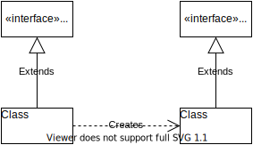

## 第13章 工厂方法（Factory Method）模式

工厂方法模式是类的创建模式，又叫做虚拟构造子(Virtual Constructor)模式，或者多态性工厂(Polymorphic Factory)模式。

<pre>
polymorphic
美 [ˌpɑˌliˈmɔrfɪk]  
n. 多态;多型;多态性;
adj. 多形的;多态的
</pre>

工厂方法模式的用意是定义一个创建产品对象的工厂接口，将实际创建工作推迟到子类中。

### 13.1 引言

#### 13.1.1 简单工厂模式的优缺点

正如本书在“简单工厂(Simple Factory)模式”一章里介绍过的，工厂模式哟简单工厂模式、工厂方法模式和抽象工厂模式几种。

在简单工厂模式中，一个工厂类处于对产品类实例化的中心位置上，他知道每一个产品，它决定哪一个产品类应当被实例化。

这个模式的有点是允许客户端相对独立于产品的创建过程，并且在系统引入新产品的时候无需修改客户端，也就是说，它在某种程度上支持“开-闭”原则。

这个模式的缺点是对“开-闭”原则的支持不够，因为如果有新的产品加入到系统中去，就需要修改工厂类，将必要的逻辑加入到工厂类中。

#### 13.1.2 工厂方法模式的引进

本章要讨论的工厂方法模式是简单工厂模式的进一步抽象和推广。由于使用了多态性，工厂方法模式保持了简单工厂模式的优点，并且克服了它的缺点。

首先，在工厂方法模式中，核心的工厂类不再负责所有产品的创建，而是将具体创建的工作交给子类去做。这个核心类摇身一变，成为了一个抽象工厂角色，仅负责给出具体工厂子类必须实现的接口，而不接触哪一个产品类应当被实例化这种细节。

这种进一步抽象化的结果，使这种工厂方法模式可以用来允许系统在不修改具体工厂角色的情况下引进新的产品，这一特点无疑使得工厂模式具有超过简单工厂模式的优越性。

下图所示是工厂方法模式的简略类图，此类图中仅展示了一个工厂类和一个产品类，在实际系统里，会遇到多个产品类及相应的工厂类。

#### 13.1.3 平行的等级结构

### 13.2 工厂方法模式的结构

### 13.3 工厂方法模式在农场系统中的实现

### 13.4 关于工厂方法模式的实现

### 13.5 Java语言中工厂方法模式的例子

### 13.6 工厂方法模式与其他模式的关系

### 13.7 女娲举绳造人

### 13.8 其他的例子

